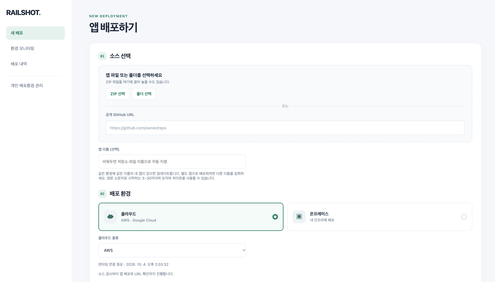
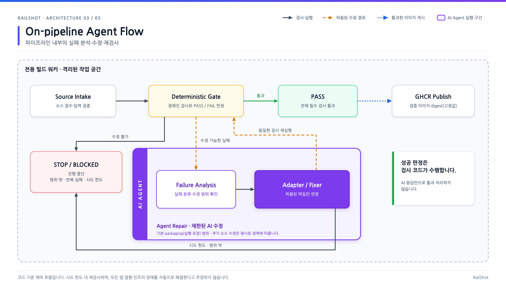
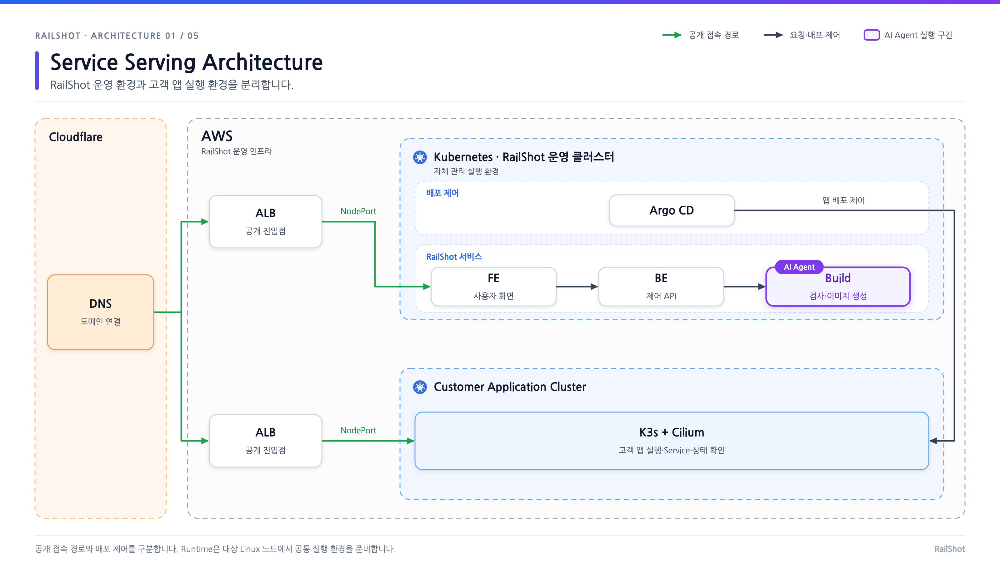

<p align="center">
  <a href="https://railshot.io/">
    
  </a>
</p>

**한국어** | [日本語](README.ja.md)

**One Action, Infinite Clouds**

한 번의 요청으로 배포하고, 관리·운영까지.

RAILSHOT은 웹이나 자신의 AI 에이전트에서 프로젝트를 제출하면, 배포에 필요한 파일 준비와 실패 수정, 컨테이너 이미지 게시, 클라우드·온프레미스 적용, 공개 URL 확인까지 이어주는 배포 플랫폼입니다. 배포 후에도 같은 화면에서 앱 상태와 작업 로그를 확인하고 업데이트·중지·재개·삭제를 관리할 수 있습니다.

[서비스 열기](https://railshot.io/) · [Notion 발표 자료](https://app.notion.com/p/3ed8bee9ada48088ab99d21c268da793) · [설계 문서](docs/architecture/README.md) · [MCP 연결 안내](apps/agent/README.md)

## 어떻게 사용하나요?

1. **프로젝트를 제출합니다.** 웹에서 폴더·ZIP·공개 GitHub 저장소 URL을 선택하거나, MCP를 연결한 에이전트에게 배포를 요청합니다.
2. **앱 이름과 실행 환경을 선택합니다.** 등록된 AWS·GCP 클라우드 환경 또는 연결된 OpenStack 온프레미스 환경을 사용합니다. 실제 선택 가능 여부는 환경의 준비 상태에 따라 표시됩니다.
3. **배포 과정을 확인합니다.** 기본 검사가 실패하면 AI가 허용된 범위에서 수정안을 만들고, 같은 검사를 다시 통과해야 다음 단계로 진행합니다.
4. **검증된 URL로 앱을 엽니다.** 이미지 게시 이후 대상 클러스터 적용과 공개 HTTP 검증을 거쳐 접속 주소를 제공합니다.
5. **배포 후에도 관리합니다.** 배포 이력, AI가 변경한 파일과 검사 결과, 환경 지표·앱 로그를 확인하고 앱을 업데이트하거나 중지·재개합니다.

웹 배포는 [railshot.io](https://railshot.io/)에서 시작할 수 있습니다. 개인 OpenStack 환경을 연결하려면 [고객 설치 프로그램](docs/architecture/client-bootstrap.md)과 [개인 환경 관리 계약](docs/api/personal-environments.md)을 참고하세요.

### 실제 배포·운영 화면

**프로젝트 제출과 환경 선택.** 폴더·ZIP·공개 GitHub URL을 입력하고, 클라우드 또는 온프레미스 실행 환경을 선택합니다.

[](docs/assets/readme/new-deployment.png)

<sub>발표 자료의 화면과 구조도를 사용했습니다. 이미지를 클릭하면 원본을 볼 수 있습니다. [이미지 출처](docs/assets/readme/README.md)</sub>

## AI가 수정하고, 검사가 판단합니다

기본 검사에 실패하면 AI가 허용된 범위에서 수정하고 같은 검사를 다시 실행합니다. 통과한 이미지만 게시하며, 허용 범위를 벗어나거나 시도 한도에 도달하면 중단합니다.

[](docs/assets/readme/agent-pipeline.png)

RAILSHOT은 AI가 작성한 완료 설명으로 배포 성공을 판단하지 않습니다. 수정안의 허용 범위와 실제 검사 결과를 확인하고, 통과한 이미지의 digest를 그대로 배포에 사용합니다.

| 단계 | 하는 일 | 다음 단계로 넘어가는 조건 |
| --- | --- | --- |
| 기본 검사 | 변경·비밀 정보 경계(L0), 배포 설정(L1), 이미지 빌드(L2), 컨테이너 기동·HTTP(L3)를 검사합니다. | 필수 검사를 모두 통과합니다. |
| 배포 파일 준비 | 필요한 Dockerfile·배포 명세를 규칙 기반으로 준비하고, 필요한 경우 AI가 보완합니다. | 패키징 단계의 수정 범위 안에서 제안이 검증됩니다. |
| 실패 수정 | 관측된 실패와 관련 로그를 바탕으로 AI가 수정안을 제안합니다. | 실제 빌드·실행 실패 뒤에만 정책이 허용하는 소스 수정이 가능하며, 테스트·검사 자체는 바꾸지 않습니다. |
| 재검사 | 변경을 적용한 뒤 L0부터 필수 검사를 다시 수행합니다. | 설정된 시도 횟수 안에서 검사를 통과합니다. |
| 이미지 게시 | 검증한 이미지와 출처·해시를 묶어 GHCR에 게시합니다. | 게시 단계에서 소스를 다시 빌드하지 않고 검증된 산출물을 확인합니다. |
| 배포·접속 확인 | GitOps 선언을 반영하고 Argo CD, 실제 워크로드와 공개 HTTP를 확인합니다. | 검증된 배포 결과와 접속 URL을 반환합니다. |

AI에는 핵심 실패 정보와 관련 로그를 제한된 크기로 전달하고, 추가 근거가 필요할 때 더 읽도록 합니다. 패키징과 실패 수정의 시도 횟수는 별도로 관리하며, 실행별 설정과 실제 호출 횟수를 기록합니다. 검사에 바로 통과하는 입력에는 AI 호출이 필요하지 않습니다. 자세한 정책과 실행 옵션은 [CI 파이프라인](ci/README.md), [배포 준비 지침](ci/scripts/agents/skills/prepare-deployment/SKILL.md), [실패 근거 구성](ci/scripts/runner/repair_evidence.py)을 참고하세요.

## 아키텍처

운영 API, CI 실행 환경, 고객 앱 실행 클러스터를 분리합니다. 웹과 MCP는 같은 제품 API를 사용하고, 각 클라우드·온프레미스 연결부는 등록된 환경에 맞게 배포를 수행합니다.

[](docs/assets/readme/service-serving.png)

AWS의 서비스 제공 구성을 보여줍니다. 운영 클러스터의 API·빌드·Argo CD와 고객 앱 실행 클러스터를 분리하고, 공개 접속 경로와 배포 제어 경로를 구분합니다.

이미지 게시(`published`), 클러스터 적용, 공개 URL 검증은 별도 결과입니다. MCP의 배포 요청이 접수됐거나 AI 수정이 성공했다고 해서 앱 배포까지 완료된 것은 아닙니다. 앱의 최근 시도와 마지막으로 검증된 서비스 상태도 구분해서 표시합니다. 수집되지 않은 지표는 정상값으로 대신 채우지 않습니다.

[전체 설계](docs/architecture/README.md) · [앱·환경·실행 관리](docs/architecture/application-management.md) · [CI → CD 전달 계약](docs/api/ci-publication.md) · [배포 방식과 검증 기준](docs/architecture/application-deployment-strategies.md)

## 자신의 에이전트에서 사용하기

원격 MCP 주소는 `https://railshot.io/mcp`이며 OAuth로 연결합니다. Codex CLI에서는 다음과 같이 등록합니다.

```sh
codex mcp add railshot --url https://railshot.io/mcp
codex mcp login railshot --oauth-client-registration dcr
```

RAILSHOT 웹을 사용하던 브라우저에서 연결을 승인하면 해당 웹 세션에 연결됩니다. 예를 들어 “이 공개 GitHub 저장소를 AWS에 `my-app` 이름으로 배포해 줘”라고 요청할 수 있습니다.

| 도구 | 용도 |
| --- | --- |
| `list_options`, `list_targets` | 사용 가능한 환경과 등록된 배포 대상을 확인합니다. |
| `deploy_repository` | 공개 GitHub 저장소의 배포를 요청합니다. |
| `get_deployment_progress`, `get_deployment` | 진행 단계, AI 작업 내역과 최종 배포 결과를 확인합니다. |
| `get_app_overview`, `get_deployment_evidence` | 배포·운영 요약과 추가 빌드·배포·실행 근거를 조회합니다. |

원격 MCP는 공개 GitHub 저장소를 입력으로 받습니다. **로컬 폴더·ZIP을 에이전트에서 배포하려면** 사용자 컴퓨터에서 실행하는 별도의 `railshot-local` MCP와 `deploy_local_project`를 사용합니다. 로컬 MCP의 세션은 원격 OAuth 세션과 자동 공유되지 않습니다. 설치 방법과 ChatGPT·Claude 연결 안내는 [MCP 문서](apps/agent/README.md)에 있습니다.

## 로컬 개발

**Node.js 22.13 이상과 npm**이 필요합니다. 저장소 루트에서 의존성을 설치한 뒤 API와 대시보드를 각각 실행합니다.

```sh
npm ci --ignore-scripts

# 터미널 1: API: http://127.0.0.1:4173
npm start --workspace railshot-api

# 터미널 2: 대시보드: http://127.0.0.1:4181
npm run dev
```

대시보드의 개발 서버는 `/api/` 요청을 로컬 API로 전달합니다. 위 명령은 로컬 개발 서버를 시작하며, 실제 배포에는 GitHub·CI worker·배포 대상·CD의 운영자 설정이 필요합니다. 설정이 없는 상태의 `/healthz` 응답은 클라우드 배포 준비가 끝났다는 뜻이 아닙니다.

```sh
# API 및 MCP 검사: 실제 모델·클라우드 호출 없이 실행
npm test --workspace railshot-api
npm test --workspace @railshot/agent

# 대시보드 프로덕션 빌드
npm run build
```

Python·Terraform·Ansible·런타임 검사는 [CI 안내](ci/README.md)에 정리되어 있습니다. 서비스 환경변수는 [API 설정](apps/api/README.md), [MCP 설정](apps/agent/README.md), [플랫폼 컨테이너 배포](docs/architecture/container-deployment.md)를 참고하세요.

## 저장소 구성

| 경로 | 책임 |
| --- | --- |
| [`apps/`](apps/README.md) | 웹 대시보드, 제품 API·CLI, MCP 서버와 에이전트 |
| [`ci/`](ci/README.md) | 앱 검사, AI 수정, 검증 이미지 게시 및 플랫폼 PR 검사 |
| [`infrastructure/`](infrastructure/ansible/README.md) | Provider 연결, Terraform, Ansible 기반 인프라 준비 |
| [`deployment/`](deployment/README.md) | Kubernetes 런타임과 플랫폼 배포 |
| [`gitops/`](gitops/README.md) | 배포 선언, Argo CD 연동과 적용 결과 확인 |
| [`observability/`](observability/README.md) | 환경 지표, 로그와 HTTP 관측 |
| [`docs/`](docs/architecture/README.md) | 아키텍처, API 계약, 의사결정과 시점별 검증 기록 |

디렉터리별 책임은 [AGENT.md](AGENT.md)를 따릅니다. 변경은 PR로 검토하며, 통합 절차는 [Gitflow 문서](docs/integration/gitflow.md)를 참고하세요. 과거 PoC·통합 기록의 지원 범위와 미완료 항목은 해당 기록 시점의 결과입니다.
