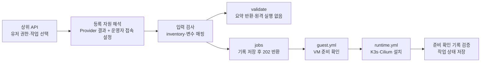
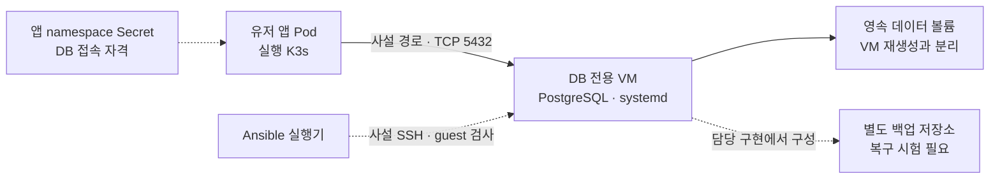

# Ansible 실행 인터페이스

버전 1.1 · 2026-10-02 · 팀 통합 기준

> 상위 API가 확정한 자원과 작업별 입력을 Ansible inventory·변수로 변환하는 인터페이스입니다. VM 생성, guest 준비 확인, 런타임 설치, 앱 배포의 책임을 구분합니다. DB는 K3s 밖의 별도 VM에 두는 기본안을 사용하며, 이번 구현은 DB 담당자에게 전달할 배치 입력을 검증하는 범위입니다.

## A. Directory Architecture

```text
contracts/
├── ansible-job.schema.json          # 상위 API의 작업·변수 입력
└── ansible-request.schema.json      # 내부 CLI 실행 요청
infrastructure/ansible/
├── api.py                          # 인증, 등록 자원 해석, 작업 접수·조회
├── inputs.py                       # 작업별 입력 검사, inventory·변수 요약
├── run.py                          # Provider 결과 변환, 실행·중복 방지
├── transport.py                    # AWS SSM / GCP IAP 관리 접속
├── guest.yml                       # 정빈 님 공통 guest 검사
└── runtime.yml                     # 승민 님 K3s·Cilium 설치 코드 호출
examples/ansible/                    # 자격증명이 없는 입력 예제
```

| 구성요소 | 책임 | 경계 |
|---|---|---|
| 상위 API·MCP | 유저 권한 확인, 대상·작업 선택, 생성→조회→설치 순서 조율 | 유저가 임의 IP·명령·키 경로를 지정하지 않도록 합니다. |
| OpenStack Controller / CSP 코드 | VM 생성·상태 조회, 프로젝트·자원 정보 반환 | OpenStack 생성의 `202 accepted`를 guest 준비 완료로 해석하지 않습니다. |
| Ansible 연결부 | 등록 target 조회, 입력 변환, 실행 상태와 준비 확인 결과 반환 | 새 큐·AWX 서버를 추가하지 않고 기존 worker·CLI를 사용합니다. |
| 정빈 님 guest / 승민 님 runtime | OS 선행조건 확인 / 단일 노드 K3s·Cilium 설치 | 원본 설치 로직을 재작성하지 않습니다. |
| 화균 님 DB 구현 | PostgreSQL·Patroni 설치 정책과 플레이북 | 선택형 하이브리드 HA 플레이북을 통합했으나 이 API 실행에는 미연결입니다. 기본 단일 PostgreSQL VM 설치도 지원하지 않아 차단을 유지합니다. |
| Argo CD 경로 | 준비된 실행 클러스터에 앱 선언 적용 | `runtime.install`에서 앱을 배포하지 않습니다. |



DB 요청은 검증·요약까지 지원합니다. `jobs`에 DB 설치를 요청하면 `501 DATABASE_PLAYBOOK_UNAVAILABLE`을 반환하며 작업을 만들지 않습니다.

## B. Request / Response Contract

### B-1. 호출 경로

| 메서드·경로 | 입력 | 응답 |
|---|---|---|
| `POST /v1/ansible/validate` | 작업·등록 target·작업별 parameters | `200`: 입력 검사와 inventory·변수 요약. SSH·설치·작업 기록 생성 없음 |
| `POST /v1/ansible/jobs` | 같은 입력 형식 | 신규 작업은 `202`와 `Location`, `Retry-After: 2` |
| `GET /v1/ansible/jobs/{request_id}` | 접수한 작업 ID | `200`: 저장한 상태와 준비 확인 결과 |

기계가독 명세는 [OpenAPI 3.1](ansible.openapi.json), 호출 입력은 [Job JSON Schema](../../contracts/ansible-job.schema.json)를 따릅니다. 기본 주소는 실행기 내부의 `http://127.0.0.1:4180`이며 모든 경로에서 운영자 Bearer 인증을 확인합니다. 브라우저·유저에게 직접 공개하는 API가 아닙니다. 상위 API가 다른 호스트에 있다면 인증된 내부 연결 방법을 별도로 정해야 합니다.

### B-2. 공통 입력과 작업별 변수

| 필드 | 규칙 |
|---|---|
| `request_id` | 1–128자 영문·숫자·`.`·`_`·`-`. 작업 접수의 중복 방지 키입니다. `validate`는 ID를 예약하지 않습니다. |
| `target_id` | 실행기에 등록된 자원 별칭. 영문 소문자로 시작하며 소문자·숫자·`-`, 최대 63자입니다. |
| `operation` | `guest.check`, `runtime.install`, `database.configure` |
| `parameters` | 작업별로 정의한 필드만 받습니다. 알 수 없는 필드·다른 작업의 변수·JSON 중복 키는 거부합니다. |

| operation | parameters | 처리 |
|---|---|---|
| `guest.check` | 생략 또는 `{}` | runtime·database 용도 VM 모두 공통 guest 검사 가능 |
| `runtime.install` | 선택적 `wait_timeout_seconds`: 정수 30–600, 생략 시 300초 | 기존 K3s·Cilium 스크립트의 `WAIT_TIMEOUT`으로 전달 |
| `database.configure` | 필수 `mode`, `nodes`, `placements` | DB 담당자 전달용 배치 매핑만 검증. 설치 미지원 |

`command`, `playbook`, `extra_vars`, SSH 키·파일 경로, 클라우드 자격증명은 HTTP 입력에 없습니다. 작업 전체 제한 시간은 운영자 target 설정의 `timeout_seconds`이며 기본 1200초, 허용 범위는 30–1800초입니다. `wait_timeout_seconds`는 그 안에서 사용하는 개별 준비 상태 대기 값으로, 전체 제한 시간을 늘리지 않습니다.

런타임 요청 예시입니다.

```json
{
  "request_id": "runtime-001",
  "target_id": "demo-openstack",
  "operation": "runtime.install",
  "parameters": {"wait_timeout_seconds": 180}
}
```

### B-3. 입력 검사와 실행 가능 여부

`validate` 응답의 `valid: true`는 입력과 등록 정보의 매핑이 유효하다는 뜻입니다. `execution_supported`는 해당 실행 코드의 존재 여부이며, SSH 연결·자원 소유권·guest 준비를 실시간으로 확인했다는 뜻이 아닙니다. inventory는 키 경로와 SSH 설정을 제거한 요약이므로 그대로 설치에 사용하는 파일이 아닙니다.

| 반환 항목 | 의미 |
|---|---|
| `operation`, `target_id` | 검사한 작업과 대상 |
| `execution_supported`, `blockers` | 현재 실행 지원 여부와 차단 사유 |
| `inventory` | 그룹·호스트 별칭·관리 IP·Provider·배치 위치·자원 ID |
| `variables` | 기존 플레이북에 전달되는 변수 또는 DB 담당자 전달용 매핑 |

현재 runtime은 Ubuntu 22.04/24.04의 amd64 단일 노드입니다. K3s `v1.34.11+k3s1`, Cilium `1.20.2`를 사용합니다. ARM64 runtime과 다중 노드 설치는 지원으로 표시하지 않습니다.

## C. Provider Result → Inventory → Variables

### C-1. 자원 정보의 출처

상위 API는 의도한 프로젝트의 권한으로 자원을 생성·조회한 후 운영자 등록 정보와 연결합니다. 실행기는 등록된 파일을 읽으며 Provider에 다시 조회하지 않습니다. target 등록·변경은 현재 운영자 설정 단계이고 동적 등록 endpoint는 없습니다. target 목록 변경은 실행기를 정상 종료한 뒤 다시 시작해 반영합니다. Provider 응답 파일은 실행 시 읽으므로 변경 시 기존 요청 ID와 충돌할 수 있습니다.

| 출처 | 사용하는 필드 | 내부 매핑·검사 |
|---|---|---|
| AWS/GCP `node_descriptor` | `target_id`, `provider_kind`, `resource_id`, `addresses.private`, `location`, `transport_ref`, `architecture` | target·사설 IP·지역/zone을 보존. `x86_64`→`amd64`. SSM/IAP 대상과 자원 ID 일치 검사 |
| OpenStack `GET /api/v1/servers/{id}` | `id`, `project_id`, `status`, `addresses[].network/address/version` | 등록한 VM·프로젝트와 일치하고 `ACTIVE`여야 합니다. 지정 관리망의 IPv4가 정확히 하나여야 합니다. |
| 운영자 target 설정 | 관리망 이름, placement, architecture, initialization, SSH 참조 | Controller 응답에 없는 접속·초기화 정보를 보완합니다. |

OpenStack 생성 응답의 `resource_id/status: accepted`는 사용할 수 없습니다. 상세 조회의 `id/status: ACTIVE`가 필요합니다. 관리망 선택에는 `addresses[].network`의 실제 이름/키를 사용하며 네트워크 UUID라고 가정하지 않습니다. 주소가 없거나 여러 개이면 임의로 첫 주소를 선택하지 않습니다. 관리 주소는 RFC1918 IPv4만 허용합니다.

필드 대조는 등록 정보와 응답의 일치 검사입니다. 자원 소유권을 독립적으로 조회하거나 VM의 현재 상태를 보장하지는 않습니다. 상위 API가 최신 응답과 프로젝트 접근 권한을 책임집니다.

### C-2. 운영자 등록 파일

[전체 등록 예제](../../examples/ansible/api-targets.json)에 AWS/GCP runtime, OpenStack runtime, 별도 DB VM을 구분했습니다. 아래는 OpenStack runtime 항목입니다.

```json
{
  "server_file": "/secure/railshot/openstack/demo-openstack/server.json",
  "resource_id": "example-runtime-vm",
  "project_id": "example-project",
  "management_network": "management",
  "placement": "onprem-a",
  "architecture": "amd64",
  "initialization": "cloud-init",
  "purpose": "runtime",
  "ssh": {
    "user": "railshot-operator",
    "identity_file": "/secure/railshot/identity_ed25519",
    "known_hosts_file": "/secure/railshot/known_hosts"
  },
  "timeout_seconds": 1200
}
```

이 객체는 `version: 1`, `targets` 맵의 `demo-openstack` 항목으로 저장합니다. VM ID·프로젝트·주소·경로는 설명용이며 실제 값으로 교체해야 합니다. SSH 포트는 OpenStack에서 생략 시 22번입니다. DB VM은 다른 자원 ID·IP를 등록하고 `purpose: database`를 사용합니다. 이 값은 운영자의 용도 지정이며 VM에 K3s가 없는지 탐지하는 기능은 아닙니다.

### C-3. 실제 Ansible 매핑

| 입력·설정 | inventory / extra-vars | 읽는 구현 |
|---|---|---|
| VM 별칭·사설 IPv4 | `k3s_server.hosts.<id>`, `ansible_host` | `guest.yml`, `runtime.yml` |
| 운영자 SSH 참조 | `ansible_user`, `ansible_port`, 개인키·known_hosts 설정 | 실행기에만 존재하는 실제 inventory |
| 요청·대상·자원 ID | `railshot_request_id`, `railshot_target_id`, `railshot_resource_id` | 실행 요청·준비 확인 기록의 대상 바인딩 |
| architecture·initialization | `railshot_expected_arch`, `railshot_initialization` | 실제 guest와 요청 비교, cloud-init 완료 확인 |
| VM IP·별칭 | `railshot_node_ip`, `k3s_api_host`, `k3s_node_name` | NIC 주소·runtime identity 확인 |
| 팀 버전 정책 | `k3s_version` | 기존 설치 버전 검사 |
| `parameters.wait_timeout_seconds` | `railshot_wait_timeout_seconds` → `WAIT_TIMEOUT` | K3s·Cilium 준비 상태 대기 |
| 실행기가 만든 값 | `railshot_nonce`, `railshot_receipt_path` | 요청과 실행 단계가 일치하는 준비 확인 기록 검사 |

실제 inventory와 변수는 비공개 임시 JSON 파일로 만들고 `ansible-playbook -i inventory.json ... --extra-vars @vars.json`에 전달합니다. API 호출자가 파일명이나 명령 문자열을 조립하지 않습니다. Ansible의 [inventory·그룹 모델](https://docs.ansible.com/projects/ansible/latest/inventory_guide/intro_inventory.html)과 [JSON/YAML 변수 파일 입력](https://docs.ansible.com/projects/ansible/latest/playbook_guide/playbooks_variables.html#vars-from-a-json-or-yaml-file)을 사용합니다.

## D. Execution / Status

### D-1. 실행 순서

1. 호출자 인증과 입력 형식을 확인합니다.
2. 등록 target에서 Provider 결과와 접속 설정을 읽고 내부 CLI 요청을 만듭니다.
3. `validate`는 요약을 반환하고 끝납니다. DB 작업 접수는 설치 미지원 오류로 끝납니다.
4. 실행 작업은 입력 해시와 `queued` 상태를 저장한 뒤 `202`를 반환합니다.
5. 기존 단일 worker가 CLI를 실행합니다. 사설 SSH 또는 SSM/IAP 위 SSH로 guest를 검사하고, `runtime.install`이면 팀 runtime을 설치합니다.
6. 요청·노드·단계·nonce가 일치하는 준비 확인 기록을 검사하고 결과를 저장합니다. 호출자는 `Location` 경로를 조회합니다.

접수와 완료를 분리하고 상태 자원의 위치와 조회 간격을 반환하는 [비동기 요청·응답 패턴](https://learn.microsoft.com/en-us/azure/architecture/patterns/async-request-reply)을 적용했습니다. 상태 조회 자체가 `200`이어도 본문의 `status`가 실패일 수 있습니다.

| 상태 | 의미 |
|---|---|
| `queued`, `running` | 접수·실행 중 |
| `succeeded` | 해당 guest/runtime 단계의 준비 확인 기록 검증 완료 |
| `failed`, `blocked` | 실패 또는 실행 전제 미충족 |
| `unknown` | 실행 후 결과를 확정할 수 없어 운영자 확인 필요 |

`application_ready`와 `public_http_verified`는 항상 false입니다. K3s 설치 성공을 앱·DB·공개 HTTPS 성공으로 바꾸어 표시하지 않습니다. guest는 Ubuntu·systemd·CPU 2개 이상·RAM 1800MiB 이상·swap 비활성·root 여유 10GiB·NIC 주소·초기화 완료를 확인합니다.

### D-2. 중복 요청과 오류

동일한 요청 ID와 동일한 서버 측 확장 입력이면 기존 작업·결과를 반환합니다. `parameters`, Provider 결과, 접속 설정, 제한 시간으로 만든 내부 요청이 달라지면 `409 REQUEST_ID_CONFLICT`입니다. 한 번에 한 작업을 접수하며 다른 작업이 실행 중이면 `409 EXECUTOR_BUSY`입니다. 무제한 대기열이나 자동 재시도는 없습니다.

| HTTP / 코드 | 처리 방법 |
|---|---|
| `400 INVALID_JOB_REQUEST` | 필드·타입·작업별 변수·DB 배치 수를 수정합니다. |
| `400 TARGET_PURPOSE_MISMATCH` | DB VM에 runtime 설치를 요청했거나 DB 목록에 runtime VM을 넣었는지 확인합니다. |
| `401` / `403` | Bearer 인증 또는 localhost Host/Origin 조건을 확인합니다. |
| `404 TARGET_NOT_REGISTERED` | 승인된 target을 등록한 뒤 호출합니다. |
| `409 REQUEST_ID_CONFLICT` | 같은 ID로 입력을 바꾸지 않습니다. |
| `409 TARGET_RECONCILE_REQUIRED` | 이전 미확정 작업의 실제 결과와 준비 확인 기록을 확인합니다. |
| `501 DATABASE_PLAYBOOK_UNAVAILABLE` | DB 담당 플레이북 연결 전에는 설치를 요청하지 않습니다. |
| `503 TARGET_CONFIGURATION_INVALID` | 등록 파일·자원/프로젝트·관리 주소와 OpenStack ACTIVE 상태를 확인합니다. 자동 재시도를 지시하는 응답이 아닙니다. |

HTTP 오류는 `{"error":{"code":"INVALID_JOB_REQUEST"}}` 형식입니다. 접수된 작업의 `error`는 `code`, `outcome_unknown`을 가지며 원문 예외·비밀·SSH 파일 경로는 반환하지 않습니다. API가 중단되면 기록과 일치하는 CLI 완료 결과가 있을 때만 복구하고, 없으면 `unknown`으로 남깁니다. 시간 초과가 원격 설치 중단을 보장하지 않습니다.

## E. Database 기본안 — K3s 밖의 별도 VM

### E-1. 구성과 접속

기본안은 **PostgreSQL 전용 VM 1대, DB 노드 1개, DCS 0개**입니다. K3s를 재설치하거나 앱을 정리할 때 DB 수명주기가 함께 바뀌지 않도록 분리합니다. Kubernetes에서 DB를 운영할 수 없다는 뜻은 아닙니다. 현재 단일 노드 K3s 구성에서는 저장장치·백업·복구까지 추가로 설계해야 하므로 별도 VM을 선택합니다. 단일 DB VM도 단일 장애 지점이며 HA를 제공하지 않습니다.



위 그림은 배치 설계입니다. PostgreSQL 설치·볼륨·백업·Secret·방화벽을 이번 연결부가 생성한 것은 아닙니다.

| 항목 | 기본 설계 |
|---|---|
| DB 서버 | 별도 VM에 PostgreSQL을 서비스로 설치. K3s control-plane·worker로 등록하지 않음 |
| 데이터 | 데이터 볼륨과 백업의 보존·복구 정책을 DB 담당 구현에서 확정 |
| DB 통신 | 앱에서 DB의 사설 주소로 TCP 5432. 공인 EIP·ALB를 DB 접속 주소로 사용하지 않음 |
| 환경 간 접속 | VPC/LAN 또는 기존 WireGuard 사설 경로의 route·복귀 경로 필요. Ansible이 터널을 새로 생성하지 않음 |
| 접근 제어 | DB의 listen 주소·방화벽·`pg_hba.conf`를 제한하고 앱 전용 계정 사용 |
| 비밀 전달 | 앱 namespace의 Secret으로 전달. Git·HTTP 요청·작업 로그에 DB 비밀번호를 저장하지 않음 |

PostgreSQL의 [listen 주소·기본 5432 포트](https://www.postgresql.org/docs/current/runtime-config-connection.html)와 [클라이언트 주소·DB·계정별 접근 규칙](https://www.postgresql.org/docs/current/auth-pg-hba-conf.html)을 기준으로 설계합니다. 외부 DB가 관찰하는 원본 주소는 CNI의 SNAT 여부에 따라 노드 IP 또는 Pod IP일 수 있으므로, 실제 출발 주소와 복귀 경로를 확인한 뒤 허용 범위를 정해야 합니다.

현재 팀의 `deployment/cilium/network-policy.json.template`은 **Ingress만** 정의합니다. 앱→외부 DB의 Egress 허용 정책이나 DB 방화벽이 구현됐다고 볼 수 없습니다. Pod CIDR `10.42.0.0/16`, Service CIDR `10.43.0.0/16`과 LAN/VPC/VPN 대역 중복도 실제 환경에서 확인해야 합니다.

현재 [CD 인계 경로](../../gitops/README.md)도 DB·앱 Secret 주입·외부 egress를 지원 범위에서 제외하며, 생성하는 NetworkPolicy는 egress를 차단합니다. 이미지 pull Secret 참조 지원과 DB 자격 주입은 다른 기능입니다. 따라서 위 앱 접속 구조는 기본 설계이며 기존 자동 배포만으로 DB 자격과 TCP 5432 접속 정책까지 적용되지 않습니다. DB 사용 앱을 연결할 때 해당 계약을 담당자와 함께 확장해야 합니다.

### E-2. 담당자에게 전달할 입력

[DB 검증 요청 예제](../../examples/ansible/database-validate.json)를 `POST /v1/ansible/validate`에 보냅니다.

```json
{
  "request_id": "db-plan-001",
  "target_id": "db-onprem",
  "operation": "database.configure",
  "parameters": {
    "mode": "standalone",
    "nodes": [{"target_id": "db-onprem", "roles": ["database"]}],
    "placements": [{
      "provider": "openstack", "site": "onprem-a",
      "database_nodes": 1, "dcs_voters": 0
    }]
  }
}
```

| 입력 | 매핑·검사 |
|---|---|
| `mode` | 기본안은 `standalone`. `patroni`는 배치 의견 전달만 허용하며 HA 적합성을 판정하지 않습니다. |
| `nodes[].target_id` | 모두 `purpose: database`로 등록한 별도 VM. 요청의 대표 target도 목록에 포함해야 합니다. |
| `nodes[].roles` | `database`, `dcs` 역할. 같은 역할·VM·관리 IP 중복을 거부합니다. |
| `placements[]` | 실제 등록 정보의 provider/site별 역할 수와 `database_nodes`, `dcs_voters`가 일치해야 합니다. |
| `inventory` | `database`, `dcs` 그룹의 안전한 호스트 요약. SSH 접속 설정이 포함된 실행 inventory는 아닙니다. |
| `variables.railshot_database` | `mode`, `port: 5432`, `placements`. DB 담당자에게 전달할 통합 매핑이며 통합된 HA 플레이북의 변수로 아직 연결하지 않았습니다. |

standalone은 DB 1개·DCS 0개를 검사합니다. Patroni 모드에서는 역할·배치 일치만 검사하며 복제·quorum·장애 도메인·장애 전환 가능 여부를 검증하지 않습니다. 회의의 AWS 3개·온프렘 2개 예시는 배치를 변수로 전달하려는 설명으로 해석하며 기본 노드 수로 고정하지 않습니다.

검증 결과가 유효해도 DB는 `execution_supported: false`, `blockers: [{"code":"DATABASE_PLAYBOOK_UNAVAILABLE"}]`입니다. 통합된 [HA 입력 규격](deployment-inputs.md)은 DB 2대 이상·etcd 홀수 3대 이상·proxy 1대 이상과 별도 TLS·Vault 입력을 요구하며, 위 기본 단일 PostgreSQL VM 요청을 실행하지 못합니다. 단일 DB 설치 지원과 운영자 비밀 참조·데이터 경로·백업·준비 상태 계약을 담당자와 맞춘 뒤 실제 변수 이름에 연결해야 합니다. 이 문서 수정으로 API·Schema·실행 차단 동작을 바꾸지는 않습니다.

## F. Integration / Verification

### F-1. 회의 요구사항과 이번 반영

근거는 [2026-10-01 Slack 허들 전문](https://softbankhackathon2026.slack.com/files/USLACKBOT/F0C63236BL1/___________________)의 자동 전사입니다. 원문 MD와 해시를 연구 자료에 보존했으며 이번에 오디오를 대조한 것은 아닙니다.

| 원문 위치 | 확인한 요구 | 반영 |
|---|---|---|
| 2:45:09 이후 | DB/Patroni 설치와 Kubernetes 배치 논의 | DB를 별도 VM으로 설명하고 현재 설치 미지원 명시 |
| 2:49:49–2:50:07 | Web/MCP 요청이 Ansible을 호출하고 변수 전달 필요 | 작업별 HTTP 입력→검증→inventory·extra-vars 매핑 |
| 2:50:14–2:51:07 | Provider별 배치·개수를 전달할 명세 요청 | nodes의 역할과 provider/site별 placements를 대조 |
| 2:53:19–2:53:42 | DB 담당 범위 확인 | 담당 플레이북을 새로 대신 구현하지 않고 연결 경계 보존 |
| 이번 추가 지시 | DB는 기본 구성부터, 클러스터 밖 배치 검토 | PostgreSQL 전용 VM 1대의 설계·제약 정리 |

현재 상위 API의 자동 자원 등록·배포 전체 오케스트레이션까지 연결된 것은 아닙니다. 이번 변경은 승인된 자원을 Ansible 입력으로 변환하는 연결부, 내부 HTTP 계약, 기존 runtime 실행, DB 배치 검증을 대상으로 합니다.

### F-2. 브랜치·시험·병합

작업 브랜치는 `feature/ansible-integration-contract`, 기준은 `integration/team-assembly-20261002`입니다. 별도 worktree에서 작업하며 팀원 구현과 개인 작업 공간의 미커밋 변경을 보존합니다. PR로 검토한 뒤 integration에 merge commit으로 반영하고, squash·rebase·force push는 사용하지 않습니다.

```bash
python3 -m unittest discover -s infrastructure/ansible -p 'test_*.py'
```

검사는 OpenStack 상세 응답의 ID·프로젝트·관리 주소, 잘못된 변수 거부, HTTP 검증/접수/조회, 변수의 실제 CLI 전달, 중복 방지, DB 배치 수·용도 분리·실행 차단을 다룹니다. HTTP 시험은 localhost 서버를 실제로 띄우며 원격 Ansible 실행만 모의 처리합니다. Ansible inventory parser와 `guest.yml`, `runtime.yml` syntax-check도 별도로 확인합니다.

이 검사는 실제 OpenStack/CSP VM 설치나 DB 서비스 가동의 증거가 아닙니다. 실제 대상에서는 사설 경로·SSH 호스트키·guest 상태·패키지 접근·runtime 준비를 확인해야 하고, DB 플레이북 연결 후에는 앱에서 인증된 DB 연결과 백업 복구를 별도로 검증해야 합니다.

### F-3. 실행기 설정과 기존 CLI

등록 파일·Provider 응답 파일·Bearer 파일은 실행기 소유 0600 파일로 관리합니다. 개인키는 group/other 권한 없이, known_hosts는 group/other 쓰기 권한 없이 준비하고 신뢰된 경로로 호스트키를 확인합니다. 실제 토큰·키는 예제에 포함하지 않습니다.

```bash
python3 infrastructure/ansible/api.py \
  --targets-file /secure/railshot/ansible-targets.json \
  --token-file /secure/railshot/ansible-api-token \
  --state-dir /secure/railshot/ansible-jobs \
  --listen 127.0.0.1 --port 4180
```

POST는 `application/json`, 1–8192바이트의 Content-Length 본문을 사용합니다. query string·후행 `/`·CORS·동적 등록·취소·삭제는 지원하지 않습니다. HTTP 상세 헤더·오류는 OpenAPI를 기준으로 합니다.

기존 직접 CLI는 [내부 요청 Schema](../../contracts/ansible-request.schema.json)와 [runtime 예제](../../examples/ansible/runtime-single-node.json)를 유지합니다. `--validate-only`는 입력 검사만 수행합니다. 기존 `patroni.install` CLI도 담당 플레이북 실행 연결 전까지 계속 차단하며 새 HTTP의 `database.configure`와 혼용하지 않습니다.

```bash
python3 infrastructure/ansible/run.py \
  --request examples/ansible/runtime-single-node.json --validate-only
```

OpenStack은 실행기에서 사설 주소까지 직접 route 또는 WireGuard 경로로 SSH에 도달해야 합니다. AWS SSM·GCP IAP도 게스트의 SSH를 운반하는 관리 터널이며 SSH를 제거하는 방식이 아닙니다. `StrictHostKeyChecking=yes`를 유지하고 임의 ProxyCommand·ProxyJump·agent 전달은 차단합니다. 키 내용·클라우드 토큰을 Ansible 변수로 전달하지 않습니다.
