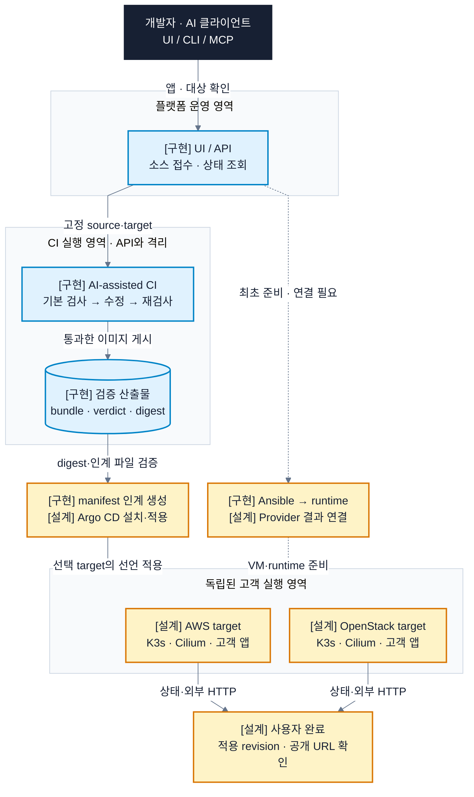
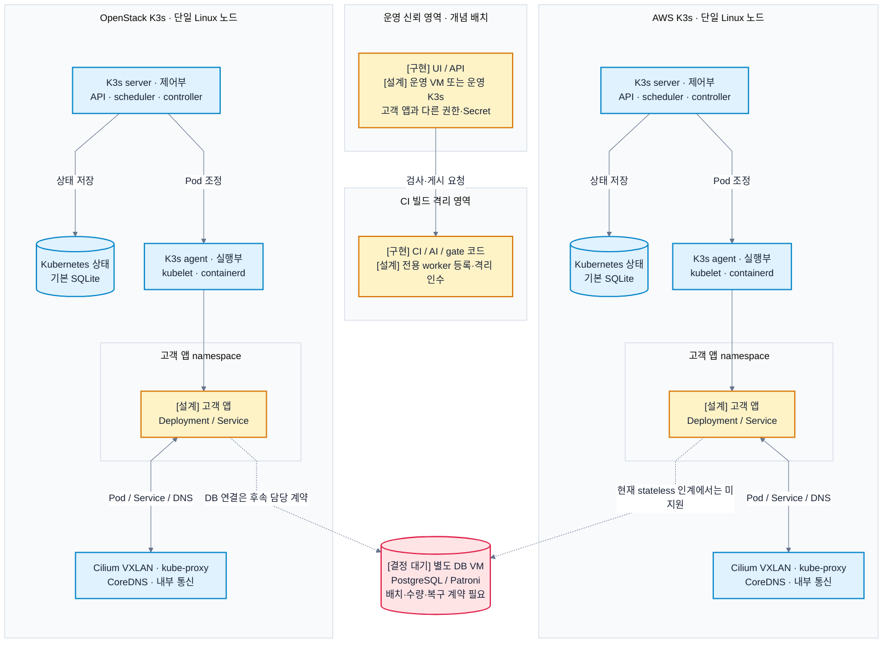
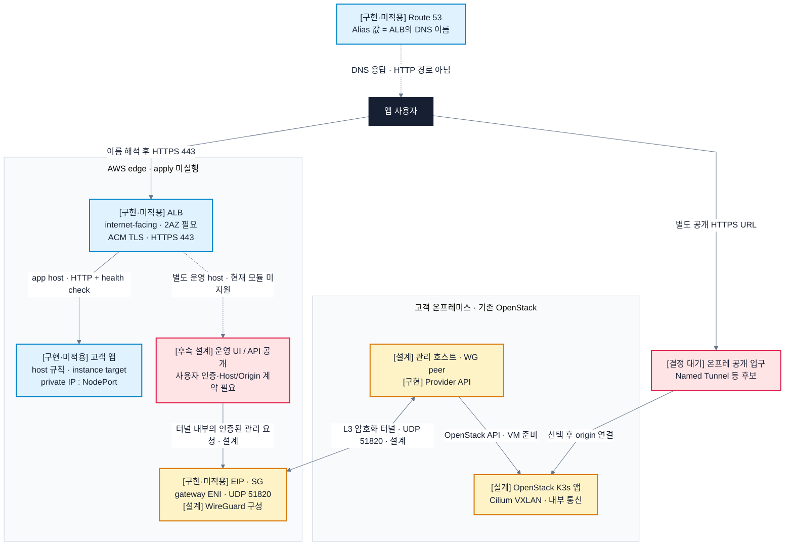
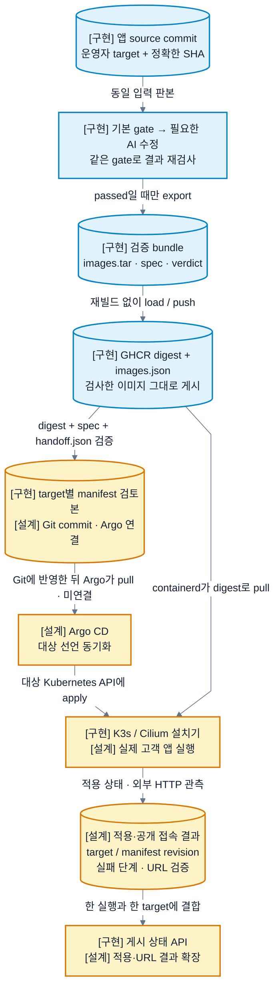
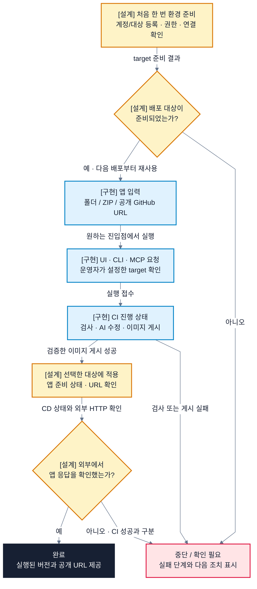
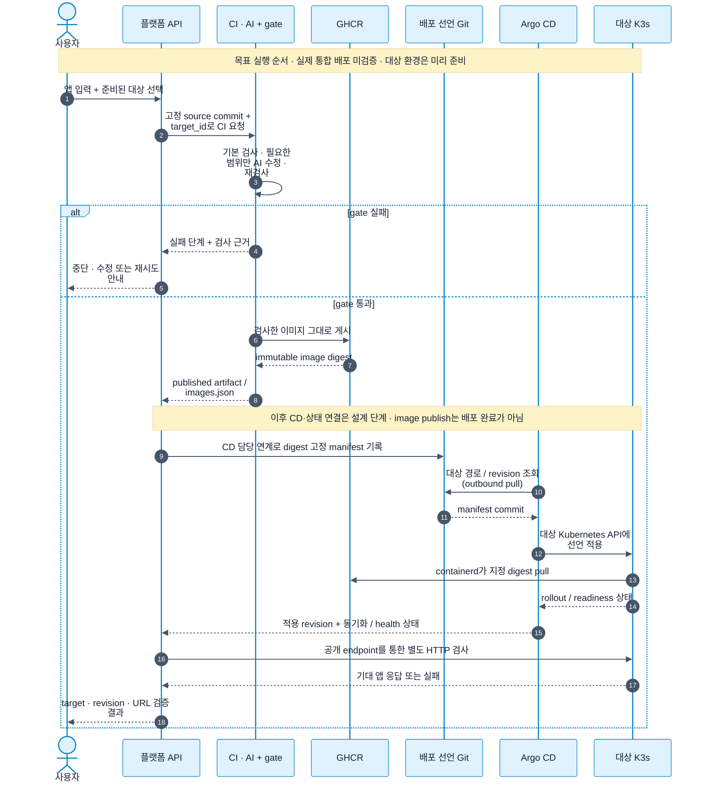

# RAILSHOT 공통 아키텍처

2026-10-02 · 팀 소스 조립·연결 및 로컬 검증 완료 / 실제 배포 인수 전 · 외부 게시·클라우드 배포 미실행

이 문서는 RAILSHOT의 코드 구성과 배포 요청 처리 방식을 설명합니다. **AI의 도움으로 앱을 배포 가능한 산출물로 만들고, 준비된 AWS 또는 OpenStack 실행 환경에 전달하는 것**이 목적입니다. 플랫폼 운영 서비스, 고객 소스를 빌드하는 환경, 고객 앱을 실행하는 클러스터의 책임을 구분합니다.

사용자는 웹 화면(UI), 명령줄 도구(CLI), AI 도구 연결 규약인 MCP로 요청합니다. API는 이 요청을 HTTP로 받는 인터페이스입니다. CI는 소스 검사·빌드·이미지 게시를, CD는 배포 선언의 적용을 담당합니다.

## 읽는 기준

- **구현:** 통합 소스에 해당 코드가 있습니다. 실제 실행 결과는 검증 보고에서 확인합니다.
- **설계:** 팀의 진행 방향 또는 연결 목표입니다. 구현과 별도로 연결 검증이 필요합니다.
- **결정 대기:** 제품 계약·배치·담당 구현 또는 검증 조건이 정해지지 않았습니다.
- 실선은 요청·데이터의 방향을 나타냅니다. 전체·클러스터 그림의 점선은 환경 준비와 추가 연결입니다. 네트워크 그림의 점선은 DNS 응답 또는 라벨에 적힌 후속 설계 경로이며, 시퀀스의 점선은 응답입니다.

구현 설명은 2026-10-02 통합 소스를 기준으로 합니다. 출처와 변경 사항은 [소스 조립 기록](../integration/summary.md), [파일별 branch·SHA 원장](../integration/source-map.json)에서 확인할 수 있습니다. 로컬 테스트 545개와 AWS edge Terraform validate가 통과했습니다. 실제 클라우드 배포와 앱의 공개 접속 검증은 수행하지 않았습니다. 상세 범위는 [검증 보고](../integration/validation.md)를 참고하세요.

## A. Directory Architecture — 코드 책임과 배치

[팀 REST API Controller 문서](https://app.notion.com/p/REST-API-Controller-3eb8bee9ada4804c8dd3c683efa3269e)와 같은 순서로 구성했습니다. A는 디렉터리와 책임, B는 계층 사이에 전달하는 데이터와 규칙, C는 사용 사례와 결과 확인 방법을 설명합니다.

```text
apps/
  api/src/                    # HTTP·CLI·MCP와 GitHub 요청/게시 상태 소비
  dashboard/                  # 로컬 웹 UI
ci/
  workflows/                  # private apps 저장소에 설치할 workflow 템플릿
  scripts/loop/ · gate/        # 기본 검사·허용된 AI 수정·재검사·bundle
  scripts/publication.py       # source/target/attempt에 게시 증거 결합
infrastructure/
  providers/openstack/        # HTTP DTO → 도메인 서비스 → OpenStack SDK
  terraform/                  # CSP 자원; aws-edge는 선택형 공개 입구
  ansible/                    # 요청 검증 → guest 검사 → 팀 runtime 호출
contracts/                    # Ansible 입력 스키마 등 경계 계약
deployment/
  runtime.sh · scripts/       # K3s/Cilium 전용 설치; 샘플 설치와 분리
gitops/handoff.py              # digest manifest 로컬 검토본 생성
```

| 영역/담당 | 주요 함수·파일 | 책임과 의존 방향 |
|---|---|---|
| 진기 진입 API | `createAppServer()`, `deploySource()`, `createDeploymentService().deploy/status()` | UI/CLI/MCP → 같은 HTTP API → GitHub. Provider API와 다른 서비스 |
| 지환 CI | `ci/workflows/railshot-deploy.yml`, `loop.py`, `gate/bundle.py`, `publication.py` | 고정 source → 검사/AI → 검증 bundle → registry/게시 receipt |
| 화균 Provider | `create_server()` → `ComputeService.create_server()` → `ComputeProvider` 구현 | DTO를 도메인 입력으로 변환하고 project/자원 참조 검증 후 OpenStack SDK 호출. 이 경로는 Terraform 실행기가 아님 |
| 정빈 연결 | `infrastructure/ansible/run.py: validate()/run()/read_receipt()` | 제한된 JSON 요청 → guest/runtime playbook → nonce가 맞는 readiness 영수증 |
| 승민 runtime | `deployment/runtime.sh`, `install-k3s.sh`, `install-cilium.sh` | Ansible이 한 번 호출하는 공통 K3s/Cilium 설치. 고객 앱 배포와 분리 |
| CD 인계 | `gitops/handoff.py: read_artifact()/render()` | 검증된 게시 파일 → target 조건 확인 → manifest와 Argo Application 검토본. 네트워크 실행 없음 |
| AWS edge | `infrastructure/terraform/aws-edge/` | 제공된 AWS 자원 참조 → 앱 1 host ALB/DNS·gateway EIP/SG. guest WG 구성 미포함 |

### A.1 공통 설계 결정

| 경계 | 현재 기준 | 남은 작업 |
|---|---|---|
| 사용자 진입 | 웹 UI·CLI·MCP가 같은 API 계약으로 앱을 제출. 현재 MCP는 로컬 stdio | 원격 사용자 인증·target 인가, 원격 사용자별 target 선택; 현재 운영자 고정 target |
| AI와 CI | 먼저 기본 검사, 실패 중 허용 범위만 AI 수정, 같은 검사 재실행. 통과한 이미지 그대로 게시 | 실제 실행 환경·모델 자격·대상 CPU·registry pull 조건 인수 |
| CI와 CD | CI는 bundle·spec·verdict·`images.json`을 전달. 로컬 CD 인계 도구가 digest 고정 manifest 검토본을 생성 | Git 반영·Argo 설치/등록/동기화·실제 적용 상태 연결 |
| CD 선택 | **Argo CD로 임시 진행**, 정빈의 대안 조사 병행 | 설치·Git 자격·선언 작성·결과 조회 연결. 최종 제품 선택으로 고정하지 않음 |
| runtime 설치 | 승민의 K3s/Cilium 설치기를 단일 설치 경로로 사용. `run.py` → `guest.yml` → `runtime.yml` 연결 구현 완료 | 실제 노드 실행 검증. 기존 `site.yml`과 중복 실행 방지 |
| 클러스터 | AWS와 OpenStack은 독립 실행 클러스터. Cilium VXLAN은 각 클러스터 내부 | 실제 target·CPU·네트워크·격리 정책 검증 |
| 앱 DB | 앱 K3s 밖의 별도 VM 배치. PostgreSQL/Patroni는 화균 중심 팀 과제 | VM 수·DCS·DB endpoint·비밀 전달·백업·복구·HA 범위 확정 |
| 완료 | 해당 target의 적용 revision과 기대 앱의 외부 HTTP 응답까지 확인 | 상태 수집·공개 URL·실패 및 재시도 계약 |

근거는 [10/1 회의 전사 원문](https://softbankhackathon2026.slack.com/files/USLACKBOT/F0C63236BL1/___________________)의 2:26:02–2:27:33(클러스터·기반 네트워크), 2:38:15–2:40:50(온보딩·인증), 2:43:09–2:55:10(Provider/runtime/DB 담당), 2:55:51–2:56:37(Argo 임시 진행), 3:04:18–3:05:14(운영 영역)입니다. 링크 열람에는 팀 Slack 접근 권한이 필요합니다. 자동 전사문을 대조했으며 원음은 별도로 검증하지 않았습니다.


### A.2 전체 구조 — 무엇을 연결하는가?

[편집 가능한 Mermaid 원본](diagrams/system-overview.mmd)

고객은 앱과 준비된 배포 대상(target)을 선택합니다. 운영 API가 CI 실행을 요청하면, CI는 검증한 이미지와 검사 결과를 전달합니다. CD의 목표 동작은 이미지 내용의 고유 해시인 digest를 배포 선언에 고정하고 대상에 적용하는 것입니다. 가상머신(VM)과 클러스터 준비는 최초 등록 또는 복구 때 수행하며, 앱 배포마다 반복하지 않습니다.

회의에서는 초기 AWS 환경에 팀 클라우드 계정을 사용하고, 온프레미스는 사용자가 운영하는 OpenStack을 사용하는 방향으로 논의했습니다. 그림의 고객 실행 영역은 고객 앱이 실행되는 영역입니다. 고객 AWS 계정 연결(BYOC)은 구현 범위에 포함되지 않습니다. VM 생성, 실행 환경(runtime) 준비, 앱 적용을 연속 처리하는 경로는 후속 검증이 필요합니다.




### A.3 클러스터 — 어떤 코드가 어디에서 실행되는가?

[편집 가능한 Mermaid 원본](diagrams/cluster-structure.mmd)

운영 API, CI 실행기(worker), 고객 앱은 신뢰 영역을 분리합니다. 운영 서비스는 VM 또는 운영용 K3s에 배치할 수 있습니다. 회의 3:04:39에서도 Kubernetes를 필수 조건으로 정하지 않았습니다. 현재 그림은 배치 구조를 설명하며, CI worker의 운영 클러스터 설치 상태는 [검증 보고](../integration/validation.md)에서 확인합니다.

승민 runtime의 현재 구성은 **단일 Linux 노드 PoC**입니다. 통합 진입점인 [runtime.sh](../../deployment/runtime.sh)는 경량 Kubernetes인 K3s와 네트워크 구성 요소인 Cilium만 설치합니다. CoreDNS는 클러스터 내부 이름 해석을, kube-proxy는 Service 트래픽 전달을 담당합니다. nginx Deployment와 노드 포트로 공개하는 NodePort Service의 설치·검사는 별도의 [install.sh 샘플 경로](../../deployment/install.sh)에 포함됩니다.

고객 앱 namespace에는 배포된 Deployment와 Service가 위치합니다. [manifest 인계 생성 도구](../../gitops/handoff.py)는 고객 클러스터 밖에서 실행하여 배포 검토본을 만듭니다. 현재 통합 runtime은 이 도구나 고객 앱을 설치하지 않습니다.

Cilium 설정은 `routingMode=tunnel`, `tunnelProtocol=vxlan`이며 kube-proxy를 유지합니다. VXLAN은 각 클러스터 내부의 노드 간 통신에 사용합니다. Traefik·ServiceLB·metrics-server·동적 local-path storage·Hubble은 기본 설치 범위에 없습니다. 단일 노드는 현재 설치 프로파일의 제약이며, 제품 전체나 Patroni의 노드 수를 정하는 기준은 아닙니다. Kubernetes 상태 저장소와 앱 PostgreSQL은 별도 구성입니다.

앱 DB는 K3s 밖의 별도 VM에 배치하는 설계입니다. PostgreSQL 고가용성 구성을 관리하는 Patroni의 배치, 노드 수, 복구 범위는 담당자 합의가 필요합니다. AWS와 온프레미스를 묶는 단일 DB 클러스터나 자동 이관은 확정하지 않았습니다. 고객 워크로드의 namespace, 역할 기반 접근 제어(RBAC), NetworkPolicy, Pod Security, 자원 할당량도 별도로 검증해야 합니다.




### A.4 네트워크 — 공개 앱 요청과 관리 연결은 어떻게 다른가?

[편집 가능한 Mermaid 원본](diagrams/network-topology.mmd)

**Route 53은 도메인 이름을 ALB 주소로 해석합니다. HTTP 트래픽은 사용자에서 ALB로 직접 전달됩니다.** ALB는 HTTP 요청을 대상 노드로 전달하는 로드 밸런서입니다. [AWS edge 모듈](../../infrastructure/terraform/aws-edge/README.md)은 Route 53 Alias, HTTPS listener, 고객 앱 한 호스트의 instance target group과 NodePort 경로를 제공합니다. 별도 gateway의 네트워크 인터페이스(ENI)에는 고정 공인 IP인 EIP와 UDP 51820 보안 그룹(SG) 규칙을 구성합니다.

입력에는 서로 다른 두 가용 영역(AZ)의 public subnet, 인터넷 게이트웨이(IGW) 경로, ACM 인증서, 실제 대상 참조가 필요합니다. 모듈의 로컬 검증 범위는 [검증 보고](../integration/validation.md)를 참고하세요. 운영 UI/API의 공개 경로는 인증과 Host/Origin 규칙을 먼저 정해야 하므로 현재 모듈에 등록하지 않습니다. 그림의 점선은 이 후속 설계를 표시합니다.

ALB는 AWS 노드의 private IP 또는 instance target을 통해 Service NodePort에 연결합니다. 샘플 포트는 30080이며 실제 앱은 할당된 포트를 사용합니다. ALB SG에서 대상의 앱·상태 확인 포트까지 접근할 수 있어야 합니다. 상태 확인 경로는 기본 virtual host에서도 응답해야 합니다. DNS, TLS, Host routing도 함께 확인합니다. ALB를 두 AZ에 배치해도 단일 앱 노드의 고가용성이 보장되지는 않습니다. [Route 53 Alias](https://docs.aws.amazon.com/Route53/latest/DeveloperGuide/routing-to-elb-load-balancer.html), [ALB 조건](https://docs.aws.amazon.com/elasticloadbalancing/latest/application/create-application-load-balancer.html), [Target group](https://docs.aws.amazon.com/elasticloadbalancing/latest/application/load-balancer-target-groups.html), [Health check](https://docs.aws.amazon.com/elasticloadbalancing/latest/application/target-group-health-checks.html).

**EIP와 WireGuard는 관리망 연결에 사용합니다.** 팀 홈의 `EIP(51820번 인바운드)`와 회의 2:28:57을 반영한 설계입니다. UDP 51820은 선택한 WireGuard 수신 포트입니다. 모듈은 운영자가 제공한 gateway ENI에 EIP를 연결하며, gateway 호스트 생성이나 WireGuard 설치는 수행하지 않습니다. ALB에는 사용자 EIP를 연결하지 않습니다. NAT Gateway의 EIP는 외부로 나가는 연결에 사용하며, 관리 요청의 수신 입구로 사용하지 않습니다. [EC2 EIP](https://docs.aws.amazon.com/AWSEC2/latest/UserGuide/elastic-ip-addresses-eip.html), [ALB subnet API](https://docs.aws.amazon.com/elasticloadbalancing/latest/APIReference/API_SetSubnets.html), [NAT Gateway](https://docs.aws.amazon.com/vpc/latest/userguide/vpc-nat-gateway.html).

WireGuard 연결에는 peer 키, 허용 주소(AllowedIPs), CIDR, 왕복 라우팅, UDP 방화벽, 최대 전송 단위(MTU) 설정이 필요합니다. NAT 뒤의 온프레미스 peer가 AWS 종단으로 연결하고, 유휴 상태에서도 역방향 수신이 필요하면 keepalive를 설정합니다. 터널은 네트워크 계층(L3)의 패킷을 전달합니다. API 권한 검사와 명령 실행은 별도 구성 요소가 수행합니다. 그림의 관리 API 요청은 이 터널 안에서 전달됩니다. [WireGuard 모델](https://www.wireguard.com/), [NAT keepalive](https://www.wireguard.com/quickstart/).

온프레미스 앱의 공개 입구는 Named Tunnel 등을 검토 중입니다. ALB→relay→WireGuard→온프레미스 앱 경로는 팀에서 합의하지 않았으므로 기본 구성에 포함하지 않습니다. ALB IP target에는 public IP를 등록할 수 없습니다. private target도 왕복 라우팅이 필요하며, 여러 클라우드를 한 ALB에 자동 연결하는 기능은 현재 범위에 없습니다.

현재 Ansible 실행기는 SSH와 sudo를 사용하며, 접속 대상의 호스트 키를 엄격히 검사합니다. SSH 없이 운영하려면 별도 실행 경로를 구현해야 합니다. 초기 cloud-init 실행이나 AWS Systems Manager(SSM)의 Run Command·Session Manager를 검토할 수 있습니다. SSM에는 Agent, IAM 권한, 외부 HTTPS 통신을 위한 443 포트 경로가 필요합니다. WireGuard 자체는 Ansible이나 원격 명령을 실행하지 않습니다. [SSM 조건](https://docs.aws.amazon.com/systems-manager/latest/userguide/setup-create-vpc.html).



## B. DTO via Layers — 경계 데이터와 규칙

DTO는 계층 사이에 전달하는 데이터 객체입니다. 아래 표는 현재 코드의 입력, 산출물, 검증 규칙을 정리합니다. 환경 준비 요청은 신뢰된 실행자가 명시적으로 호출합니다. 플랫폼 API가 Provider와 Ansible을 자동으로 연속 호출하는 경로는 아직 연결되지 않았습니다. receipt는 실행 결과를 확인하는 기록이며, nonce는 해당 요청에 발급한 일회성 식별 값입니다.

| 경계 | 입력 → 산출물 | 실제 메서드·규칙 |
|---|---|---|
| 앱 입력→플랫폼 API | multipart `app`, 선택 `target_id`, 폴더/ZIP/`repository_url` → HTTP 202와 `run_id/source_commit/target_id/state=queued` | `uploadedSource()` → `deploy()`. source 필드 중 하나, 경로/용량/파일 검증. 운영자 고정 target과 다르면 400 |
| API→Actions | `tenant/app/source_commit/target_id` → workflow run | `deploy()`는 등록한 commit을 전달. CI admission은 제출 SHA·`GITHUB_SHA`·checkout SHA 일치 요구 |
| Actions→상태 API | `published-<producer_attempt>`의 5개 파일 → `publication`, artifact ID/name | `status()`/`published()` → `readPublished()`. run·source·target·tenant·attempt·hash 일치 검사. receipt hash는 신뢰한 CI artifact 경로의 무결성 검사이며 별도 서명이 아님 |
| Provider HTTP→도메인 | `CreateServerRequest{name,image_id,flavor_id,network_ids}` → `CreateServerSpec` | `create_server()` → `ComputeService.create_server()`. 추가 필드 거부, context 및 image/flavor/network 참조 검증 |
| Provider→클라이언트 | HTTP 202 `resource_id/action/status=accepted/request_id` 또는 오류 DTO | 생성 접수 응답만 반환. 후속 `get_server()` 상태 조회 필요. VM 상태와 guest/runtime 준비는 다름 |
| Ansible 요청→실행 | `schema_version/request_id/operation/target/timeout_seconds/inventory` → 단계별 결과 | `run()`은 `guest.check` 또는 `runtime.install`을 수행. 실제 실행은 명시된 SSH 참조와 strict host key 검사를 사용. `--validate-only`는 ready를 올리지 않음 |
| runtime→Ansible | `request_id/target_id/node_id/stage/nonce/*_ready` → `guest_ready/runtime_ready` | `read_receipt()`가 이번 요청의 nonce와 일치하는 영수증 검사. exit 0만으로 ready를 승인하지 않음 |
| published→CD 검토본 | `images.json/jasmin.yaml/verdict.json/manifest.json/handoff.json` + target → `workload/application/receipt` | `read_artifact()`/`render()`. linux/amd64·단일 stateless·고정 Git SHA·제한 AppProject·할당 NodePort/자원 요구. 출력은 `rendered_for_review`, `deployed=false` |

Provider 오류는 `code/message/request_id/retryable/outcome_unknown`을 반환합니다. `INVALID_INPUT`, `UNAUTHENTICATED`, `FORBIDDEN`, `CONFLICT`, `QUOTA_EXCEEDED`, `UPSTREAM_TIMEOUT` 등으로 원인을 구분합니다. `outcome_unknown=true`이면 변경 요청의 반영 여부를 확정하지 못한 상태입니다. 생성 요청을 재전송하기 전에 현재 자원을 확인해야 합니다. [DTO](../../infrastructure/providers/openstack/src/control_plane/api/schemas.py), [오류 정의](../../infrastructure/providers/openstack/src/control_plane/domain/errors.py).

Ansible은 미지원 요청을 `PATRONI_PLAYBOOK_UNAVAILABLE`, `SINGLE_NODE_ONLY`, `RUNTIME_ARCHITECTURE_UNVERIFIED`로 거부합니다. 실행 중 시간 초과나 실패가 발생하면 일부 변경이 남을 수 있습니다. 이때 `application_ready/public_http_verified`를 true로 반환하지 않습니다. [실행기](../../infrastructure/ansible/run.py).

### B.1 데이터 흐름 — 무엇을 전달하고 무엇으로 추적하는가?

[편집 가능한 Mermaid 원본](diagrams/data-flow.mmd)

**source commit**은 앱 소스의 판본이고, **manifest commit**은 배포 선언의 판본입니다. CI는 검사를 통과한 이미지 묶음(bundle)을 그대로 게시합니다. CD는 `images.json`의 digest를 배포 선언에 넣어 검사한 이미지와 실행할 이미지를 일치시킵니다. Argo CD는 Git 선언을 가져오고, 컨테이너 실행기인 containerd는 이미지 저장소(registry)에서 이미지를 가져옵니다. 화살표는 산출물의 이동 방향이며 연결을 시작하는 주체는 라벨에 표시했습니다.

통합 코드는 기존 `gitops/rendered` 대신 `loop/release`와 `published-<producer_attempt>`를 읽습니다. API는 source commit과 운영자가 고정한 target으로 Actions 실행을 요청합니다. CI는 제출 SHA, checkout SHA, 실행 SHA가 같은지 검사합니다. 상태 조회에서는 산출물의 artifact ID, run/source, producer attempt, `handoff.json`을 대조합니다.

게시 확인 결과는 `published` 또는 `publication_unverified` 등으로 반환합니다. 현재 공개 URL은 `null`입니다. 실제 적용 revision과 공개 URL 검사 결과를 반환하려면 CD 상태 연결이 필요합니다.

[CD 인계 도구](../../gitops/handoff.py)는 published artifact의 네 파일과 `handoff.json`을 입력으로 받습니다. hash·source·target·image 계약을 검사하고 Deployment·Service·NetworkPolicy·Argo Application의 **로컬 검토본**을 생성합니다.

현재 지원 대상은 linux/amd64의 단일 stateless service입니다. DB, secret 주입, 외부 송신(egress), 경로 접두사 기반 routing 요청은 거부합니다. Git push, Argo 등록·동기화, 클러스터 접근은 수행하지 않으며 결과에 `deployed=false`를 기록합니다. 지원 범위 확장에는 별도 계약과 검증이 필요합니다.

재배포와 이전 버전 복구(rollback)에는 검증된 digest와 manifest revision이 필요합니다. 복구 시 이미지 보존 여부, 선언 재적용, 앱의 외부 HTTP 응답, DB 호환성을 확인해야 합니다. Git 변경 이력은 복구 대상 식별에 사용하며, 복구 성공 여부는 실행 결과로 판단합니다.




### B.2 인증·권한 결정과 현재 코드의 차이

OIDC(OpenID Connect)는 외부 인증 제공자의 로그인 결과를 확인하는 규약이며, 현재 제품 인증 방식으로 채택하지 않았습니다. 사용자 로그인과 고객·대상 인가, GitHub Actions의 AWS 임시 자격, Provider의 OpenStack 자격은 각각 다른 경계입니다. OIDC 로그인을 사용하더라도 API의 고객별 권한 검사는 별도로 필요합니다.

회의 2:40:26–2:40:50에서는 **고객 서버의 CLI가 ID와 비밀번호를 로컬에서 처리하고 unscoped token을 플랫폼에 전달**하는 방식을 제안했습니다. 현재 Provider가 지원하는 방식은 password 또는 application credential이며, 외부 unscoped token의 입력·교환 경로는 없습니다.

Unscoped token은 project 권한이 지정되지 않은 토큰입니다. 다만 사용자가 접근 가능한 project의 scoped token을 요청하는 데 사용할 수 있으므로 인증 비밀로 취급해야 합니다. 수신, 교환, 만료, 폐기 범위를 정해야 하며, 토큰 재교환으로 원래 만료 시각을 늘릴 수는 없습니다. [Keystone token](https://docs.openstack.org/keystone/latest/admin/tokens-overview.html#unscoped-tokens), [범위 교환 API](https://docs.openstack.org/api-ref/identity/v3/index.html#token-authentication-with-scoped-authorization), [만료 체인](https://docs.openstack.org/api-ref/identity/v3-ext/#os-revoke-api).

Application credential은 애플리케이션에 발급하는 ID·secret 자격입니다. 이 자격을 고객 관리 호스트에 보관하고 인증된 Provider API를 호출하는 방식은 **변경 권고이며, 회의 채택안은 아닙니다**. 채택할 경우 project, 역할, 만료, 교체, API 범위를 정해야 합니다. 발급 시 기본 역할 상속과 만료 설정을 확인해야 하며, `unrestricted=false`도 읽기 전용을 뜻하지 않습니다. [Application credential](https://docs.openstack.org/keystone/latest/user/application_credentials.html). 고객 앱, 빌드 입력, AI 수정 공간에는 플랫폼 관리자 자격을 전달하지 않습니다.

## C. User Journey — 사전조건, 실행, 접수 후 판단

### C.1 Case 1: 준비된 target으로 앱을 게시

**입력/사전조건:** 폴더·ZIP·공개 GitHub URL 중 하나를 입력합니다. 운영자가 고정한 target, GitHub 연동, 신뢰한 CI workflow와 worker가 필요합니다.

1. `deploySource()`가 입력을 HTTP API로 전달합니다. `uploadedSource()`와 `validateFiles()`가 입력을 검사합니다.
2. `deploy()`가 앱 트리를 등록하고 source commit·target을 고정한 Actions 요청을 보냅니다.
3. CI가 기본 검사와 필요한 AI 수정·재검사를 수행한 뒤 통과한 이미지를 게시합니다.
4. `status()`가 해당 release의 producer attempt·artifact ID와 인계 파일을 대조합니다.

**접수 후 판단:** HTTP 202는 실행 접수 응답입니다. Git 등록 후 dispatch ID를 받지 못하면 부분 성공을 알리는 502가 반환될 수 있습니다. `published`는 이미지 게시를 확인한 상태이며 URL은 `null`입니다. artifact가 없거나 식별 정보가 다르면 `publication_unverified`를 반환합니다.

### C.2 Case 2: OpenStack VM과 공통 runtime 준비

**입력/사전조건:** 기존 OpenStack의 project·image/flavor/network, Provider API의 Bearer 자격, VM 관리 경로가 필요합니다. Ansible에는 검증한 node/resource/private IP와 SSH 참조를 별도 계약으로 전달합니다. 플랫폼 API→Provider→Ansible의 자동 연속 실행은 아직 연결되지 않았습니다.

1. Provider `create_server()`가 DTO를 `CreateServerSpec`으로 바꾸고 참조·권한을 검사합니다.
2. HTTP 202 이후 `get_server()`로 VM 상태를 조회합니다. ACTIVE라도 guest ready로 처리하지 않습니다.
3. 신뢰된 실행자가 `run.py`에 명시적 요청을 전달합니다. `guest.yml`은 OS/CPU/IP/자원과 초기화 완료를 검사합니다.
4. `runtime.yml`이 소유권과 기존 구성을 확인하고 `runtime.sh`로 K3s/Cilium을 설치합니다. nonce가 맞는 단계 영수증이 있어야 ready를 승인합니다.

**부분 실패/미지원:** 시간 초과 또는 runtime 실패 후 일부 설치가 남을 수 있습니다. 현재 통합 runtime은 amd64 단일 노드이며, ARM64·다중 worker·Patroni 설치 요청은 거부합니다. 중복 설치를 방지하기 위해 기존 `site.yml`의 K3s 설치를 추가 실행하지 않습니다. 이 단계의 성공은 고객 앱 준비나 공개 HTTP 응답까지 확인한 결과는 아닙니다.

### C.3 Case 3: 게시 산출물에서 배포 검토본 만들기

**입력/사전조건:** 신뢰한 workflow의 published 파일과 검토된 target 설정을 입력합니다. registry digest, source, target, 파일 hash가 일치해야 합니다.

1. `read_artifact()`가 인계 receipt와 네 파일의 계약을 검사합니다.
2. `render()`가 CPU, 단일 stateless 범위, Git revision, AppProject, NodePort, ingress CIDR과 resource 설정을 확인합니다.
3. 검토용 Deployment·Service·NetworkPolicy·Argo Application을 로컬에 생성합니다.

**접수 후 판단:** 결과는 `rendered_for_review/deployed=false`입니다. Git 반영, Argo 설치·등록·동기화, runtime 적용, 외부 HTTP 검사는 수행하지 않습니다. DB·secret·외부 egress가 필요한 앱은 현재 지원 범위에서 제외합니다.

### C.4 사용자 흐름 — 어떤 조작 뒤에 완료라고 말하는가?

[편집 가능한 Mermaid 원본](diagrams/user-flow.mmd)

최초 등록 시 환경 준비와 권한 설정을 수행합니다. 이후에는 준비된 환경을 재사용하여 앱 입력과 대상 선택으로 배포를 요청합니다. “One Action”은 이 반복 배포의 사용자 조작을 줄이는 목표입니다.

현재 UI·CLI·MCP는 폴더, ZIP, 공개 GitHub 기본 URL을 입력으로 받습니다. 비공개 Git 저장소와 모든 언어·프레임워크의 지원은 보장하지 않습니다. AI는 요청과 배포 오류 처리를 돕고, 사용자는 게시된 이미지와 적용 대상을 확인합니다. 기본 검사(gate)에 실패하면 게시 전에 중단합니다. runtime 또는 URL 검사 실패는 CI 성공과 구분하여 표시하는 것이 목표입니다.




### C.5 목표 실행 시퀀스 — 성공과 실패를 누가 판단하는가?

[편집 가능한 Mermaid 원본](diagrams/deployment-sequence.mmd)

아래 시퀀스는 준비된 target으로 앱 하나를 배포하는 목표 순서입니다. Provider의 VM 생성과 runtime 초기 설치는 사전에 수행합니다. API→배포 선언 Git 연결은 CD 연계를 나타냅니다. 현재 플랫폼 API에는 이 Git commit 작성 경로가 구현되어 있지 않습니다.

CI는 검사와 이미지 게시 결과를 판단합니다. 이후 Argo의 동기화·상태 확인과 별도의 외부 HTTP 검사가 필요합니다. target 생성 접수, VM ACTIVE, guest 준비, cluster Ready, app Ready, 공개 HTTP 응답은 각각 별도로 확인합니다.




### C.6 요소·화살표 근거와 주장 상한

| 요소/연결 | 직접 확인한 출처 | 이 문서가 주장하는 범위 |
|---|---|---|
| UI/CLI/MCP→API | [server.js](../../apps/api/src/server.js), [client.js](../../apps/api/src/client.js), [mcp.js](../../apps/api/src/mcp.js) | 입력·진입 부품 구현. 다중 고객 인증과 target 인가는 별도 |
| API→GitHub/상태 조회 | [github.js](../../apps/api/src/github.js), [API 계약](../../apps/api/docs/interface.md) | source/target과 published 인계 소비 구현. 외부 URL null; 실배포 증거 아님 |
| AI→gate→bundle→digest | [CI workflow](../../ci/workflows/railshot-deploy.yml), [loop.py](../../ci/scripts/loop/loop.py), [bundle.py](../../ci/scripts/gate/bundle.py) | 소스 구현. workflow 설치·runner 등록·실제 cloud run은 별도 |
| Provider→OpenStack | [router.py](../../infrastructure/providers/openstack/src/control_plane/api/router.py), [connection.py](../../infrastructure/providers/openstack/src/control_plane/infrastructure/openstack/connection.py), [auth.py](../../infrastructure/providers/openstack/src/control_plane/auth.py) | project 범위 VM API와 고정 Bearer 인증. OIDC/다중 고객·unscoped 교환 구현 아님 |
| Ansible→runtime | [run.py](../../infrastructure/ansible/run.py), [guest.yml](../../infrastructure/ansible/guest.yml), [runtime.yml](../../infrastructure/ansible/runtime.yml), [runtime.sh](../../deployment/runtime.sh) | guest/runtime 단계와 nonce 영수증을 검사하는 실행 경로 구현. 실제 노드 실행 아님 |
| K3s·Cilium·앱 Service | [K3s](../../deployment/scripts/install-k3s.sh), [Cilium](../../deployment/scripts/install-cilium.sh), [Service](../../deployment/manifests/service.yaml), [검사](../../deployment/scripts/verify.sh) | 단일 노드 부품의 설치·검사 코드. 이 통합본의 cloud E2E 아님 |
| AWS edge 코드 | [main.tf](../../infrastructure/terraform/aws-edge/main.tf), [입력 계약](../../infrastructure/terraform/aws-edge/variables.tf) | Terraform validate 범위. apply·DNS/TLS/HTTP·WG 실증 없음 |
| CD manifest 인계 | [handoff.py](../../gitops/handoff.py) | 단일 stateless 검토본 생성. Git push·Argo sync·배포 완료 아님 |
| 독립 클러스터·Argo·DB | [회의 전사 원문](https://softbankhackathon2026.slack.com/files/USLACKBOT/F0C63236BL1/___________________), 위 시간대 | 회의 진행 기준. 설치·HA·복구 완료 주장 없음 |
| Route 53/ALB·WG | 위 AWS/WireGuard 공식 문서, [팀 홈](https://app.notion.com/p/6ad8bee9ada4823e85e3813e6745a1ed), [공개 입구 검토](https://app.notion.com/p/3e98bee9ada48131aef1c414a80e8c55) | 서비스별 유효 조건과 목표안. 실제 리소스·handshake·URL 미검증 |


### C.7 통합 완료 전 확인할 항목

1. 첫 시연의 AWS/OpenStack target과 CPU를 고정하고, source/target/run/attempt/artifact/digest 식별을 끝까지 보존합니다.
2. 구현된 Ansible 단일 runtime 연결을 실제 준비된 노드에서 인수하고, 재실행·부분 실패·소유권 경계를 확인합니다.
3. Argo의 설치 주체, Git 읽기 자격, manifest 작성자, registry pull 자격, 적용 상태 소비자를 연결합니다.
4. AWS DNS/TLS/ALB/NodePort와 온프레 공개 입구를 각각 검증합니다. WireGuard는 관리 API reachability와 인가를 함께 검사합니다.
5. OIDC 여부·고객 자격 전달 방식·token 수명과 폐기·다중 고객 격리를 확정합니다. DB는 별도 VM 배치와 Patroni 조건을 담당자가 확정합니다.
6. 두 target의 실제 배포·외부 HTTP·revision 증거를 확보한 뒤에만 문서 상태를 갱신합니다. 로컬 코드 검사·그림 렌더와 cloud 실행 결과를 분리합니다.

### C.8 이 문서와 그림의 로컬 검증

2026-10-02 Mermaid 11.12.0으로 원본 여섯 개의 문법을 검사하고 SVG·PNG를 렌더링했습니다. 렌더를 확인하여 한글 글꼴 측정 차이, 영역 제목 겹침, 연결선 배치를 수정했습니다. SVG 경계 밖으로 벗어난 라벨은 0개이며, 본문 Mermaid와 별도 `.mmd` 원본은 6/6 일치합니다. 현재 문서의 상대 파일 링크도 확인했습니다. 기록은 [그림 검증 결과](diagrams/render-validation.json), 시스템의 실행 검증 범위는 [검증 보고](../integration/validation.md)를 참고하세요.
