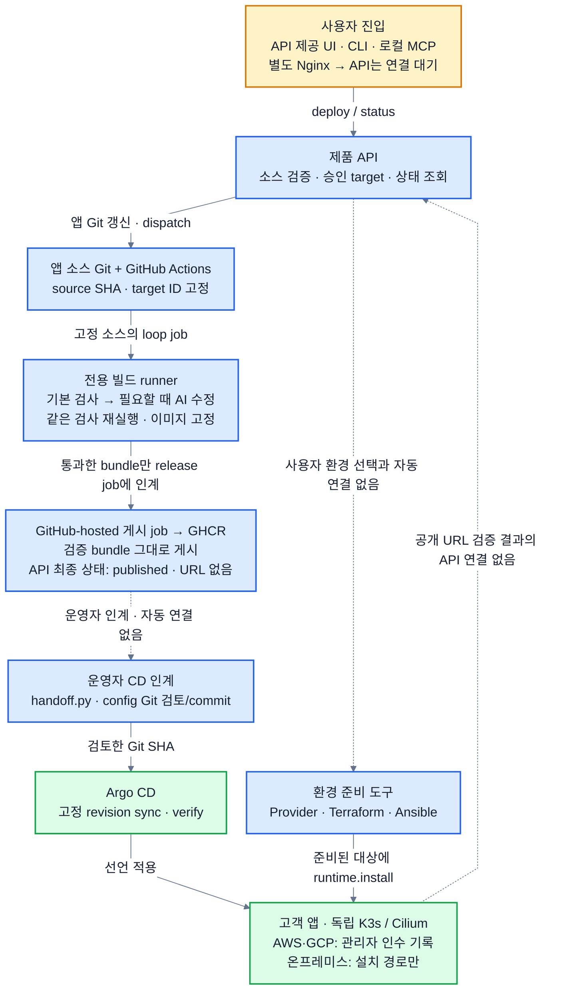
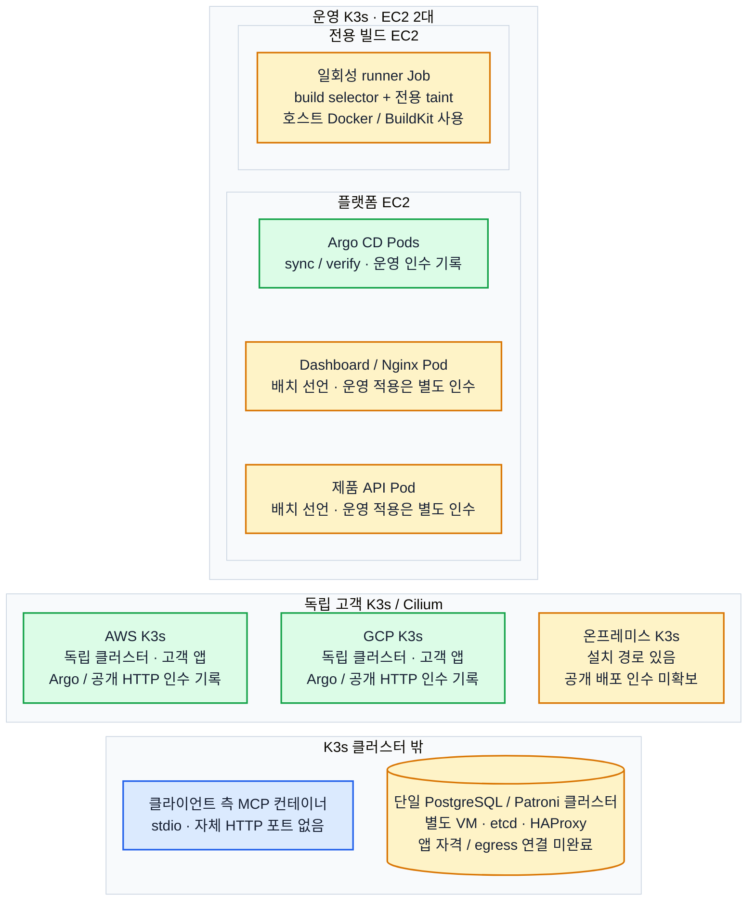
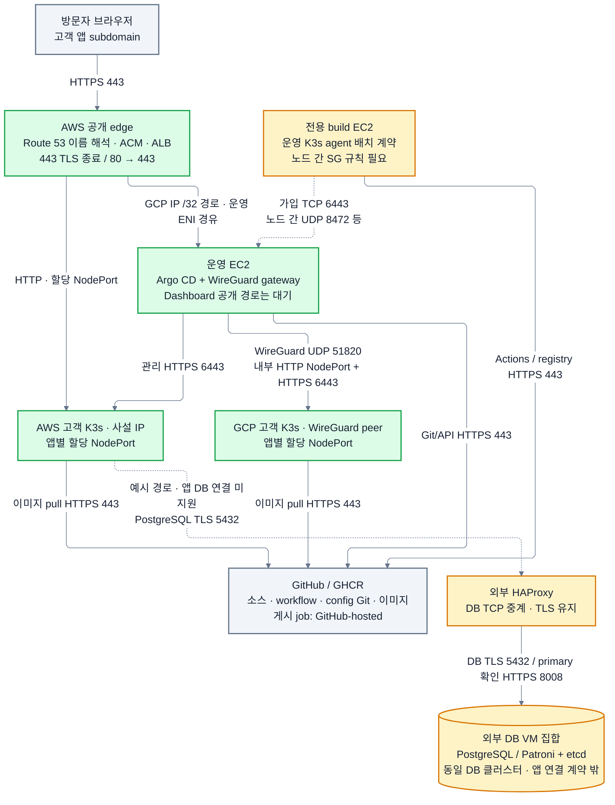
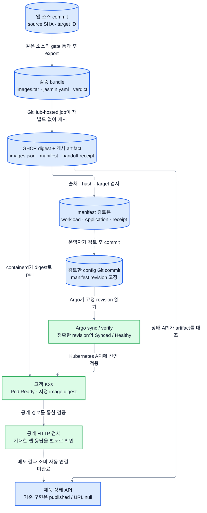
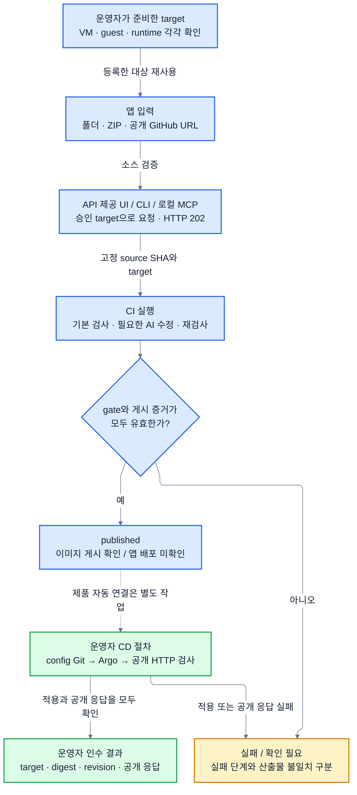
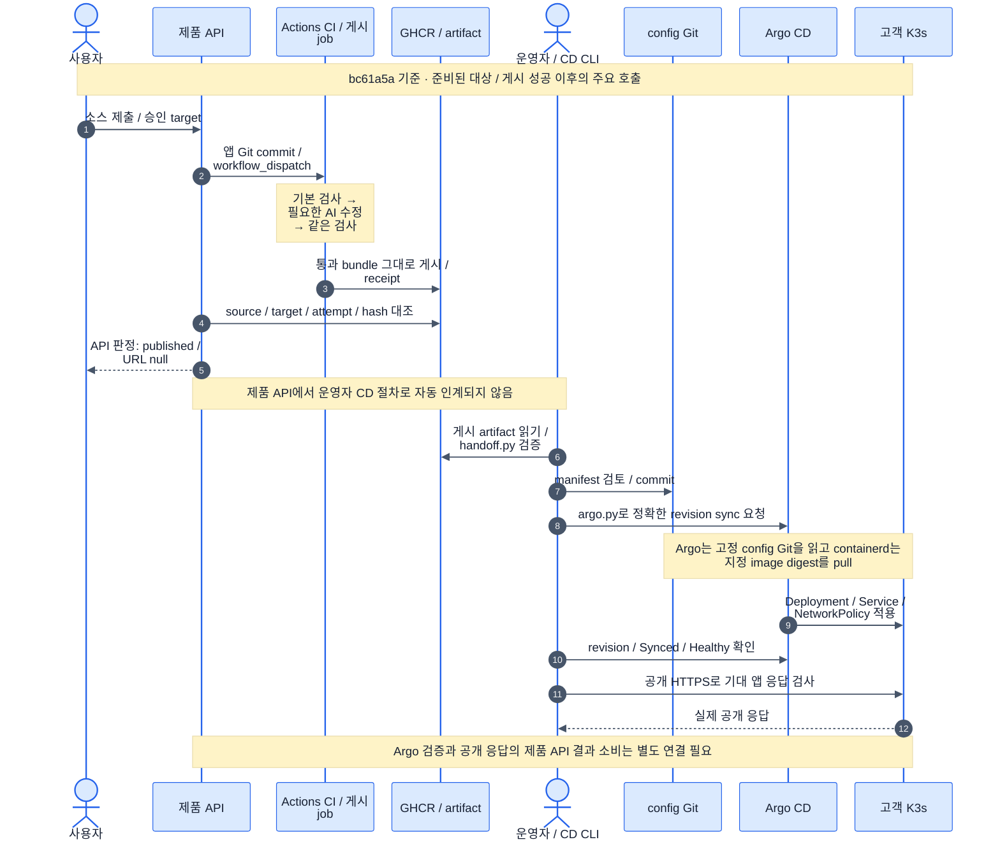

# RAILSHOT 공통 아키텍처

**네트워크 후속 결정(2026-10-02):** AWS·GCP·OpenStack 모두 self-managed K3s를 사용하고, 선택한 공급자 안에서 앱 공개 경로를 완성합니다. 새 목표와 Octavia L7 구현 범위는 [self-managed K3s 공개 경로](self-managed-ingress.md)를 따릅니다. 아래 Route53·중앙 ALB·WireGuard 그림은 명시된 기준 커밋의 구현 이력이며 새 목표의 완료 증거가 아닙니다.

**구현 기준: integration `bc61a5a2e00873191d3fee710d391ca6a8c57020` (2026-10-02).** AI 보조 검사·수정·이미지 게시, 운영자 GitOps/Argo 배포 도구, AWS/GCP 관리자 배포 인수 기록을 반영합니다. 작업 중인 제품 API 브랜치와 실시간 운영 상태를 이 기준에 합치지 않습니다.

RAILSHOT은 앱 소스를 검사하고, 필요한 경우 AI가 제한된 범위를 수정한 뒤 같은 검사를 다시 통과시켜 배포 가능한 이미지를 만듭니다. 운영 서비스와 전용 빌드 노드는 하나의 운영 K3s에 배치하고, 고객 앱은 AWS·GCP·온프레미스의 독립 K3s에서 실행합니다. DB는 모든 K3s 밖의 별도 VM 영역입니다.

## 읽는 기준과 검증 기록

- **파랑:** 기준 커밋의 구현 또는 산출물 계약입니다. 실제 운영 적용 완료를 뜻하지 않습니다.
- **초록:** 아래 인수 기록에 실행 근거가 있는 구성·절차입니다. 현재 가동 여부는 새 조회가 필요합니다.
- **노랑:** 추가 연결·적용·인수가 필요한 부분입니다.
- 흐름도의 실선은 구현된 호출·산출물·통신 방향입니다. 점선은 라벨에 적힌 수동 인계 또는 미연결 경계입니다. 시퀀스의 점선은 응답입니다. 클러스터 그림은 포함 관계이며 보이지 않는 정렬선에 통신 의미가 없습니다.

| 증거 | 확인한 범위 | 확대하지 않는 주장 |
|---|---|---|
| [AWS/GCP 관리자 배포](../integration/cloud-e2e-progress.md), [Inference Atlas](../poc/inference-atlas-20261002.md) | private 이미지 게시·pull, Argo 적용 revision, Pod digest, 공개 HTTPS | 제품 요청 하나의 전체 자동 배포, 지속 가용성 |
| [컨테이너 배치](container-deployment.md), [운영 Cilium 전환 절차](../operations/control-cilium-migration.md) | 플랫폼/빌드 선언과 CNI 전환·복구 절차 | 이 문서만으로 이미지 게시·운영 전환·build agent 가입 완료 |
| [Observability 인수](../integration/observability-acceptance-20261002.md) | 임시 AWS 환경의 수집·장애·복구·자원 정리 | 지속 운영 배치, 제품 UI 자동 연결 |
| [DB 인수](../integration/database-acceptance-20261002.md) | 임시 VM의 TLS SQL·동기 복제·동일 primary 백업·격리 복원 | 기존 화균 보유 VM 변경, 다중 거점 장애 내성·강제 failover |

[최초 소스 조립 기록](../integration/summary.md)과 [초기 검증 보고](../integration/validation.md)는 각 문서에 적힌 시점의 이력입니다. 아래 구조는 이후 병합된 구현을 포함합니다. 진행 중인 운영 전환과 자원 수명 연장 결과는 담당 인수 기록에서 갱신합니다.

## A. 코드 책임과 배치

| 영역 | 정본 | 책임 |
|---|---|---|
| UI·API·CLI·MCP | `apps/dashboard`, `apps/api/src` | 소스 검증, GitHub 요청, 게시 상태 소비. MCP는 클라이언트 측 stdio |
| CI·AI·게시 | `ci/workflows/railshot-deploy.yml`, `ci/scripts/loop`, `ci/scripts/publication.py` | 기본 검사 → 필요한 AI 수정 → 같은 검사 → 통과 bundle 게시 |
| VM 준비 | `infrastructure/providers`, `infrastructure/terraform` | Provider의 SDK 실행과 Terraform 실행은 별도 진입점 |
| guest/runtime 연결 | `infrastructure/ansible/api.py`, `run.py`, `runtime.yml` | 등록된 descriptor/target 검증, guest 검사, 공통 설치 호출, nonce 영수증 확인 |
| K3s·Cilium | `deployment/bootstrap`, `deployment/cilium` | 고객 단일 노드 프로필과 운영 server+전용 build agent 프로필 |
| CD | `gitops/handoff.py`, `gitops/argo.py` | manifest 검토본 생성과 고정 Git revision sync/verify를 분리 |
| 공개 입구 | `infrastructure/terraform/aws-edge` | Route 53·ACM·ALB IP target·GCP 사설 경로·WG gateway 규칙 |
| 관측 | `observability` | 별도 관측 VM과 대상 exporter. CI 실행 이벤트와도 별도 |
| DB | `infrastructure/ansible/roles`, `playbooks` | 외부 VM의 PostgreSQL/Patroni·etcd·HAProxy·백업 |

### A.1 전체 제품 흐름

[Mermaid 원본](diagrams/system-overview.mmd) · [PNG](diagrams/system-overview.png) · [SVG](diagrams/system-overview.svg)

기준 구현에서 자동 제품 경로는 이미지 게시 상태까지입니다. API가 직접 제공하는 UI·CLI·MCP는 같은 HTTP 계약을 사용합니다. 분리된 정적 Nginx에는 아직 API 프록시가 없으므로 컨테이너를 함께 배치하는 것만으로 프런트 연결이 끝나지 않습니다. 사용자 환경 선택→Provider/Ansible, CI→CD, 공개 결과→API 연결은 후속 제품 작업입니다.

Argo CD는 설치·sync·verify 코드와 관리자 실행 증거가 있습니다. 전체를 미구현으로 표시하지 않습니다. API가 runner Pod에 직접 작업을 보내는 구조도 아닙니다. GitHub Actions가 전용 runner에 검사 job을 할당하고, 별도의 GitHub-hosted release job이 통과한 bundle을 그대로 GHCR에 게시합니다.

### A.2 클러스터 구성

[Mermaid 원본](diagrams/cluster-structure.mmd) · [PNG](diagrams/cluster-structure.png) · [SVG](diagrams/cluster-structure.svg)

운영 K3s는 기존 플랫폼 EC2와 전용 빌드 EC2 두 대를 사용하는 배치입니다. Dashboard/API/Argo는 플랫폼 노드, 일회성 runner Job은 build label·taint가 있는 전용 노드에 둡니다. 이 그림은 선언된 배치이며 실제 가입한 노드 수나 현재 Pod 목록을 대신하지 않습니다.

runner는 hostNetwork·Docker socket·NET_ADMIN과 호스트 BuildKit을 사용하는 신뢰된 실행기입니다. 전용 EC2, 고객 코드 컨테이너의 기존 제한, 호스트 방화벽 검증을 함께 유지합니다. taint는 스케줄링 장치이고 Docker/BuildKit은 Pod 자원 할당량 밖에서 동작합니다.

고객 AWS/GCP/온프레미스는 독립 클러스터입니다. 고객 설치 프로필의 단일 amd64 노드 제한을 운영 두 노드 배치나 DB 수량 제한으로 확대하지 않습니다. 운영 Pod/Service CIDR은 `10.52.0.0/16` / `10.53.0.0/16`, 각 고객 프로필은 `10.42.0.0/16` / `10.43.0.0/16`입니다. Cilium은 VXLAN을 사용하고 kube-proxy를 유지합니다. 기존 Flannel의 운영 전환은 별도 인수 대상입니다.

DB는 거점별 독립 DB가 아니라 **K3s 밖의 단일 Patroni 클러스터**입니다. HTTP `database.configure`의 승인 HA profile 실행 연결은 구현됐습니다. 앱에 DB endpoint·TLS·자격·egress를 주입하는 CD 연결은 별도이며, 기존 DB VM 작업은 동결 범위로 둡니다. [하이브리드 DB 구조](hybrid-db.md)를 따릅니다.

### A.3 네트워크 토폴로지

[Mermaid 원본](diagrams/network-topology.mmd) · [PNG](diagrams/network-topology.png) · [SVG](diagrams/network-topology.svg)

Route 53은 이름을 해석하고 실제 HTTPS는 브라우저에서 ALB로 전달됩니다. ALB에서 TLS를 종료하며 target type은 **`ip`**입니다. AWS 고객 노드에는 사설 IP의 앱별 NodePort로 연결합니다. GCP는 ALB subnet의 `/32` 경로가 운영 ENI를 향하고, gateway가 원래 ALB source를 유지해 WireGuard로 전달합니다. 그림의 공개 경로는 고객 앱 경로이며 제품 `railshot.io` Dashboard 공개 완료를 뜻하지 않습니다.

WireGuard UDP 51820 안에는 GCP 앱의 HTTP NodePort와 Argo의 HTTPS 6443 관리 요청이 들어갑니다. AWS 고객 API는 사설 HTTPS 6443으로 접근합니다. **Cilium은 클러스터 내부, WireGuard는 클라우드 사이의 노드 경로**입니다. 독립 클러스터의 Pod CIDR 재사용은 클러스터 간 Pod 전체 연결을 의미하지 않습니다. 온프레미스의 실제 공개 경로는 별도 인수 전이므로 GCP의 검증된 경로를 그대로 적용한 것으로 그리지 않습니다.

기준 커밋의 CI SG는 ingress가 없고 egress가 HTTP/HTTPS·지정 DNS 중심입니다. 운영 build agent 가입에는 제한된 peer 사이의 TCP 6443, VXLAN UDP 8472와 필요한 kubelet/상태 검사 통신을 맞춰야 합니다. 기존 Docker 격리 방화벽과의 공존도 가입 후 실제 job으로 확인합니다. 포트 계약은 [runner 절차](../../ci/scripts/runner/README.md)를 따릅니다.

고객 앱의 DB 연결 점선은 후속 계약입니다. HAProxy는 PostgreSQL TLS를 종료하지 않고 TCP 5432로 전달합니다. primary 확인은 Patroni HTTPS 8008, DB 복제는 TLS 5432, Patroni→etcd는 mTLS 2379, etcd peer는 mTLS 2380입니다. 현재 stateless CD는 secret·외부 egress를 거부하고 `egress: []`를 생성합니다.

## B. 산출물과 완료 상태

source commit과 manifest commit은 서로 다른 판본입니다. CI가 source/target/run/producer attempt를 고정하고 게시 receipt의 hash를 검사하며, CD는 검토한 config Git revision과 image digest를 고정합니다. 한 단계의 성공으로 다음 단계까지 성공 처리하지 않습니다.

| 상태/경계 | 생산자 → 소비자 | 판단 |
|---|---|---|
| VM accepted / ACTIVE | Provider → 운영자/환경 실행기 | 생성 접수·VM 상태. guest/runtime ready와 다름 |
| guest/runtime ready | Ansible → 호출자 | 요청·대상·nonce가 맞는 단계 영수증 확인 |
| published | CI artifact → 제품 상태 API | source/target/attempt/artifact/hash 일치. `url:null` |
| rendered_for_review | `handoff.py` → 운영자 | Deployment·Service·NetworkPolicy·Application 검토본. `deployed:false` |
| Argo 적용 검증 | `argo.py` → 운영자 | 정확한 revision의 Succeeded/Synced/Healthy. `public_verified:false` |
| 공개 앱 응답 | 외부 HTTP 검사 → 운영자 | 실제 앱 응답 확인. 현재 제품 상태 API 자동 소비 없음 |

[CD 인계](../../gitops/handoff.py)는 linux/amd64 단일 stateless service만 지원하며 DB·secret·migration·외부 egress를 거부합니다. [Argo 실행기](../../gitops/argo.py)는 고정 Git SHA의 workload 일치를 확인한 뒤 sync와 상태 검증을 수행합니다. manifest 생성과 실제 적용을 서로 다른 단계로 유지합니다.

### B.1 데이터 흐름

[Mermaid 원본](diagrams/data-flow.mmd) · [PNG](diagrams/data-flow.png) · [SVG](diagrams/data-flow.svg)

### B.2 접근과 자격 경계

기준 API는 명시한 Host/Origin과 내부 Bearer token을 검증하고 GitHub 자격은 API에만 제공합니다. MCP는 클라이언트 측 프로세스이며 승인된 관리 경로로 내부 API에 접속합니다. GitHub·클라우드 자격은 브라우저에 전달하지 않습니다. 기준 UI는 사용자가 입력한 API 접근 token을 요청에 사용하며, 공개 데모의 서버 프록시 방식은 작업 중인 브랜치의 별도 변경입니다. 진행 중인 로그인 없는 공개 데모의 Nginx 서버 프록시 연결과 새 제품 API는 기준 커밋의 구현 완료로 계산하지 않습니다. 별도 user/auth 도메인 구현을 이 문서의 필수 후속 작업으로 추가하지 않습니다.

Provider의 OpenStack password/application credential, Ansible의 strict SSH host key, GitHub/registry 자격, 고객 Kubernetes API 자격은 각각 별도 계약입니다. 회의의 unscoped token 제안과 현재 Provider의 지원 방식을 혼동하지 않습니다. 상세 입력은 [Provider 문서](../../infrastructure/providers/openstack/README.md), [Ansible 인터페이스](../api/ansible.md), [제품 API 설계](../api/ci-backend-design.md)에서 확인합니다.

## C. 사용자 조작과 실행 순서

### C.1 사용자 흐름

[Mermaid 원본](diagrams/user-flow.mmd) · [PNG](diagrams/user-flow.png) · [SVG](diagrams/user-flow.svg)

폴더·ZIP·공개 GitHub URL을 제출하면 API가 입력을 검증하고 운영자가 승인한 target으로 CI를 요청합니다. HTTP 202는 접수이고, `published`는 이미지 게시입니다. 관리자 CD 인수 경로는 이미 존재하지만 제품 요청 한 번의 자동 배포 완료와 구분합니다. 환경 생성·DB 연결·온프레미스 실제 공개 배포를 이 그림의 완료 조건에 암묵적으로 포함하지 않습니다.

### C.2 구현된 호출과 운영자 인계 시퀀스

[Mermaid 원본](diagrams/deployment-sequence.mmd) · [PNG](diagrams/deployment-sequence.png) · [SVG](diagrams/deployment-sequence.svg)

게시 성공 경로의 주요 호출만 표시합니다. 실패·게시 증거 확인 불가 상태는 앞의 사용자 흐름을 따르며, API가 job 결과와 artifact 검증을 바탕으로 `failed` 또는 `publication_unverified`를 계산합니다. 검사 job과 게시 job을 Actions 참가자로 묶었습니다. 실제 검사·AI 수정은 전용 runner, 검증 bundle 게시는 GitHub-hosted job이 수행합니다. API에서 운영자 CD 단계로 넘어가는 자동 호출을 그리지 않습니다.

## 요소·연결 근거와 남은 인수

| 그림 요소/연결 | 직접 근거 | 주장 상한 |
|---|---|---|
| 진입과 CI 요청/조회 | [server](../../apps/api/src/server.js), [github](../../apps/api/src/github.js), [Nginx](../../apps/dashboard/nginx.conf) | API 제공 UI/CLI/MCP와 published 상태. 분리 Nginx 프록시는 기준 구현에 없음 |
| 검사·AI·bundle·게시 | [workflow](../../ci/workflows/railshot-deploy.yml), [loop](../../ci/scripts/loop/loop.py) | 같은 검사와 통과한 이미지의 게시. 실제 runner 가입 완료는 별도 |
| Provider/Ansible/runtime | [Ansible API](../../infrastructure/ansible/api.py), [runtime](../../infrastructure/ansible/runtime.yml) | 등록된 descriptor로 설치 호출. 제품 환경 생성 자동 연결과 다름 |
| 운영 노드 배치 | [platform](../../deployment/manifests/platform.yaml), [build runner](../../deployment/manifests/build-runner.yaml), [Cilium preflight](../../deployment/cilium/preflight.py) | 선언된 역할·권한·CIDR. 운영 적용 결과는 해당 인수 기록 |
| CD와 상태 | [handoff](../../gitops/handoff.py), [argo](../../gitops/argo.py) | 검토본 생성, 운영자 sync/verify 구현. 공개 URL의 제품 소비 미연결 |
| ALB/WG·고객 경로 | [edge](../../infrastructure/terraform/aws-edge/main.tf), [AWS/GCP 인수](../integration/cloud-e2e-progress.md) | IP target·GCP 경로 구현과 관리자 실행 기록. 모든 target의 자동 연결 아님 |
| DB·관측 | [DB 인수](../integration/database-acceptance-20261002.md), [관측 인수](../integration/observability-acceptance-20261002.md) | 임시 자원에서 제한된 검증과 정리. 현재 상시 운영 설치 아님 |

운영 Cilium 전환, build agent 가입과 고객 job, 플랫폼 이미지 게시·Dashboard/API 배치·`railshot.io` DNS/TLS는 각각 실제 실행 증거로 닫습니다. 제품의 최종 인수는 한 요청의 source/target/digest/config revision을 유지한 CI→CD→공개 URL 결과 반환입니다. DB 기존 VM 작업은 동결하고, 앱 DB 연결은 이번 실행환경 종료 범위에서 제외합니다.

이 문서의 본문 Mermaid와 별도 원본 여섯 개는 동일하게 유지합니다. SVG·PNG는 해당 원본에서 생성하고 렌더를 확인합니다. 원본·출력 hash와 검증 범위는 [그림 검증 결과](diagrams/render-validation.json)에 기록합니다. 그림의 문법·표시 검사는 클라우드 배포 검증을 대신하지 않습니다.
