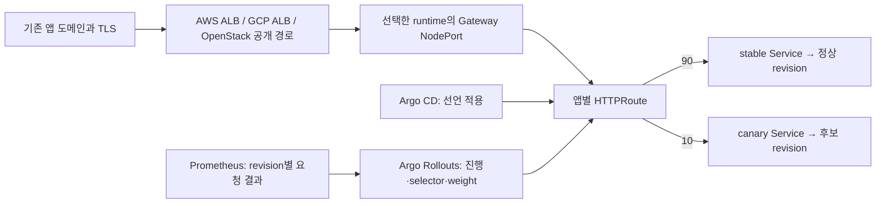

# 앱별 배포 전략 지원 계획

작성: 2026-10-03 · 상태: 조사와 코드 근거에 기반한 제안. 전략 구현·컨트롤러 설치·운영 설정 변경은 수행하지 않았다.

코드 기준: `integration/team-assembly-20261002`의 [`e30feb7fca4ee65a78fa469b29421870542ea5bd`](https://github.com/Jasmin-Softbank/Railshot/tree/e30feb7fca4ee65a78fa469b29421870542ea5bd). 진행 중인 자동 배포·삭제 작업의 후속 커밋은 포함하지 않는다. 구현을 시작할 때 해당 작업의 최종 SHA와 실제 검증 결과로 아래 선행조건을 다시 확인한다.

## 권고

**앱 생성·업데이트·삭제의 수명주기를 먼저 완성하고, Rolling Update → Blue-Green → 실제 트래픽 분할 Canary 순으로 지원한다.** CI의 검사·AI 수정·불변 이미지 게시와 Argo CD의 Git 선언 적용은 유지한다. 앱 전략 때문에 같은 이미지를 다시 빌드하거나 DNS를 릴리스마다 바꾸지 않는다.

이 문서에서 요청의 `rollout`은 **Rolling Update**라는 전략을 뜻한다. **Argo Rollouts**는 Blue-Green·Canary 진행을 맡길 컨트롤러 후보다. 단순 Rolling Update는 Kubernetes Deployment를 재사용한다. 승격·분석·중단·이전 revision 보존까지 필요한 단계부터 Argo Rollouts를 도입하며, 별도의 자체 rollout controller는 작성하지 않는다.

| 전략 | 실행 방식 | 트래픽 경로 | 지원을 열 조건 |
|---|---|---|---|
| Rolling Update | 기존 `apps/v1 Deployment`에 교체 정책·준비 시간·기한 명시 | 기존 앱 Service·NodePort·LB 유지 | 동일 앱 업데이트, 용량 확인, 실패와 rollback 증거 |
| Blue-Green | Argo Rollouts가 active/preview Service selector와 ReplicaSet 관리 | 기존 active Service의 NodePort 유지, preview는 내부 ClusterIP | Rollouts 설치·권한·Git 소유권 조정, 후보 검증, 수동 승격·복귀·정리 |
| Canary | Argo Rollouts + Gateway API plugin + 검증된 L7 라우터 | 기존 외부 LB → Gateway → stable/canary Service | 실제 요청 분할·revision별 관측·가중치 복귀·라우터 장애 검증 |

첫 지원 범위는 현재 renderer가 받는 **단일 HTTP service의 stateless 앱**이다. DB 사용 앱은 아래 호환성 조건을 별도로 충족해야 한다. 여러 service의 동시 전환, worker/queue consumer, TCP/gRPC, sticky session·장시간 WebSocket의 전환 보장은 별도 확장이다. 이 범위를 지원하는 것처럼 기본 성공 처리하지 않는다.

## 현재 코드에서 확인한 사실

아래 근거는 모두 고정된 기준 SHA의 코드다. 문서에 적힌 설계와 실제 운영 배포 여부는 별도다.

| 확인한 동작 | 코드 근거 | 계획에 미치는 영향 |
|---|---|---|
| 앱 ID는 환경·tenant·app으로 결정되고 앱별 target을 생성 | [applications.js L33–42](https://github.com/Jasmin-Softbank/Railshot/blob/e30feb7fca4ee65a78fa469b29421870542ea5bd/apps/api/src/applications.js#L33-L42) | Blue/Green을 서로 다른 사용자 앱으로 등록하지 않는다. 기존 앱 선택 후 revision만 추가한다. |
| 하나의 queued/running/unknown 작업이 workspace 전체 신규 실행을 막음 | [product.js L17–42](https://github.com/Jasmin-Softbank/Railshot/blob/e30feb7fca4ee65a78fa469b29421870542ea5bd/apps/api/src/product.js#L17-L42) | 승인 대기 Canary가 다른 앱까지 막히지 않도록 앱 admission과 공유 writer 잠금을 구분해야 한다. |
| 재시작하면 진행 중 작업을 unknown으로 보존 | [product-store.js L94–101](https://github.com/Jasmin-Softbank/Railshot/blob/e30feb7fca4ee65a78fa469b29421870542ea5bd/apps/api/src/product-store.js#L94-L101) | 재시작을 후보 재배포나 자동 승격으로 처리하지 않는다. 먼저 실제 상태를 읽는다. |
| CI 산출물의 app·target·source·digest를 검증하고 CD로 전달 | [handoff.py L64–98](https://github.com/Jasmin-Softbank/Railshot/blob/e30feb7fca4ee65a78fa469b29421870542ea5bd/gitops/handoff.py#L64-L98), [applications.js L63–85](https://github.com/Jasmin-Softbank/Railshot/blob/e30feb7fca4ee65a78fa469b29421870542ea5bd/apps/api/src/applications.js#L63-L85) | 전략 정책도 같은 release 증거에 묶고, 승격·복귀에서 재빌드하지 않는다. |
| 고객 앱은 하나의 Deployment + NodePort Service + NetworkPolicy. `strategy`는 생략 | [handoff.py L137–182](https://github.com/Jasmin-Softbank/Railshot/blob/e30feb7fca4ee65a78fa469b29421870542ea5bd/gitops/handoff.py#L137-L182) | Kubernetes 기본 RollingUpdate에 의존한다. 앱별 전략 지원이 이미 구현된 것은 아니다. |
| bootstrap 샘플 workload에는 `maxUnavailable:0/maxSurge:1`이 있음 | [workload.json.template L1–12](https://github.com/Jasmin-Softbank/Railshot/blob/e30feb7fca4ee65a78fa469b29421870542ea5bd/deployment/manifests/workload.json.template#L1-L12) | 이 샘플을 고객 앱 renderer의 동작 근거로 혼동하지 않는다. |
| Argo 검증·AppProject는 종류와 소유 객체를 엄격히 제한 | [argo.py L16–64](https://github.com/Jasmin-Softbank/Railshot/blob/e30feb7fca4ee65a78fa469b29421870542ea5bd/gitops/argo.py#L16-L64), [L155–183](https://github.com/Jasmin-Softbank/Railshot/blob/e30feb7fca4ee65a78fa469b29421870542ea5bd/gitops/argo.py#L155-L183) | Rollout·추가 Service·AnalysisRun을 허용하려면 manifest 생성뿐 아니라 검증과 권한도 함께 확장한다. |
| AWS는 앱 route당 target group 하나, GCP는 backend service 하나, Octavia는 pool/member 경로 | [AWS target L118–135](https://github.com/Jasmin-Softbank/Railshot/blob/e30feb7fca4ee65a78fa469b29421870542ea5bd/infrastructure/terraform/aws-edge/main.tf#L118-L135), [listener L197–207](https://github.com/Jasmin-Softbank/Railshot/blob/e30feb7fca4ee65a78fa469b29421870542ea5bd/infrastructure/terraform/aws-edge/main.tf#L197-L207), [GCP L86–164](https://github.com/Jasmin-Softbank/Railshot/blob/e30feb7fca4ee65a78fa469b29421870542ea5bd/infrastructure/terraform/gcp-edge/main.tf#L86-L164), [Octavia L31–71](https://github.com/Jasmin-Softbank/Railshot/blob/e30feb7fca4ee65a78fa469b29421870542ea5bd/infrastructure/terraform/openstack-edge/main.tf#L31-L71) | 현재 route 계약에는 stable/canary 가중치 제어가 없다. |
| AWS route 쓰기는 새 route와 부가 네트워크만 허용, GCP도 기존 앱 route 변경 거절 | [edge.py L194–223](https://github.com/Jasmin-Softbank/Railshot/blob/e30feb7fca4ee65a78fa469b29421870542ea5bd/gitops/edge.py#L194-L223), [gcp_routes.py L203–214](https://github.com/Jasmin-Softbank/Railshot/blob/e30feb7fca4ee65a78fa469b29421870542ea5bd/gitops/gcp_routes.py#L203-L214) | 기존 LB를 weight나 Gateway로 전환하는 작업은 현재 `ensure` 호출로 해결되지 않는다. 소유 route 변경 계약이 필요하다. |
| OpenStack 공개 경로는 Octavia와 기존 Cloudflare Tunnel을 함께 검증·등록 | [application_routes.py L74–125](https://github.com/Jasmin-Softbank/Railshot/blob/e30feb7fca4ee65a78fa469b29421870542ea5bd/deployment/scripts/application_routes.py#L74-L125) | 연결 검증·삭제 시 Tunnel 경로와 Octavia 경로의 소유권을 모두 보존한다. 이는 실환경 E2E 성공 주장과 다르다. |
| Traefik/ServiceLB 비활성, Cilium kubeProxyReplacement=false | [install-k3s.sh L6–18](https://github.com/Jasmin-Softbank/Railshot/blob/e30feb7fca4ee65a78fa469b29421870542ea5bd/deployment/bootstrap/install-k3s.sh#L6-L18), [Cilium install.sh L23–29](https://github.com/Jasmin-Softbank/Railshot/blob/e30feb7fca4ee65a78fa469b29421870542ea5bd/deployment/cilium/install.sh#L23-L29) | 사용 가능한 L7 Gateway가 이미 있다고 가정하지 않는다. |
| 앱 배포 전략·승격·취소·앱 삭제 endpoint가 이 기준 SHA에는 없음 | [server.js](https://github.com/Jasmin-Softbank/Railshot/blob/e30feb7fca4ee65a78fa469b29421870542ea5bd/apps/api/src/server.js), [product.openapi.json](https://github.com/Jasmin-Softbank/Railshot/blob/e30feb7fca4ee65a78fa469b29421870542ea5bd/docs/api/product.openapi.json) | 진행 중인 자동 배포·삭제 구현을 합친 뒤 계약을 확정한다. 조회 중지는 배포 취소가 아니다. |

## 구현 시작 조건: 자동 배포·삭제 완료 증거

전략 구현을 시작하기 전에 담당 배포·삭제 플로우의 최종 revision에서 다음을 한 번의 앱 수명주기로 확인한다. 현재 작업의 완료를 이 문서가 대신 선언하지 않는다.

1. 새 앱 등록 → 검증 이미지 게시 → 정확한 Git revision 적용 → Pod digest 일치 → 앱 공개 HTTPS와 release 식별 확인.
2. 동일 `application_id`를 선택한 업데이트가 namespace·hostname·공유 runtime을 새로 만들지 않음. 서로 다른 파일명으로 업로드해도 선택한 앱 identity 유지.
3. 삭제 intent 기록 → 신규 배포 차단 → 해당 앱 외부 경로 종료·drain → Git/Argo 재생성 차단 → 앱 소유 리소스 정리 → 부재 readback → tombstone/receipt 보존.
4. 삭제 후 다른 앱, 공유 LB/listener, 인증서, DNS zone, Tunnel, runtime 노드와 독립 `/healthz`가 보존됨. 앱 전용 CI binding·credential renewal·관측 항목만 정리됨.
5. 배포/삭제 중 프로세스 종료, API 재시작, route 적용 timeout, 같은 요청 중복 제출 후 결과를 읽어 복구할 수 있음. 불명 상태를 DB 값 수정으로 성공 처리하지 않음.
6. 첫 검증은 한 provider에서 끝낸 뒤 같은 검사를 GCP·OpenStack에 적용. provider별 capability는 통과한 범위만 열고, 모두 지원한다는 일괄 표시를 하지 않음.

현재 진행 중인 CD resume/reconcile·삭제 구현은 재사용할 대상이다. 이 계획을 이유로 별도 재시도·삭제 실행기를 중복 작성하지 않는다.

## 1단계: Rolling Update를 명시적인 제품 기능으로 만들기

기존 `gitops/handoff.py`의 Deployment를 재사용한다. 앱의 검증된 readiness 경로, resource requests/limits, image digest, NodePort를 유지한다. 기본 정책 후보는 `maxUnavailable:0`, `maxSurge:1`이며 `minReadySeconds`, `progressDeadlineSeconds`, startup/termination 정책은 앱의 시작·종료 특성을 반영해 제한된 값으로 받는다.

Kubernetes는 진행 기한 초과를 상태로 보고하며 그 자체로 이전 버전으로 자동 복귀시키지 않는다. 따라서 release 작업은 실패를 보존하고, 정책에 따른 rollback 또는 사용자 rollback을 **이전 정상 digest·설정의 새 Git commit**으로 수행한다. 기존 Argo CD와 충돌하는 일회성 `kubectl rollout undo`만 실행하고 끝내지 않는다. [Kubernetes Deployment 공식 문서](https://kubernetes.io/docs/concepts/workloads/controllers/deployment/)

통과 조건은 새 revision 전체 ready, 실제 Pod imageID, 안정화 시간, 공개 앱 경로와 release 식별이다. 전환 중 응답 실패율도 측정한다. 단일 노드가 죽는 장애까지 무중단으로 보장한다고 표현하지 않는다. 추가 Pod와 종료 중 Pod까지 수용할 여유가 없으면 사전 차단하며, 몰래 `Recreate`로 바꾸지 않는다.

## 2단계: Blue-Green

진행 제어는 Argo Rollouts에 맡긴다. 대상 runtime에 고정 버전·digest의 controller/CRD를 설치하는 선택 기능으로 만들고, 고객 앱 namespace에 필요한 권한만 부여한다. 플랫폼 API 자신은 이번 전략 대상에서 제외한다. API는 현재 단일 PVC writer이므로 그 Deployment의 `Recreate`를 고객 앱과 같이 변경하지 않는다.

기존 앱 Service를 active Service로 사용하여 외부 LB target과 NodePort를 유지한다. 새 preview Service는 같은 앱 namespace의 ClusterIP로 만들고, 제한된 검증 Job이 후보의 readiness·release 식별·smoke 요청을 확인한다. Preview를 위해 공용 DNS나 외부 NodePort를 자동 추가하지 않는다. Rollouts는 active/preview selector를 관리하고, 승격 후 기존 ReplicaSet을 일정 기간 보존할 수 있다. [공식 Blue-Green 동작](https://argoproj.github.io/argo-rollouts/features/bluegreen/)

진행 순서는 후보 생성 → 후보 검증 → `awaiting_promotion` → 승격 → active endpoint·공개 경로 검증 → 보존 기간 종료 → 이전 revision 축소다. 첫 버전은 수동 승격을 기본으로 하고, 동일 검증을 통과한 정책만 자동 승격을 선택하게 한다. 실패 시에는 기존 정상 revision으로 트래픽 복귀를 확인하고 결과를 남긴다. Service 변경 전파와 연결 drain을 고려해 이전 Pod를 즉시 삭제하지 않는다.

기존 Deployment를 바로 삭제하고 kind만 Rollout으로 바꾸지 않는다. 기존 workload와 후보 Rollout을 함께 기동하고, 동일 digest 후보를 먼저 검증한 뒤 기존 Service를 인계하고 구 Deployment를 축소한다. 이때 임시 리소스도 앱 소유 목록에 기록한다. `workloadRef`를 선택하면 Deployment replicas에 대한 Git/컨트롤러 소유권까지 고정해야 한다. 정확한 이행 방식은 작은 migration 검증에서 하나로 확정한다. [공식 migration 절차](https://argoproj.github.io/argo-rollouts/migrating/)

이행 검증 전에는 Rollout을 임시 active/preview Service에 연결해 기존 공개 Service를 먼저 바꾸지 못하게 한다. 두 controller와 기존 공개 Service의 Pod 선택 범위를 구분하고, legacy Service의 EndpointSlice에 후보 Pod UID가 섞이지 않음을 확인한다. 서비스 인계·실패 복귀 때 실제 endpoint가 어떤 owner UID와 digest에 속하는지도 확인한다.

현재 완료 판정은 [Deployment를 직접 선택](https://github.com/Jasmin-Softbank/Railshot/blob/e30feb7fca4ee65a78fa469b29421870542ea5bd/gitops/argo.py#L216-L262)하며, [로그 reader도 Deployment → ReplicaSet → Pod의 owner UID를 추적](https://github.com/Jasmin-Softbank/Railshot/blob/e30feb7fca4ee65a78fa469b29421870542ea5bd/gitops/logs.py#L143-L195)한다. P2에서 두 경로를 함께 확장한다. Rollout의 관측 generation·stable/candidate hash·분석/승격 상태와 실제 Pod digest를 묶고, 진행 중에도 두 revision의 로그를 소유권 검증 후 구분해 보여준다. Argo의 aggregate Healthy만으로 승격 완료를 판정하지 않는다.

## 3단계: Canary와 트래픽 라우팅 선택

replica 비율을 트래픽 비율로 표시하지 않는다. 특히 replica 1~2개인 현재 형태에서는 10%를 Pod 수로 구현할 수 없다. Rollouts도 별도 traffic manager가 없으면 replica 수로 근사한다. [공식 Canary 제약](https://argoproj.github.io/argo-rollouts/features/canary/)

| 후보 | 공식 기능과 현재 구조의 차이 | 판단 |
|---|---|---|
| AWS/GCP/Octavia의 native weight | [AWS weighted target groups](https://docs.aws.amazon.com/elasticloadbalancing/latest/application/rule-action-types.html), [GCP weightedBackendServices](https://docs.cloud.google.com/load-balancing/docs/https/traffic-management-global), [Octavia member weight](https://docs.openstack.org/api-ref/load-balancer/v2/index.html) 자체는 존재 | 새 proxy는 줄지만 3종 변경·readback·rollback과 Terraform 충돌 처리가 필요. 첫 공통 구현으로 선택하지 않는다. AWS weight는 unhealthy 그룹에서 건강한 그룹으로 자동 failover하지 않으므로 별도 복귀 제어도 필요하다. |
| Argo Rollouts 내장 ALB/GCP 연동 | [ALB 연동](https://argoproj.github.io/argo-rollouts/features/traffic-management/alb/)은 AWS Load Balancer Controller가 관리하는 Ingress를 전제로 함. [GCP 연동](https://argoproj.github.io/argo-rollouts/features/traffic-management/google-cloud/)은 Gateway API plugin 경로 | 지금 Terraform이 소유한 ALB/URL map에 그대로 붙이는 방안은 제외. 같은 LB를 두 writer가 관리하지 않는다. |
| Cilium Gateway API | 기존 CNI 재사용 가능하지만 [공식 전제](https://docs.cilium.io/en/stable/network/servicemesh/gateway-api/gateway-api/)에 kubeProxyReplacement=true와 L7/Gateway 설정 필요 | 현재 false이므로 별도 네트워크 전환이 된다. Canary 도입의 필수조건으로 CNI를 바꾸지 않는다. |
| Argo Rollouts + Gateway API plugin + Envoy Gateway | [HTTPRoute backendRefs weight](https://gateway.envoyproxy.io/docs/tasks/traffic/http-traffic-splitting/)로 요청을 분할하고 공통 Kubernetes 계약을 사용 | **우선 검증 후보.** CNI 교체 없이 외부 LB 뒤에 선택적으로 배치. 추가 controller/proxy의 자원·운영 비용과 장애 영향을 먼저 측정한다. |

Canary 경로의 제안 구조는 다음과 같다. 기존 DNS·TLS·외부 LB 역할을 유지하며, 등록된 앱의 backend 경로만 명시적으로 이행한다.



Gateway는 검증된 runtime에만 설치한다. 앱마다 새 LB/새 controller를 만들지 않는다. shared Gateway의 허용 namespace/hostname을 등록된 앱에 한정하고, 앱 HTTPRoute와 backend Services는 같은 namespace에 둔다. Gateway의 cross-namespace route 연결은 `allowedRoutes` 등으로 제한한다. 한 앱 삭제가 shared Gateway를 지우지 않게 소유권을 분리한다.

Envoy의 Service를 [명시적으로 NodePort로 설정](https://gateway.envoyproxy.io/docs/api/extension_types/#kubernetesservicespec)해 의도하지 않은 외부 LB 생성을 막는다. 현재 앱 NetworkPolicy는 등록된 ingress CIDR만 허용하므로 Gateway·preview 검증 Job의 namespace/Pod 범위와 필요한 egress를 별도로 제한해 허용한다. 실제 source IP와 Host 전달, 외부 LB가 겨냥하는 노드의 ready Gateway endpoint를 확인한다. `externalTrafficPolicy: Local`에서 해당 노드에 endpoint가 없으면 다른 노드에 Pod가 있어도 전달되지 않는 조건을 검증한다.

외부 LB health check의 Host·path·port도 함께 검증한다. 예를 들어 [AWS ALB는 대상 IP와 검사 port를 Host로 사용](https://docs.aws.amazon.com/elasticloadbalancing/latest/application/load-balancer-troubleshooting.html#a-registered-target-is-not-in-service)하므로 앱 hostname만 허용한 HTTPRoute로는 검사가 실패할 수 있다. Gateway readiness용 제한된 검사 경로와 앱 readiness를 구분하고, 실제 target health가 정상인 것을 전환 전 조건으로 둔다. 모든 Host를 임의 앱으로 보내는 wildcard로 우회하지 않는다. 이 검사는 환경 연결용 runtime `/healthz`를 대체하지 않는다.

**기존 NodePort 계약 변경을 별도 작업으로 취급한다.** 현재 Service selector로 다른 namespace의 Gateway Pod를 고르는 것은 불가능하므로 단순 selector 수정으로 연결하지 않는다. 새 Gateway NodePort와 stable 100% HTTPRoute를 먼저 검증하고, 해당 앱의 LB backend를 정확한 자원 ID·이전 값에 묶어 전환한 후 공개 경로를 확인한다. 실패 시 이전 NodePort로 복귀한다. 기존 앱 NodePort는 이행과 복귀 검증이 끝날 때까지 보존한다. shared ingress port와 앱 고유 backend port를 registry에서 구분하고, AWS/GCP의 additive-only validator 및 Octavia worker에는 **해당 앱 route의 제한된 update/reconcile 계약**을 추가한다. 전체 LB의 임의 수정 허용으로 풀지 않는다.

DNS 캐시로 비율을 나누거나 Cloudflare DNS 레코드를 단계마다 교체하지 않는다. Canary 단계의 weight 변경은 runtime 안에서만 일어나며 Terraform을 매 단계 실행하지 않는다.

버전은 설치 전에 고정한다. 현재 repo의 runtime pin은 K3s `v1.34.11+k3s1`, Cilium `1.20.2`다. [Envoy Gateway 호환표](https://gateway.envoyproxy.io/news/releases/matrix/)에는 v1.9/Kubernetes v1.34 조합이 있지만, [Rollouts Gateway plugin의 시험 목록](https://rollouts-plugin-trafficrouter-gatewayapi.readthedocs.io/en/latest/provider-status/)에 나온 Envoy 조합은 다르다. **두 표의 존재만으로 전체 조합 검증 완료를 주장하지 않는다.** Rollouts·plugin·Gateway·CRD·K3s의 고정 버전 전체를 한 disposable runtime에서 검증하고 checksum/image digest와 설치·제거 receipt를 남겨 capability를 연다.

## 공통 API·상태·권한 계약

아래는 새 계약의 제안이며 현재 지원되는 요청 예시는 아니다.

```json
{
  "application_id": "기존에 등록된 앱 ID",
  "expected_active_revision": "현재 정상 release ID",
  "deployment_strategy": {
    "type": "canary",
    "policy_id": "운영자가 검증한 정책 ID"
  }
}
```

- 앱 설정에는 기본 전략을 두고 매 배포에는 정규화된 정책 snapshot과 hash를 보존한다. 설정을 나중에 바꿔도 진행 중인 release는 바뀌지 않는다. multipart/API 검증, operation fingerprint, CD 전달, renderer와 receipt에 같은 값을 연결한다. 동일 Idempotency-Key에 다른 전략을 보내면 거절한다.
- 최초 배포에는 이전 stable이 없으므로 초기 revision 준비·공개 경로 검증으로 baseline을 만든다. Canary 비율 비교나 이전 revision 복귀가 가능한 것처럼 표시하지 않는다. 전략 변경은 정상 상태에서만 시작하며, Deployment/Rollout kind 또는 route 이행을 포함하면 일반 image update와 구분된 이행 절차와 복귀 증거를 요구한다.
- 환경 capability는 지원 전략, controller/route/metrics 준비 여부, 용량, 차단 이유를 반환한다. UI는 지원되지 않는 전략을 사전 표시한다. 요청 manifest, 임의 PromQL·URL·Secret·cluster endpoint를 사용자나 AI가 직접 공급하게 하지 않는다.
- 상태에 `active_revision`, `candidate_revision`, `previous_stable_revision`, 정책 hash, `step_index`, 요청/관측 weight, 관측 시각, 승인·abort·rollback 기록을 추가한다. 요청 weight, controller가 적용한 weight, 실제 측정한 요청 비율은 별도 값이다.
- 기존 operation store를 확장하여 `preparing → candidate_ready → analyzing/awaiting_promotion → promoting → verifying → succeeded`를 표현한다. 실패·abort·rollback 성공은 서로 다른 결과로 남긴다. API 재시작 후에는 Git SHA·Rollout UID/generation·Service/HTTPRoute·실제 endpoint를 읽어 단계와 연결을 복원한다.
- 같은 앱의 update/promote/abort/rollback/delete는 한 번에 하나만 허용한다. 현재 SQLite 저장을 이용한 영속 admission을 두고, shared Git writer·NodePort 할당·provider 변경의 짧은 잠금은 유지한다. 관찰·승인 대기 동안 공용 Git/노드 잠금을 계속 잡지 않는다. 기존 `checkFree()`만 제거하는 병렬화는 금지한다.
- 제어 요청은 앱 소유 세션과 대상 release·예상 generation을 확인하고 idempotent하게 처리한다. 세션 만료 후 앱을 다른 세션에 자동 양도하지 않는다. 현재 세션 모델의 복구·운영자 인계 경로를 먼저 정한다.
- 앱 삭제와 rollout abort를 구분한다. abort는 정상 revision을 서비스하며 후보 진행을 멈추는 작업, delete는 앱 전체를 종료하는 작업이다. 후보 정리는 shared LB·Gateway·runtime과 앱 이력을 보존한다.

Argo CD는 desired image·정책·정적 route 연결을, Rollouts는 ReplicaSet 진행·동적 Service hash selector·weight를 소유한다. `ignoreDifferences`는 그 앱의 그 필드에만 한정하고, sync 때도 존중되도록 검증한다. 전체 Service selector나 HTTPRoute spec을 무시하면 경로 탈취·오배선을 감출 수 있으므로 금지한다. 최초 생성의 100/0 값도 검증한다. 현재 고객 앱 [Application 검증](https://github.com/Jasmin-Softbank/Railshot/blob/e30feb7fca4ee65a78fa469b29421870542ea5bd/gitops/argo.py#L195-L208)은 `ignoreDifferences` 및 비어 있지 않은 `syncPolicy`를 허용하지 않으므로 이 제한도 정확한 field/option allowlist로 확장해야 한다. 자동 sync/selfHeal을 함께 켤 필요는 없다. [Argo CD diff 설정](https://argo-cd.readthedocs.io/en/stable/user-guide/diffing/), [RespectIgnoreDifferences](https://argo-cd.readthedocs.io/en/stable/user-guide/sync-options/#respect-ignore-differences-configs)

API는 공식 Rollouts 제어 동작을 호출하고 실제 결과를 읽는다. 상태값만 변경해 승격 완료를 만들지 않는다. abort로 stable 트래픽이 복구돼도 Git의 후보 image가 자동으로 이전 image가 되는 것은 아니다. rollback 완료에는 이전 정상 artifact·설정의 Git 선언과 live state 일치가 필요하다.

복귀 기간 동안 이전 정상 이미지·CI 검증 artifact/receipt·설정·정책 snapshot을 보존하고, 필요한 private registry credential을 갱신한다. 새 Pod가 이전 digest를 실제 pull할 수 있는지 검증한다. 남아 있는 ReplicaSet이나 노드 캐시만으로 복귀 가능을 판정하지 않는다. credential 원문을 release receipt에 저장하지 않는다.

## 관측과 승격 기준

| 관측 | 생산자 → 데이터 → 사용처 | 판정 |
|---|---|---|
| 런타임 연결 | 상시 관측기 → runtime `/healthz` sample/time → 환경 상태 | 인프라 접근 가능 여부. 후보 품질이나 승격 성공의 근거로 쓰지 않음. |
| 후보 준비 | Kubernetes → readiness·Pod imageID·generation → release preflight | 후보가 정확한 이미지로 준비됐는지 확인 |
| 앱·경로 검증 | 제한된 probe Job + 외부 HTTP probe → revision 식별·status/body·latency → 승격 전후 확인 | preview 및 공개 경로가 의도한 revision을 실제로 제공하는지 확인 |
| 트래픽 분할 | Gateway 설정/status와 revision별 요청 count → requested/applied/observed 비율 → 단계 진행 | 설정 readback과 실제 표본을 함께 기록. 표본 비율은 통계적 오차가 있으므로 정확한 매 요청 비율로 표현하지 않음. |
| 후보 품질 | Gateway 또는 앱 metrics → app/environment/revision으로 묶은 요청 수·5xx·지연 histogram → AnalysisRun | 앱 SLO·baseline과 비교. 노드 CPU/메모리나 단일 blackbox 성공으로 대체하지 않음. |

기존 Prometheus를 재사용하되 revision별 요청량·오류율·latency 계측은 **추가 작업**이다. metric 이름과 label 계약은 선택한 Gateway의 실제 scrape 결과를 보고 확정한다. stable/candidate Service 및 ReplicaSet hash를 release digest와 묶어 다른 앱의 지표가 섞이지 않게 한다.

관측기 → metrics scrape, Rollouts/AnalysisRun → Prometheus query 경로의 DNS·TLS·인증·NetworkPolicy도 qualification에 포함한다. runtime 연결 healthz가 성공했다는 이유로 이 경로를 연결된 것으로 처리하지 않는다. 분석 endpoint와 query는 운영자가 검증한 정책에서만 선택한다.

정책 예시는 `10% → 50% → 100%`지만 단계·관찰 창·최소 표본·5xx/latency 한계는 앱 정책으로 확정한다. 첫 qualification에서는 고정된 부하로 분할을 검증한다. 운영 트래픽이 적으면 최소 표본을 채우지 못한 상태를 성공으로 바꾸지 않고 시간 상한 뒤 승인 대기 또는 abort로 처리한다. 지표 없음·stale·NaN·관측기 오류도 자동 승격 조건을 충족하지 않는다. 공식 AnalysisRun은 결과에 따라 진행·중단·보류를 표현한다. [Argo Rollouts analysis](https://argoproj.github.io/argo-rollouts/features/analysis/)

관측 서버가 끊기면 새 승격을 중지한다. 후보 비율 유지/0으로 복귀는 검증된 정책으로 고정하고, 불확실한 제어 응답에는 먼저 live readback을 한다. 관측값을 0 오류로 채우거나 UI를 강제로 정상 처리하지 않는다.

controller/plugin 중단과 Gateway proxy의 데이터 경로 장애도 구분한다. proxy가 죽으면 stable도 같은 경로를 사용하므로 weight 100/0만으로 복구되지 않는다. 고정 버전 proxy 복구 또는 보존된 기존 backend 경로 복귀 후 공개 요청이 정상 revision에 도달하는 것까지 검증한다. 기존 NodePort 폐기 시점은 이 복구 정책과 함께 결정한다.

## DB·상태·복구 제한

현재 DB migration은 불변 이미지·명령·binding에 묶인 보존 Job이며, 배포 전 sync wave로 실행된다. [handoff.py L184 이후](https://github.com/Jasmin-Softbank/Railshot/blob/e30feb7fca4ee65a78fa469b29421870542ea5bd/gitops/handoff.py#L184-L235)

동시에 동작하는 구·신 앱 모두와 호환되는 expand migration만 progressive delivery에서 허용한다. contract/destructive migration은 이전 revision의 복귀 기간이 끝난 뒤 별도 작업으로 한다. 이미지 rollback은 DB 자동 역변경이나 데이터 복구를 의미하지 않는다. Blue/Green용 두 DB를 임의 복제하지 않는다.

보존된 이전 migration Job의 실패가 [Argo health 판정](https://github.com/Jasmin-Softbank/Railshot/blob/e30feb7fca4ee65a78fa469b29421870542ea5bd/gitops/argo.py#L231-L243)을 막을 수도 있다. 복귀 시 앱 이미지뿐 아니라 해당 Job의 실행·스키마 상태를 함께 확인하고, 실패 증거를 지워 성공으로 바꾸지 않는다.

현재 고객 renderer는 `/tmp` emptyDir와 승인된 외부 PostgreSQL binding을 사용한다. 향후 RWO PVC, in-process session, 단일 writer 작업을 받으면 두 revision 동시 실행 가능성을 별도로 검증해야 한다. 조건을 만족하지 않는 앱에 무중단 전략을 표시하지 않는다.

## 단계별 변경 범위와 완료 조건

| 단계 | 주요 변경 위치 | 완료 증거 |
|---|---|---|
| P0 앱 수명주기 | 진행 중인 API/application registration·resume·delete 코드 | 배포→업데이트→삭제·중복·중단 복구, 다른 앱/공유 자원 보존 receipt |
| P1 Rolling | `apps/api/src/{server,product,applications,product-store}.js`, `gitops/{handoff,argo,bridge}.py`, OpenAPI·dashboard | 동일 앱 v1→v2 정상 교체, bad image/readiness 실패 시 v1 보존, 이전 digest 복귀, 용량 부족 사전 거절 |
| P2 Blue-Green | 기존 runtime bootstrap/Ansible에 선택 Rollouts 설치, `gitops/` renderer·allowlist·관측·제어·`logs.py`, NetworkPolicy | preview 검증, 승격 전 v1만 제공, 승격 후 v2, 두 revision 로그, 중단/복귀/drain, Argo 재동기화 시 selector 충돌 없음 |
| P3 Canary qualification | Gateway/plugin pin·설치, 소유 route 이행, 관측 label·정책 | LB target health, 100/0 정상 baseline, 90/10·50/50 실제 표본, 후보 오류 시 100/0 복귀, 낮은 표본·관측기 장애에서 승격 차단, proxy 장애 후 공개 경로 복구 |
| P4 앱별 노출 | 전략 capability·설정·제어 API, dashboard·기존 배포 이력 | app/environment별 지원 범위 표시, revision·단계·weight·분석·조작 이력, 소유 세션 제어·stale 판정 |

P1~P3 각각의 완료 조건에 삭제 회귀를 포함한다. active/candidate/AnalysisRun/임시 preview가 남아도 다른 앱이나 shared runtime을 삭제해서 정리하지 않는다. 이미 검증된 provider부터 기능을 열고, AWS → GCP → OpenStack 순서는 운영 배포·삭제 완료 순서에 맞춰 조정한다.

새 공통 디렉터리·범용 provider strategy framework·추가 queue/DB·service mesh를 선행 도입하지 않는다. 기존 책임 디렉터리에 필요한 최소 파일만 둔다. 별도 `gitops/rollouts/` 배치가 필요하면 구현 시 현재 저장소 구조와 소유권을 확인해 결정한다.

## 구현 착수 시 확정할 항목

- 배포·삭제 최종 SHA/receipt와 per-app update·reconcile 계약. 이 기준 HEAD의 부재를 진행 중인 작업의 실패로 단정하지 않는다.
- 앱 SLO, 수동/자동 승격 권한, 승인 대기 최대 시간, 세션 만료 후 소유권 복구.
- 각 runtime의 여유 용량과 controller/proxy 실측 비용. 단일 노드 장애에는 별도 가용성 계획이 필요하다.
- 검증할 Rollouts/Gateway/plugin/CRD 전체 버전 조합, 네트워크 정책, NodePort 이행·복귀 절차.
- 환경별 capability 공개 시점. 하나의 provider 검증을 세 provider 완료로 확장해서 보고하지 않는다.

이 문서는 현재 자동 배포·삭제 작업을 기다리는 **설계 산출물**이다. 작업 완료를 감시하는 예약 작업이나 자동 활성화는 만들지 않았다.
