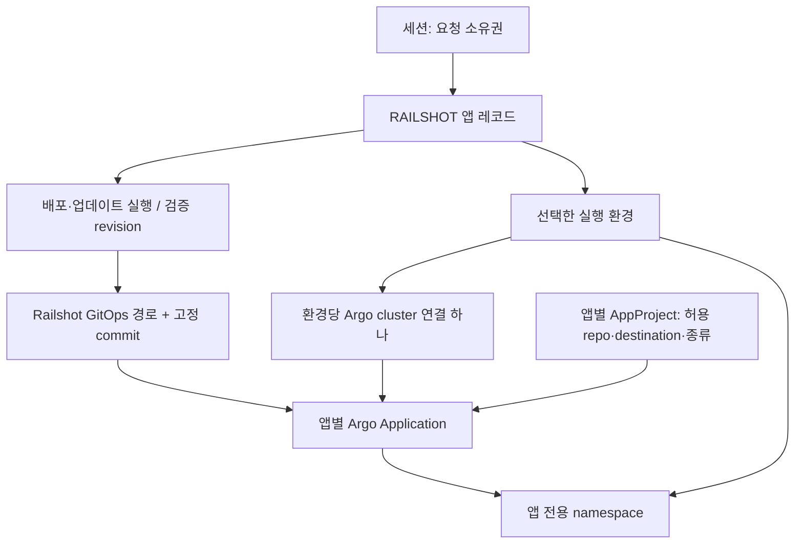

# 앱·환경·실행 관리 계층

기준: shared Argo cluster 수정 #86과 앱 lifecycle #79를 포함한 integration `6e273a6`. 아래는 코드의 관리 계약이다. 실제 운영 반영과 앱 배포 성공은 해당 revision의 배포·전환·HTTPS 검증 기록으로 별도 확인한다.

## 식별자와 소유권

사용자 소유권과 인프라 배치를 서로 다른 축으로 관리한다. 브라우저 세션이 Kubernetes 클러스터나 Argo 인스턴스 하나에 대응하지 않는다.

| 계층 | 식별자·정본 | 책임·경계 |
|---|---|---|
| 요청 소유자 | `session_id`, API 세션·SQLite | 본인 앱·실행·계획 조회 및 조작. 현재는 7일 쿠키 세션이며 계정·조직 인증이 아니다. 세션 만료는 인프라 삭제가 아니다. |
| 환경 | `environment_target_id`, 운영자 환경 등록 | AWS/GCP/OpenStack의 기존 runtime·접근 경로·공유 자원을 선택한다. 공용 환경을 고르는 것은 환경 전체의 소유권을 얻는 일이 아니다. |
| 앱 | `application_id` / 앱 레코드의 `id`, `target_id` | 현재 `hash(environment_id, configured tenant, app name)`으로 식별한다. 앱 전용 namespace·NodePort·hostname·GitOps binding이 연결된다. `tenant`는 CI/환경 설정이며 브라우저 사용자 ID가 아니다. |
| 실행·revision | operation `id`, source commit, publication digest, GitOps revision | 같은 앱에 신규 배포·업데이트·재개 기록을 연결한다. 실행 ID와 앱 ID는 다르다. 현재 검증 성공 버전과 최근 실패 시도를 구분한다. |
| Argo 관리 객체 | Application + 제한된 AppProject | 검증된 배포 선언의 Git 경로·revision을 해당 cluster/namespace에 적용한다. 원본 GitHub 앱 저장소나 사용자 쿠키를 직접 감시하지 않는다. |

동일 환경·설정 tenant·앱 이름은 같은 앱 ID다. 다른 세션 소유의 동일 앱에 신규 등록을 요청하면 소유권 충돌로 거절한다. 세션 ID를 hash에 추가해 기존 앱을 새 앱으로 바꾸거나, 새 쿠키에 이전 앱을 자동 양도하지 않는다. 계정·조직 기반 tenant로 확장할 때는 별도의 소유권 이전 계약과 기존 ID 호환 절차가 필요하다.

## Argo가 바라보는 구조

- 신규 앱: namespace와 AppProject 이름은 앱 ID이며, Git 경로는 `gitops/applications/<app>/<application_id>`다. Application 이름은 target·namespace·app에서 생성한다. `targetRevision`은 검증된 GitOps commit SHA이며 CD 실행기가 명시적으로 sync한다.
- 플랫폼: `railshot-platform` Application은 `deployment/platform` 브랜치의 `gitops/applications/railshot-platform`을 바라본다. 대상은 제어 클러스터의 `railshot-system`이며 자동 sync/selfHeal을 사용한다. 고객 앱의 배포 정책과 별개다.
- 기존 수동 등록 앱: `railshot-apps` 등의 공용 AppProject와 `tenant-*` namespace를 사용한다. 새 앱 구조로 이름만 바꾸거나 재생성하지 않는다. 저장된 binding과 소유권 검증을 유지한다.
- 환경 cluster 연결은 canonical `railshot-<environment_id>` Secret 하나다. 정확히 허용한 앱 namespace와 RoleBinding을 추가하며 `clusterResources=false`를 유지한다. 앱별 private credential은 로그·자격 갱신에 사용하고 Argo cluster discovery label을 붙이지 않는다.
- 공통 namespace 목록은 다른 앱이 존재하는 동안 보존한다. AppProject destination과 runtime RBAC 양쪽이 맞아야 한다. Application이 존재하거나 Argo aggregate Healthy라는 이유만으로 실제 앱 HTTPS 검증을 생략하지 않는다.

2026-10-03 11:04 KST, 전환 전 운영 조회에서는 같은 AWS server에 환경 cluster와 calculator cluster가 함께 등록돼 있었다. calculator는 `namespace is not managed`, 기존 앱은 잘못 선택된 앱 ServiceAccount의 권한 오류를 보였다. #86은 이 중복 discovery를 환경 연결 하나로 정리한다.

11:23 KST 재조회에서는 AWS discovery가 `railshot-k3s-aws` 하나이며 calculator와 기존 두 tenant namespace가 허용 목록에 있었다. calculator는 `Missing/OutOfSync`이고 comparison condition은 없었다. inference-atlas는 `Missing/Unknown`이며 11:16 KST에 기록된 calculator ServiceAccount의 namespace 권한 오류가 남아 있었다. 이전 cache 조건인지 현재 credential 문제인지는 이 조회만으로 확정할 수 없다. 플랫폼은 `Healthy/Synced`였다. 중복 등록 해소와 앱 복구·기존 앱 권한 정상화는 각각 확인해야 한다.

11:30 KST 후속 조회에서 세 Application 모두 `Healthy/Synced`, conditions 없음으로 확인됐다. calculator와 inference-atlas의 기존 GitOps revision도 유지됐다. 이 Argo 상태 확인은 신규 앱의 DNS 생성이나 lifecycle 삭제 검증을 대체하지 않는다.

## 변경 영향을 함께 확인할 표면

| 표면 | 생산자 → 데이터 → 사용처 | 확인할 불변 조건 |
|---|---|---|
| API 소유권·멱등 처리 | 세션 → 앱/operation owner·요청 fingerprint → 조회·실행 검사 | 다른 세션 상세는 404, 같은 키의 다른 입력 거절, 세션 값은 공개 응답에 포함하지 않음 |
| 대시보드 | 앱/operation → `environment_target_id`, 앱 ID, revision → 목록·상세·업데이트·이력 | 앱 target을 환경으로 표시하지 않음. legacy target은 환경으로 추정하지 않고 “배포 대상” 표시 |
| 실행 접수 | 공유 writer 상태 → `EXECUTOR_BUSY.admission` → API·프론트엔드 | 미접수와 결과 불명 구분. 다른 세션 blocker의 앱/ID/시각 비공개. 명시적 재개도 같은 제한 사용 |
| CI → CD | source commit·producer attempt·이미지 digest → publication binding → renderer/sync | 다른 앱·환경·산출물 혼입 거절. 재개에서 새 빌드나 앱 등록을 반복하지 않음 |
| GitOps·Argo 등록 | 환경/앱 binding → canonical cluster·AppProject·Application → Argo cache/sync | 같은 API server의 중복 앱 cluster discovery 없음. 앱별 destination·리소스 allowlist 유지 |
| 자격 갱신·로그 | 등록 정책·ServiceAccount UID·namespace → TokenRequest/Pod owner 검사 → 갱신 worker·로그 reader | 공통 연결과 앱 private credential을 구분. 정책/Secret 전환 중 일부 쓰기 실패에도 갱신 가능 |
| 관측 | 환경 ID → 노드 지표; 앱 target → Pod/로그 → UI | 공유 노드 지표를 특정 앱 전용 지표로 해석하지 않음. 다른 앱 Pod·로그 혼입 거절 |
| 중지·재개·삭제 | 앱 소유 목록·실행 상태 → 제한된 실행 계획 → runtime/provider 정리 | #79의 세션 소유권·공통 실행 검사와 업데이트·CD 재개 경합 검사 유지. 공통 cluster Secret·갱신 정책·다른 앱·공유 LB 보존 |
| CLI/MCP | 각 클라이언트의 origin별 cookie jar → 동일 API 세션 검사 | 원격 클라이언트도 세션 소유권 적용. 서로 같은 쿠키 저장소를 공유하면 같은 세션으로 취급됨. 사람의 로그인 계정이나 Argo SSO가 생긴 것은 아님 |

구현 위치: `apps/api/src/{sessions,applications,product,product-store}.js`, `apps/dashboard/app.js`, `deployment/scripts/{applications,environment}.py`, `gitops/{handoff,argo,credentials,logs}.py`. API 계약은 [product.md](../api/product.md), 세션 수명은 [dashboard-sessions.md](../api/dashboard-sessions.md)를 따른다.

## 실행 제한과 복구

현재 한 API writer가 공유 Git·runtime 변경을 관리한다. `queued/running/unknown` 작업이 있으면 신규 실행·업데이트 시작·환경 생성·다른 작업 재개를 거절한다. 이는 사용자·앱 소유권과 다른 **workspace 범위의 실행 제한**이다. 이 변경은 제한을 완화하거나 요청 대기열을 추가하지 않는다.

#79의 명시적 삭제는 예외를 좁게 둔다. 유일한 active 작업이 같은 앱의 `queued/running` 배포일 때만 그 배포를 취소 대상으로 연결할 수 있다. 실제 삭제 전 worker 종료·CI 취소 결과와 원래 binding을 검증하며, `unknown` 작업이나 다른 앱의 실행을 건너뛰지 않는다.

`EXECUTOR_BUSY`는 `admission.accepted=false`로 이번 action의 미접수를 명시한다. 기존 unknown 때문에 거절하더라도 이번 요청의 `outcome_unknown`은 false다. 프론트엔드는 실행 완료 후 재요청과 운영자 결과 확인 후 재요청을 구분한다. 같은 세션에만 blocker 요약을 제공한다.

Argo 연결 수정 시 순서:

1. 해당 revision의 API와 credentials worker 반영을 확인한다.
2. 기존 등록 절차로 canonical cluster 정책·Secret을 전환하고, 앱 private credential을 discovery에서 분리한다. 허용 namespace와 갱신 상태를 읽어 확인한다.
3. 기존 배포 ID·CI publication·GitOps revision을 유지한 채 복구하고 실제 앱 HTTPS를 확인한다. 성공하지 않은 operation을 DB에서 임의로 종료하지 않는다.
4. 새 앱에서 소스 접수→CI→새 DNS→Argo→HTTPS를 확인한다. 기존 앱과 공통 연결도 다시 확인한다.
5. 삭제 기능의 별도 검증에서 앱 자원만 제거되고 공통 연결·다른 앱·환경 관측이 유지되는지 확인한다.

앱별 동시 실행을 열려면 공유 writer의 실제 변경 범위, Git commit 경합, namespace/NodePort 할당, 삭제·업데이트·재개의 영속 제어와 재시작 복구를 먼저 검증해야 한다. 현재 전역 검사를 세션 필터로 바꾸는 것만으로 실행 격리를 제공하지 않는다.
