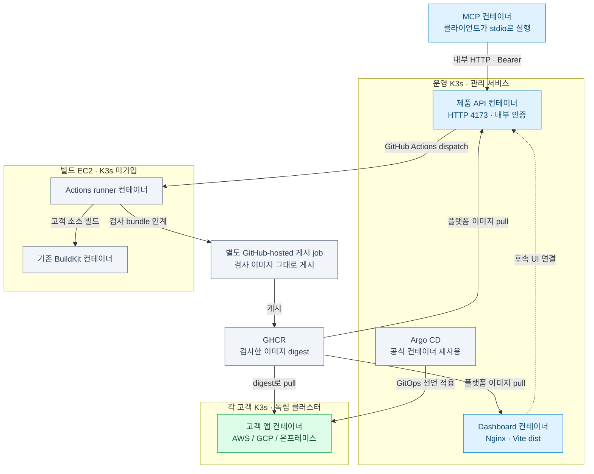

# 플랫폼 컨테이너와 배포 환경

**배치 결정(2026-10-02): 대시보드·제품 API·Argo CD는 기존 운영 K3s의 개별 Pod로, 고객 소스의 검사·AI 수정·빌드는 별도 EC2의 컨테이너로 실행한다. 빌드 EC2는 현재 운영 K3s에 편입하지 않는다.** 고객 앱은 고객 K3s에 배포한다. 서비스마다 VM을 추가하지 않고 기존 운영 노드와 빌드 워커를 재사용한다.

대시보드, 제품 API, MCP, CI runner는 별도 이미지로 빌드한다. CD는 공식 Argo CD 컨테이너를 재사용하고 고객 앱은 기존 CI가 검사한 이미지 digest로 배포한다. MCP는 현재 stdio 방식이므로 연결한 클라이언트에서 컨테이너를 실행한다. 새 로컬 Kubernetes는 구성하지 않는다.

이 문서는 컨테이너·CI 설정을 설명한다. 이미지 게시, 운영 설치, UI의 전체 배포 기능 완료를 뜻하지 않는다.



Argo는 별도 config Git 경로의 검토된 선언을 읽는다. 위 그림은 배치와 주요 통신만 나타내며 CI 게시가 자동으로 Argo sync를 시작한다는 뜻이 아니다. 고객 클러스터는 서로 독립돼 있다. 고객 소스의 검사는 전용 CI VM에서, 게시와 플랫폼 이미지 build/smoke는 GitHub-hosted runner에서 수행한다. MCP의 내부 API 접속은 허가된 관리 경로/port-forward를 사용하며 API를 인터넷에 공개하지 않는다.

**빌드 워커의 EC2 이름은 `railshot-build-worker-aws-01`이다.** 기존 `railshot-ci-k3s-aws`의 표시 이름만 바꿨으며 인스턴스 ID는 `i-09955d23ad1d8dbe2`다. 이름에서 빌드 역할을 드러내고, 고객 배포 대상인 K3s와 혼동하지 않게 했다. 이름 변경 후에도 중지 상태이며, 새 컨테이너 배포나 클러스터 가입을 실행한 것은 아니다.

## 2025 사례와 배치 판단

조사 대상은 [SoftBank Hackathon 2025 in Korea, Powered by KOREC & Progate](https://en.snu.ac.kr/snunow/events?bbsidx=159315&md=v)다. 수상 등급은 팀·참가자의 공개 기록이며 주최 측 전체 결과표는 확보하지 못했다. 배치 구조는 아래 고정된 커밋의 IaC·매니페스트와 대조했다. 당시 실제 노드 수나 성능은 확인하지 않았다.

| 사례 | 공개 자료에서 확인한 구성 | RAILSHOT에 적용할 점 |
|---|---|---|
| Team Blue · 본선 1위([참가자 기록](https://kr.linkedin.com/in/jaejun-lee-39b169215/en)) | 같은 Kubernetes 클러스터에 [빌드 전용 노드 그룹과 taint](https://github.com/sh-final-blue/kops-repo/blob/36faeac3ef7177411725df00c9569c67e020eeb2/cluster.yaml#L216-L234)를 두고, [빌더 Pod의 nodeSelector·toleration](https://github.com/sh-final-blue/web-faas-builder/blob/cfb5b9910c4378bf7da1fc1f518978dbc9653a3f/k8s/deployment.yaml#L22-L29)으로 배치 | 같은 클러스터에 포함하더라도 빌드 실행은 별도 노드로 분리할 수 있다. |
| Cutty-X / Team Green · [본선 2위](https://github.com/Softbank-Hackathon-2025-Team-Green) | [CodeBuild의 privileged Linux 컨테이너](https://github.com/Softbank-Hackathon-2025-Team-Green/infra/blob/f4851d60fd7d6dafb36587cae8975f42a952f166/modules/codebuild/main.tf#L1-L17)에서 빌드하고, [EC2 K3s·Knative](https://github.com/Softbank-Hackathon-2025-Team-Green/infra/blob/f4851d60fd7d6dafb36587cae8975f42a952f166/README.md)에서 함수 실행 | 빌드 컨테이너는 운영 K3s 외부에서도 관리할 수 있다. |
| Yoitang · 2차 예선 최우수상([팀 기록](https://github.com/Joyeongbinnn/2025softbank-hackathon-preliminary-round/blob/2668c90f0fc5020f4a37659666c5096c614e55c5/README.md)) | K3s EC2와 별도로 CI EC2를 두고 Compose로 Jenkins·API·DB·Nginx, Kaniko 컨테이너로 이미지 빌드 | 별도 VM과 컨테이너를 함께 사용했다. CI 호스트에 API·DB·자격을 함께 둔 설정까지 그대로 채택하지 않는다. |

컨테이너는 서비스의 실행·배포 단위를 나누고, 전용 노드는 자원 경합과 호스트 장애의 영향을 나눈다. **성격이 다르다는 이유만으로 모두 별도 VM에 두지는 않는다.** 우리 코드의 HTTP API·대시보드·Argo는 운영 K3s 안에서 Pod·Service·권한·자원 제한으로 나누고, 고객 코드 빌드는 호스트 경계까지 분리한다.

현재 [runner Compose](../../ci/runner-compose.yml)는 host network, Docker socket, `NET_ADMIN`을 사용하고, [CI Ansible](../../infrastructure/ansible/ci.yml)은 호스트 firewall을 설정하며 privileged BuildKit을 실행한다. 같은 파일은 K3s가 설치된 호스트를 거부한다. 따라서 운영 서버에 컨테이너만 추가하면 운영 API·Argo와 빌드가 호스트 권한 및 자원을 공유하게 된다. [GitHub의 runner 운영 지침](https://docs.github.com/en/actions/how-tos/manage-runners/use-actions-runner-controller/deploy-runner-scale-sets)도 임의 코드를 실행하는 runner와 production workload의 격리를 권고한다.

Blue처럼 **운영 K3s의 전용 worker node로 편입하는 것도 가능한 설계**다. 다만 현재는 호스트 방화벽을 조작하는 실행기를 Kubernetes Job/runner 방식으로 옮기고, 운영 Secret·API 접근 제한과 빌드 실패 시 영향을 다시 검증해야 한다. taint·nodeSelector만 추가해서 이 작업이 끝나는 것은 아니다. 지금 편입하면 노드 수를 줄이지 못하면서 실행 경로를 하나 더 바꾸므로 채택하지 않는다. 빌드 동시성 증가나 워커 자동 확장이 실제 요구가 될 때 검토한다. 별도 EC2 유지 자체가 고객 간 완전한 격리나 처리량을 보증하는 것은 아니다.

## 파일과 실행 책임

| 구성 | 소유 위치 | 실행 환경 |
|---|---|---|
| 프런트 이미지 | `apps/dashboard/Dockerfile`, `nginx.conf` | 운영 K3s / 로컬 Docker |
| HTTP API·CLI·MCP | `apps/api/Dockerfile`의 `api`, `mcp` target | API는 운영 K3s, MCP는 연결한 클라이언트가 프로세스로 실행 |
| 플랫폼 이미지 검증·게시 | `.github/workflows/platform-containers.yml` | Railshot 저장소 CI. `railshot-ci.yml`이 변경 경로에 맞게 호출 |
| 고객 소스의 검사·AI 수정·게시 | `ci/workflows/`, `ci/scripts/` | 검사는 빌드 EC2, 검사한 이미지 게시는 별도 GitHub-hosted job |
| CI runner | `ci/runner-compose.yml`, `ci/scripts/runner/` | `railshot-build-worker-aws-01`의 컨테이너. 현재 실행기는 K3s 노드 설치 금지 |
| CD | `gitops/argo/`, `gitops/applications/railshot-platform.yaml` | 공식 Argo CD / 제한된 플랫폼 AppProject |
| 고객 런타임 | `deployment/`, `gitops/handoff.py`, `gitops/argo.py` | 기존 K3s/Cilium 위 앱별 컨테이너. K3s 전체를 앱 이미지로 다시 감싸지 않음 |

Provider Controller와 Terraform은 host 준비, Ansible은 guest 검사와 runtime 호출 책임을 유지한다. 이 변경에서는 provider/Ansible 서버를 옮기거나 고객 런타임을 재설치하지 않는다.

## 로컬 실행

저장소 루트에서 실행한다. 토큰을 출력하지 않고 Git에서 제외된 `.local`에 만든다. 로컬 UID를 API/MCP에 전달해 Compose의 파일 secret을 읽을 수 있게 한다. CI runner용 Compose는 맥에서 실행하지 않는다.

```sh
mkdir -p .local/container-secrets
chmod 700 .local/container-secrets
python3 -c 'import pathlib,secrets; p=pathlib.Path(".local/container-secrets/api-token"); p.touch(mode=0o600, exist_ok=False); p.write_text(secrets.token_hex(32))'
export RAILSHOT_API_TOKEN_PATH="$PWD/.local/container-secrets/api-token"
export RAILSHOT_LOCAL_UID="$(id -u)" RAILSHOT_LOCAL_GID="$(id -g)"
docker compose -f deployment/compose.yaml --profile mcp build
docker compose -f deployment/compose.yaml up -d dashboard api
```

화면은 `http://127.0.0.1:4181`, API health는 `http://127.0.0.1:4173/healthz`다. GitHub 자격과 target 없이도 컨테이너 health와 MCP 프로토콜을 확인할 수 있으나 배포 요청은 503이다. 실제 게시에는 [환경 변수 예시](../../deployment/.env.example)를 비공개 파일로 복사해 값을 채우고 Compose의 `--env-file`로 전달한다.

MCP 클라이언트의 command는 `docker`, args는 아래와 같다. `-T`로 터미널 제어 문자가 JSON-RPC stdout에 섞이지 않게 한다. API 컨테이너를 먼저 시작하고 관련 환경 변수를 MCP 클라이언트 프로세스에도 전달한다.

```text
compose -f /absolute/path/to/Railshot/deployment/compose.yaml run --rm -T --no-deps mcp
```

MCP에는 HTTP 포트가 없다. 로컬 폴더를 배포하려면 필요한 폴더만 `/sources` 같은 경로에 읽기 전용으로 마운트하고 `JASMIN_SOURCE_ROOT=/sources`를 지정한다. 전체 home, Docker socket, cloud 자격을 마운트하지 않는다. 공개 GitHub URL 입력에는 소스 폴더 mount가 필요 없다.

## CI와 이미지 게시

Railshot 자체의 변경 검사는 [railshot-ci.yml](../../.github/workflows/railshot-ci.yml)이 담당한다. 고객 apps 저장소에 설치하는 `ci/workflows/railshot-deploy.yml`와 구분한다. docs-only는 경로 분류와 최종 gate만 실행하며, 공유 계약·알 수 없는 경로·CI workflow 변경은 필요한 검사를 넓혀 실행한다. 삭제·rename도 분류에 포함한다. 선택한 검사만 성공하고 나머지는 의도적으로 skipped인 경우에만 gate를 통과한다.

`Platform containers` workflow는 선택된 이미지마다 빌드 후 실제 entrypoint를 실행한다. UI assets, API Host/인증/Secret 파일, MCP 초기화, runner 도구를 검사한다. CI runner의 전용 VM firewall·등록·실제 job과 클라우드 배포는 이 smoke 검사와 별개다.

`Publish platform containers`에서 이미지 게시가 필요할 때 검토한 `main` 또는 `integration/**` ref에서 workflow_dispatch의 `publish=true`를 사용한다. 일반 PR은 이미지를 게시하지 않는다. 게시 job은 빌드 job의 검사한 이미지 tar를 받아 그대로 GHCR에 게시하며 재빌드하지 않는다. component별 JSON artifact에는 `ghcr.io/jasmin-softbank/railshot-<component>@sha256:...`가 남는다. 이들을 합친 `images.json`으로 배포 선언을 만든다.

```sh
python3 -c 'import json,pathlib; result={}; [result.update(json.loads(p.read_text())) for p in pathlib.Path("/private/published").glob("*.json")]; pathlib.Path("/private/images.json").write_text(json.dumps(result))'
python3 deployment/scripts/render-platform.py /private/images.json \
  --target-id k3s-aws > /private/platform-workload.json
```

`k3s-aws`는 운영자가 승인한 실제 target으로 대체한다. renderer는 정확한 GHCR repo와 digest를 요구한다. 이미지 hash를 검증하는 것은 레지스트리 게시·노드 pull 성공을 대신하지 않는다.

## 운영 K3s와 Argo

기존 운영 Argo CD를 재사용한다. 새 운영 클러스터에서만 namespace를 먼저 만들고 `kubectl apply -k gitops/argo`로 공식 v3.5.3의 고정된 upstream commit을 설치한다. 현재 운영 클러스터에 재설치를 실행하지 않는다.

1. 운영자가 `railshot-system` namespace와 해당 namespace의 `ghcr-pull`, `railshot-api` Secret(`token`), `railshot-github` Secret(`token`)을 비공개 입력에서 준비한다. API token은 UID/GID 1000이 읽도록 `0440`+`fsGroup:1000`으로 mount한다. GitHub 자격은 API에만 준다.
2. 검토한 renderer 출력만 `gitops/applications/railshot-platform/workload.json`에 넣어 config commit을 만든다. AppProject/Application 파일의 `targetRevision`을 그 정확한 commit으로 교체한다. 이 파일은 workload 경로 밖에 유지한다.
3. namespace와 선언 범위를 확인한 뒤 AppProject/Application을 적용하고 수동 sync한다. 자동 sync·prune·Namespace/Secret 생성 권한은 넣지 않았다. 초기 requests/limits는 측정 전 시작값이므로 기존 운영 노드 여유량과 업로드 메모리를 확인한다.
4. 기본 Service는 모두 ClusterIP다. 우선 승인된 운영 context에서 `kubectl -n railshot-system port-forward service/railshot-dashboard 4181:8080`, API는 `service/railshot-api 4173:4173`으로 검증한다. API readiness는 `configured:true`도 확인하지만 GitHub 자격의 실제 권한을 보증하지 않으므로 실요청 검증이 별도로 필요하다.
5. 공개 UI가 필요하면 renderer에 할당한 `--dashboard-node-port`를 추가하고 기존 `infrastructure/terraform/aws-edge`의 host route로 운영 노드 사설 IP와 연결한다. health path는 `/healthz`. `externalTrafficPolicy:Local`이므로 ALB target 노드에 실제 UI Pod가 있어야 한다. 보안 그룹은 ALB에서 오는 해당 포트만 허용한다. API에는 공개 route나 프런트 프록시를 넣지 않았다.

화면의 API 연결과 사용자 인증·사용자별 target 인가는 후속 작업이다. 현재 Bearer token은 신뢰한 운영자 CLI/MCP용이며 사용자 로그인이나 multi-tenant 인가 구현이 아니다. 프런트에 이 token을 넣지 않는다. Ansible HTTP API의 운영 클러스터 이전도 이번 배포에 포함하지 않는다.

## 빌드 워커와 고객 앱

CI runner의 호스트 준비, token 파일, 한 번의 job 후 재등록 절차는 [runner README](../../ci/scripts/runner/README.md)를 따른다. 기존 격리 검사를 유지하기 위해 전용 VM의 Docker socket, host network, 필요한 NET_ADMIN 권한을 사용한다. 이 runner 컨테이너 자체는 VM 관리자 권한을 제한하는 보안 경계가 아니다. 고객 source는 기존 제한된 빌드·검사 컨테이너에서 실행한다.

고객 앱은 기존 [CI 게시 계약](../../ci/README.md) → [GitOps 인계](../../gitops/README.md) → [runtime 검증](../../deployment/README.md)을 따른다. Argo의 Synced/Healthy, 실제 Pod image digest/Ready, 공개 HTTPS를 각각 확인한다. 별도 generic runtime 이미지나 새 CD 서버를 만들지 않는다.
