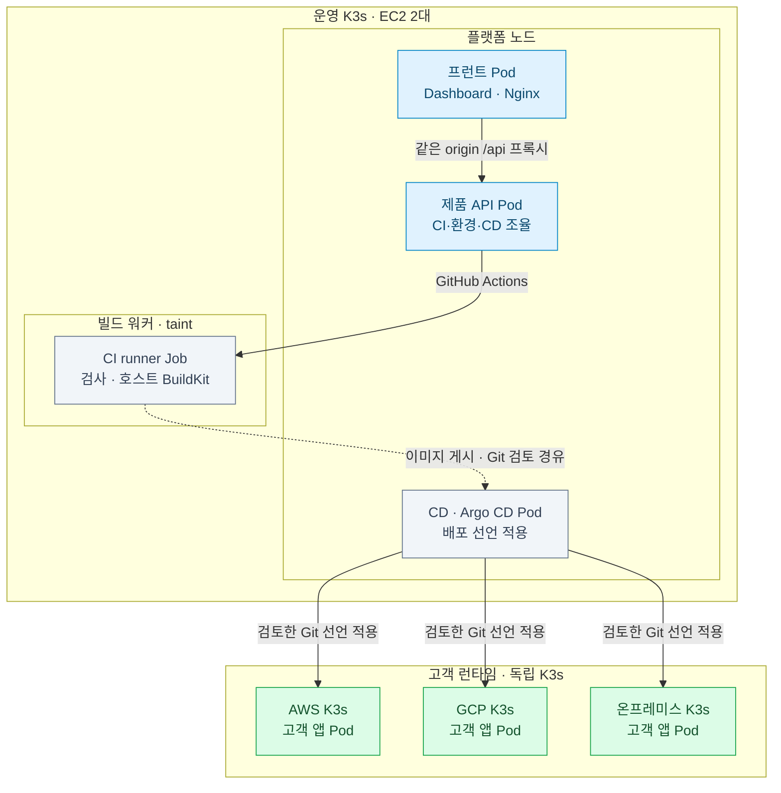
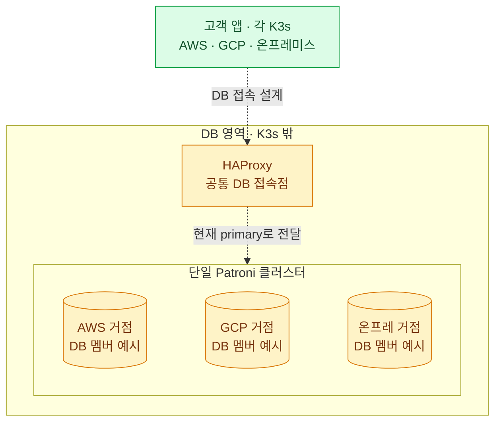

# 플랫폼 컨테이너와 배포 환경

**배치 결정(2026-10-02): 운영 K3s는 기존 EC2 두 대를 플랫폼 노드와 빌드 전용 워커로 나눠 사용한다.** 플랫폼 노드에는 대시보드·제품 API·Argo CD Pod를, 빌드 워커에는 고객 소스를 검사·AI 수정·빌드하는 runner Job을 배치한다. 빌드 워커에는 taint를 두고 runner만 대응하는 nodeSelector·toleration을 갖는다. 프런트·API·CI·CD마다 새 VM을 추가하지 않는다.

고객 앱은 **AWS·GCP·온프레미스의 서로 독립된 K3s**에서 실행한다. DB는 모든 K3s 밖에 두며, 현재 DB 담당 구현은 **여러 거점에 걸친 하나의 PostgreSQL/Patroni 클러스터**다. 환경마다 독립 DB 클러스터가 하나씩 있다는 뜻이 아니다.

대시보드, 제품 API, MCP, CI runner는 별도 이미지로 빌드한다. CD는 공식 Argo CD 컨테이너를 재사용하고 고객 앱은 기존 CI가 검사한 이미지 digest로 배포한다. MCP는 현재 stdio 방식이므로 연결한 클라이언트에서 컨테이너를 실행한다. 새 로컬 Kubernetes는 구성하지 않는다.

이 문서는 배치 설계와 현재 컨테이너·CI 선언을 설명한다. [제품 API](../api/product.md)·[OpenAPI](../api/product.openapi.json)에 v1 빌드·배포·환경 연결을 정의했고, Dashboard는 같은 origin의 `/api/`를 호출한다. 사용자 계정·로그인·팀원 allowlist 없이 같은 workspace를 사용한다. 코드 연결을 기존 빌드 EC2의 운영 K3s 가입, 이미지 게시·운영 설치, 실제 클라우드 E2E 완료로 해석하지 않는다.



그림의 위쪽은 **배포를 관리하는 운영 K3s**, 아래쪽 세 K3s는 **고객 앱을 실행하는 환경**이다. API는 runner Pod에 직접 HTTP 작업을 보내지 않고 GitHub Actions dispatch를 사용한다. 고객 소스의 검사와 빌드는 빌드 워커에서 수행하고, 검사 bundle을 받은 별도 GitHub-hosted job이 이미지를 그대로 GHCR에 게시한다. Argo는 별도 config Git 경로의 검토된 선언을 읽어 고객 K3s에 적용하며, 고객 앱은 그 선언의 digest를 pull한다. 그림은 배치 중심이며 게시가 자동 Argo sync를 뜻하지 않는다. 플랫폼 이미지 build/smoke·게시 역시 GitHub-hosted runner가 맡는다.



두 번째 그림의 DB 세 상자는 **같은 Patroni 클러스터의 거점별 멤버 배치를 표현한 예시**다. 고정된 DB 대수나 거점별 독립 standby 클러스터를 정한 것이 아니다. HAProxy는 현재 primary로 접속을 중계하는 논리적 접속점이며 그림의 위치가 실제 서버 위치를 지정하지 않는다. etcd·복제·백업 경로는 이 배치 그림에서 생략했다. DB 연결 점선은 설계이며 현재 자동 배포가 DB 설치·앱 자격·접속 정책까지 완료한다는 뜻이 아니다.

MCP는 현재 stdio 방식으로 클라이언트 측 컨테이너에서 실행한다. 운영 노드에 별도 MCP 서버를 추가하지 않으며, 허가된 관리 경로/port-forward로 내부 API에 연결한다.

**빌드 워커의 EC2 이름은 `railshot-build-worker-aws-01`이다.** 기존 `railshot-ci-k3s-aws`의 표시 이름만 바꿨으며 인스턴스 ID는 `i-09955d23ad1d8dbe2`다. 이름에서 빌드 역할을 드러내고 고객 배포 대상인 K3s와 구분한다. 2026-10-02 이름 변경 확인 당시에는 중지 상태였고 새 컨테이너 배포나 클러스터 가입을 실행하지 않았다. 이후 실제 상태·가입·job 결과는 운영 검증 기록으로 별도 확인한다.

## 2025 사례와 배치 판단

조사 대상은 [SoftBank Hackathon 2025 in Korea, Powered by KOREC & Progate](https://en.snu.ac.kr/snunow/events?bbsidx=159315&md=v)다. 수상 등급은 팀·참가자의 공개 기록이며 주최 측 전체 결과표는 확보하지 못했다. 배치 구조는 아래 고정된 커밋의 IaC·매니페스트와 대조했다. 당시 실제 노드 수나 성능은 확인하지 않았다.

| 사례 | 공개 자료에서 확인한 구성 | RAILSHOT에 적용할 점 |
|---|---|---|
| Team Blue · 본선 1위([참가자 기록](https://kr.linkedin.com/in/jaejun-lee-39b169215/en)) | 같은 Kubernetes 클러스터에 [빌드 전용 노드 그룹과 taint](https://github.com/sh-final-blue/kops-repo/blob/36faeac3ef7177411725df00c9569c67e020eeb2/cluster.yaml#L216-L234)를 두고, [빌더 Pod의 nodeSelector·toleration](https://github.com/sh-final-blue/web-faas-builder/blob/cfb5b9910c4378bf7da1fc1f518978dbc9653a3f/k8s/deployment.yaml#L22-L29)으로 배치 | 이 방식을 따라 운영 K3s 안의 빌드 실행을 전용 워커 노드에 배치한다. |
| Cutty-X / Team Green · [본선 2위](https://github.com/Softbank-Hackathon-2025-Team-Green) | [CodeBuild의 privileged Linux 컨테이너](https://github.com/Softbank-Hackathon-2025-Team-Green/infra/blob/f4851d60fd7d6dafb36587cae8975f42a952f166/modules/codebuild/main.tf#L1-L17)에서 빌드하고, [EC2 K3s·Knative](https://github.com/Softbank-Hackathon-2025-Team-Green/infra/blob/f4851d60fd7d6dafb36587cae8975f42a952f166/README.md)에서 함수 실행 | 빌드 컨테이너는 운영 K3s 외부에서도 관리할 수 있다. |
| Yoitang · 2차 예선 최우수상([팀 기록](https://github.com/Joyeongbinnn/2025softbank-hackathon-preliminary-round/blob/2668c90f0fc5020f4a37659666c5096c614e55c5/README.md)) | K3s EC2와 별도로 CI EC2를 두고 Compose로 Jenkins·API·DB·Nginx, Kaniko 컨테이너로 이미지 빌드 | 별도 VM과 컨테이너를 함께 사용했다. CI 호스트에 API·DB·자격을 함께 둔 설정까지 그대로 채택하지 않는다. |

컨테이너는 서비스의 실행·배포 단위를 나누고, 전용 노드는 자원 경합과 호스트 장애의 영향을 나눈다. **성격이 다르다는 이유만으로 모두 별도 VM에 두지는 않는다.** 최신 배치는 Blue 사례처럼 한 운영 클러스터 안에서 노드 역할을 나눈다. HTTP API·대시보드·Argo는 플랫폼 노드에 모으고, 고객 코드 빌드는 기존 빌드 EC2에만 배치한다. 두 EC2를 재사용하므로 이 변경으로 새 관리용 VM 네 대를 만들지 않는다.

고객 빌드 backend는 [runner Job 선언](../../deployment/manifests/build-runner.yaml)으로 관리하되, 사용자 코드는 기존 호스트 Docker의 제한된 검사·빌드 컨테이너에서 실행한다. 이 Docker·BuildKit 프로세스는 Kubernetes Pod 자원 할당량 밖에서 실행되므로 빌드 노드의 Docker 제한과 여유 자원을 따로 관리한다. [CI Ansible](../../infrastructure/ansible/ci.yml)이 담당하는 BuildKit·방화벽·검증 receipt를 재사용한다. runner는 host network, 빌드 노드의 Docker socket, `NET_ADMIN`이 필요한 신뢰된 실행기이며 고객 코드에 이 권한을 전달하지 않는다. 플랫폼 노드의 socket·운영 Secret을 runner에 공유하지 않는다. [GitHub의 runner 운영 지침](https://docs.github.com/en/actions/how-tos/manage-runners/use-actions-runner-controller/deploy-runner-scale-sets)도 임의 코드를 실행하는 runner와 production workload의 격리를 권고한다.

플랫폼 Pod는 `railshot.io/node-role=platform`, 빌드 Job은 `railshot.io/node-role=build`를 선택한다. 빌드 노드에는 `railshot.io/dedicated=build:NoSchedule` taint를 두고 빌드 Job에만 해당 toleration을 준다. **taint는 스케줄링 장치이며 보안 경계를 완성하지 않는다.** 빌드 노드는 여전히 호스트 관리자 권한을 가진 실행기이고 운영 클러스터의 구성원이 된다. 가입 전후에 K3s 통신과 기존 Docker 격리 정책의 공존, 최소 권한 node identity·API 접근, 운영 Secret 차단, 실제 고객 소스 job을 확인해야 한다. 현재 문서는 이 검증과 live 가입 완료를 주장하지 않는다.

## K3s 밖의 하이브리드 DB

DB 배치는 화균 담당의 [고정된 README](https://github.com/Jasmin-Softbank/Railshot/blob/67d19efc81b01b2a55b6dd54c198088b018bdd1f/README.md), [하이브리드 DB 구조](hybrid-db.md), [입력 규격](../api/deployment-inputs.md), [복제 정책](../decisions/replication-policy.md)을 따른다. 현재 코드는 준비된 Ubuntu 24.04 VM에 PostgreSQL 16·Patroni·etcd·HAProxy를 Ansible로 설치한다. DB를 K3s StatefulSet으로 옮기거나 CloudNativePG와 같은 PostgreSQL을 공동 관리하지 않는다. 베어메탈·외부 관리형 DB는 이 구현의 확인된 지원 대상으로 간주하지 않는다.

[10/1 회의 자동 전사](https://softbankhackathon2026.slack.com/files/USLACKBOT/F0C63236BL1/___________________)의 약 2:45–2:53에서도 DB를 Kubernetes 밖에 두는 방향, Ansible 설치 스크립트와 거점별 배치 입력, DB 담당 범위를 논의했다. 약 2:50의 AWS 3개·온프레미스 2개는 변수 전달을 설명한 예시이며 최종 대수나 DB·etcd 역할별 수량을 확정한 기록으로 사용하지 않는다. 구현의 구체적 지원 범위는 위 고정된 브랜치와 입력 계약을 기준으로 한다.

하나의 Patroni 클러스터를 여러 거점에 배치하며 예시는 DB 3개·etcd 3개·HAProxy 1개다. 이 예시가 위 그림의 각 환경별 최종 VM 수를 확정하지는 않는다. 거점별 독립 대기 클러스터나 자동 거점 승격은 미구현이다. 기본값은 동기 복제, `synchronous_mode_strict=true`, `synchronous_node_count=1`이며 동기 복제본이 없으면 쓰기를 차단한다. `backup_enabled=false`이고 단일 HAProxy는 단일 장애점이므로 원격 복구와 접속점 이중화가 완료됐다고 표시하지 않는다.

현재 [Ansible HTTP 계약](../api/ansible.md)은 등록된 HA profile과 대상·TLS/Vault/SSH 참조를 검증한 뒤 담당 플레이북을 실행하고 결과 receipt를 확인하는 코드까지 연결되어 있다. standalone 설치는 지원하지 않는다. DB VM을 마련한 별도 담당 채팅에서 실제 DB 검증을 진행하며, 이 문서는 설치·복제 검증 완료를 주장하지 않는다. 제품 환경 API의 DB 실행은 아직 연결하지 않았다. [CD 인계 계약](../../gitops/README.md)은 DB 자격 주입과 외부 egress를 지원 범위에서 제외한다. DB 사용 앱을 연결하려면 HAProxy endpoint·TLS·자격 참조·앱에서 DB로 가는 네트워크 정책을 맞추고 실제 연결을 검증해야 한다.

## 파일과 실행 책임

| 구성 | 소유 위치 | 실행 환경 |
|---|---|---|
| 프런트 이미지 | `apps/dashboard/Dockerfile`, `nginx.conf` | 운영 K3s / 로컬 Docker |
| HTTP API·CLI·MCP | `apps/api/Dockerfile`의 `api`, `mcp` target | API는 운영 K3s, MCP는 연결한 클라이언트가 프로세스로 실행 |
| 플랫폼 이미지 검증·게시 | `.github/workflows/platform-containers.yml` | Railshot 저장소 CI. `railshot-ci.yml`이 변경 경로에 맞게 호출 |
| 고객 소스의 검사·AI 수정·게시 | `ci/workflows/`, `ci/scripts/` | 검사는 운영 K3s의 전용 빌드 워커, 검사한 이미지 게시는 별도 GitHub-hosted job |
| CI runner | `deployment/manifests/build-runner.yaml`, `ci/scripts/runner/` | `railshot-build-worker-aws-01`에 배치하는 일회성 Job. 기존 Compose는 독립 VM 실행용이며 같은 runner를 중복 실행하지 않음 |
| CD | `gitops/argo/`, `gitops/applications/railshot-platform.yaml` | 공식 Argo CD / 제한된 플랫폼 AppProject |
| 고객 런타임 | `deployment/`, `gitops/handoff.py`, `gitops/argo.py` | 기존 K3s/Cilium 위 앱별 컨테이너. K3s 전체를 앱 이미지로 다시 감싸지 않음 |
| 하이브리드 DB | `infrastructure/ansible/playbooks/`, `infrastructure/ansible/roles/` | K3s 밖의 준비된 VM에서 단일 Patroni 클러스터. HTTP 설치 연결·실환경 인수는 별도 |

Provider Controller와 Terraform은 host 준비, Ansible은 guest 검사와 runtime 호출 책임을 유지한다. 운영 K3s의 노드 배치 변경과 고객 K3s·DB의 설치는 별개 작업이며 이 문서 변경으로 고객 runtime을 재설치하지 않는다.

## API 실행 도구와 영속 상태

[API Dockerfile](../../apps/api/Dockerfile)의 `api` target은 Node 서비스와 함께 Python, Git, SSH, PyYAML, jsonschema, Ansible, Terraform, kubectl, AWS CLI·SSM plugin, Google Cloud CLI를 설치한다. 제품의 native CD·환경 어댑터가 Pod 안에서 기존 Python 실행기를 호출하기 위한 도구다. MCP target에는 이 실행 도구를 추가하지 않는다. API가 Docker/BuildKit으로 고객 코드를 직접 빌드하지도 않는다.

[runtime-install.sh](../../apps/api/runtime-install.sh)는 Linux amd64 컨테이너 build에서만 실행한다. Python 패키지는 기존 CI requirements의 고정 버전, Terraform·kubectl은 CI·K3s 버전 정책을 재사용한다. 추가 도구의 공식 배포 URL·버전·SHA-256은 [runtime-tools.json](../../apps/api/runtime-tools.json)에 고정한다. 내려받은 파일을 모두 검증한 뒤 설치하고, [runtime-smoke.py](../../apps/api/runtime-smoke.py)가 버전·Python import·native CLI 도움말·Ansible syntax를 확인한다. Dockerfile은 UID 1000으로도 이 smoke를 실행한다. 이는 클라우드 자격·연결·VM 설치 시험과 구분한다.

이미지에는 기존 GitOps bridge와 의존 CI 모듈·schema, Terraform AWS/GCP 모듈과 lock 파일, Ansible guest/runtime·tasks·group_vars·schema, deployment bootstrap/Cilium·버전 정책을 함께 복사한다. 운영 SSH 키·known_hosts·Provider 자격·kubeconfig·Git/CD 설정은 이미지에 넣지 않고 실행 시 비공개 설정으로 제공한다.

API는 UID/GID 1000, root filesystem 읽기 전용, 쓰기 가능한 `/tmp`와 `/var/lib/railshot`을 사용한다. Kubernetes는 `railshot-api` PVC 4 GiB·ReadWriteOnce, replica 1, `Recreate`로 이전·새 API Pod의 동시 쓰기를 피한다. `RAILSHOT_STATE_DIR=/var/lib/railshot/state`에는 접수 기록·idempotency·소스 snapshot·환경 결과를 보존한다. 파일 잠금은 여러 호스트의 분산 잠금이 아니므로 replica 증가나 같은 PVC의 별도 writer는 지원하지 않는다. 재시작 후 미완료 작업은 unknown으로 보존하고 자동 재실행하지 않는다.

`railshot-executors` Secret은 init container가 `/var/lib/railshot/config`에 복사한다. 디렉터리 0700·설정 파일 0600과 API 실행 UID 소유 조건을 맞추며 기본 manifest는 `cd.json`·`kubeconfig` 경로를 설정한다. 새 환경 기능을 켜려면 `RAILSHOT_PROFILES_FILE`, profile의 Terraform state·target·SSH 참조와 Provider 자격도 이 권한 모델로 준비해야 한다. Secret을 root 소유 0444로 직접 mount하는 것만으로 개인키·비공개 profile 검사를 통과하지 않는다. known_hosts는 신뢰된 host key를 사전 등록하고 group/other 쓰기를 금지한다.

[prepare-state.js](../../apps/api/prepare-state.js)는 최초 PVC에서 `Jasmin-Softbank/Railshot`의 기존 `deployment/apps` 브랜치를 `/var/lib/railshot/repository`에 clone한다. 이후 init은 저장된 checkout의 브랜치·origin을 확인한다. 이 앱 선언 브랜치는 API rollout 전에 별도로 준비해야 하며, 플랫폼 이미지 release가 생성하는 `deployment/platform`과 구분한다. init과 CD의 Git 인증은 서버 내부 `GITHUB_TOKEN`과 이미지의 askpass를 사용한다.

HOME은 쓰기 가능한 `/var/lib/railshot`이며 Ansible·gcloud의 실행 파일과 임시 상태가 이 경로를 사용할 수 있다. Git config checkout·Terraform state도 API UID가 쓰고 외부에 공개되지 않는 경로여야 한다. GitHub·Provider·SSH 자격을 전달하는 설정은 서버 운영 설정이며 사용자 로그인 데이터가 아니다. 현재 기본 manifest의 CD 설정과 추가 환경 profile 준비 여부를 실제 배포 전에 각각 확인한다.

## 로컬 실행

저장소 루트에서 실행한다. 현재 Compose는 Dashboard Nginx→API 내부 연결용 토큰을 사용하고 브라우저에는 노출하지 않는다. 토큰을 출력하지 않고 Git에서 제외된 `.local`에 만든다. 로컬 UID를 API/MCP에 전달해 Compose의 파일 secret을 읽을 수 있게 한다. state init 서비스는 named volume을 같은 UID·0700으로 준비한다. CI runner용 Compose는 맥에서 실행하지 않는다.

```sh
mkdir -p .local/container-secrets
chmod 700 .local/container-secrets
python3 -c 'import pathlib,secrets; p=pathlib.Path(".local/container-secrets/api-token"); p.touch(mode=0o600, exist_ok=False); p.write_text(secrets.token_hex(32))'
export RAILSHOT_API_TOKEN_PATH="$PWD/.local/container-secrets/api-token"
export RAILSHOT_LOCAL_UID="$(id -u)" RAILSHOT_LOCAL_GID="$(id -g)"
docker compose -f deployment/compose.yaml --profile mcp build
docker compose -f deployment/compose.yaml up -d dashboard api
```

화면은 `http://127.0.0.1:4181`, API health는 `http://127.0.0.1:4173/healthz`다. 화면의 `/api/` 요청은 Nginx가 내부 API로 전달하므로 사용자 로그인·토큰 입력이 없다. GitHub 자격과 target 없이도 컨테이너 health와 MCP 프로토콜을 확인할 수 있고 대상 목록은 비어 있다. 실행 기능 미설정 요청은 503이다. 실제 CI 게시에는 [환경 변수 예시](../../deployment/.env.example)를 비공개 파일로 복사해 값을 채우고 Compose의 `--env-file`로 전달한다. 전체 앱 배포와 환경 준비에는 CD·profile 파일, 자격과 쓰기 가능한 HOME·실행 state mount를 별도로 준비한다.

MCP 클라이언트의 command는 `docker`, args는 아래와 같다. `-T`로 터미널 제어 문자가 JSON-RPC stdout에 섞이지 않게 한다. API 컨테이너를 먼저 시작하고 관련 환경 변수를 MCP 클라이언트 프로세스에도 전달한다.

```text
compose -f /absolute/path/to/Railshot/deployment/compose.yaml run --rm -T --no-deps mcp
```

MCP에는 HTTP 포트가 없다. 로컬 폴더를 배포하려면 필요한 폴더만 `/sources` 같은 경로에 읽기 전용으로 마운트하고 `RAILSHOT_SOURCE_ROOT=/sources`를 지정한다. 전체 home, Docker socket, cloud 자격을 마운트하지 않는다. 공개 GitHub URL 입력에는 소스 폴더 mount가 필요 없다.

## CI와 이미지 게시

Railshot 자체의 변경 검사는 [railshot-ci.yml](../../.github/workflows/railshot-ci.yml)이 담당한다. 고객 apps 저장소에 설치하는 `ci/workflows/railshot-deploy.yml`와 구분한다. docs-only는 경로 분류와 최종 gate만 실행하며, 공유 계약·알 수 없는 경로·CI workflow 변경은 필요한 검사를 넓혀 실행한다. 삭제·rename도 분류에 포함한다. 선택한 검사만 성공하고 나머지는 의도적으로 skipped인 경우에만 gate를 통과한다.

`Platform containers` workflow는 선택된 이미지마다 빌드 후 실제 entrypoint를 실행한다. UI assets, API Host/인증/Secret 파일, MCP 초기화, runner 도구를 검사한다. CI runner의 전용 VM firewall·등록·실제 job과 클라우드 배포는 이 smoke 검사와 별개다.

저장소 Actions 변수 `RAILSHOT_AUTO_RELEASE`가 `true`일 때만 자동 릴리스를 활성화한다. 미설정 또는 `false`이면 CI는 영향받은 이미지 검사만 수행하고 자동 게시용 tar를 내보내거나 GHCR 게시·운영 배포를 시작하지 않는다. 활성화된 `Railshot CI`는 이미지에 영향이 있는 변경이 `RAILSHOT_PLATFORM_VERIFY_REF`와 정확히 같은 브랜치에 push됐을 때 컨테이너 4종을 한 번 빌드·smoke 검사하고 이미지 tar를 보관한다. 선택된 검사와 최종 gate가 모두 통과하면 같은 run의 tar를 `Publish platform containers`에 넘겨 GHCR 게시 → `deployment/platform` 선언 갱신 → Argo·Pod·공개 HTTPS 검증을 자동으로 수행한다. PR, 다른 브랜치, 일반 CI 수동 실행과 문서만 바뀐 push는 운영을 변경하지 않는다. Agent SDK 호출이나 채팅 에이전트의 중계는 필요하지 않다.

`Publish platform containers` 수동 실행도 유지한다. 검토한 `main` 또는 `integration/**` ref에서 `publish=true`이면 해당 실행에서 빌드·smoke를 통과한 이미지 tar를 그대로 게시한다. 자동 경로는 CI가 만든 tar를 사용하므로 다시 빌드하지 않는다. component별 JSON artifact에는 `ghcr.io/jasmin-softbank/railshot-<component>@sha256:...`가 남으며 이미지 revision label은 실행의 source SHA와 일치해야 한다.

수동으로 플랫폼까지 연결할 때는 **`publish=true`, `deploy=true`와 dashboard·api를 모두 포함한 components**를 지정한다. 수동 deploy 기본값은 false이며 CI의 자동 호출은 둘 다 true다. 저장소 Actions 변수 `RAILSHOT_PLATFORM_TARGET_ID`, `RAILSHOT_PLATFORM_NODE_PORT`가 있어야 하며 등록 target와 30000–32767의 할당 포트인지 실행 전에 검사한다. workflow의 release concurrency는 중간 실행을 취소하지 않고 같은 게시·선언 갱신을 직렬화한다. 선언 갱신 직전 검증한 SHA 이후의 변경을 확인한다. 문서 변경만 추가됐으면 검증된 이미지를 배포하고, 더 최신 컨테이너 변경이나 갈라진 이력이 있으면 이전 실행의 배포를 거절해 새 이미지를 되돌리지 못하게 한다.

등록된 추가 provider가 있으면 선택 Actions 변수 `RAILSHOT_PROVIDER_TARGETS`에 `{"openstack":"k3s-openstack"}` 같은 JSON 매핑을 설정한다. 기본값은 `{}`이며 추가 provider를 활성화하지 않는다. workflow는 매 릴리스에 이 값을 publisher와 renderer의 `--provider-targets`로 전달한다. renderer는 기존 AWS 기본 대상·provider를 보존하고 API의 provider 매핑과 일치하는 `RAILSHOT_TARGET_IDS`를 함께 선언한다. 먼저 해당 대상의 CI/앱 바인딩과 API CD 등록을 완료해야 하며, 설정만으로 인프라·URL 성공을 주장하지 않는다. 로컬 검토 명령에도 같은 옵션을 명시해야 한다. 변수를 비우면 다음 릴리스가 추가 매핑을 제거하므로 API Deployment에만 수동 설정하지 않는다.

deploy job은 같은 workflow run에서 게시한 digest artifact만 합쳐 검토 SHA의 [renderer](../../deployment/scripts/render-platform.py)를 호출한다. [publish-platform.py](../../deployment/scripts/publish-platform.py)는 `deployment/platform` 전용 브랜치의 **`gitops/applications/railshot-platform/workload.json` 한 파일만** commit하고 일반 fast-forward push한다. 브랜치가 없으면 검토한 소스 SHA에서 시작하고, 이미 있으면 다른 파일과 기존 이력을 유지한다. 강제 push·전체 branch 덮어쓰기는 하지 않으며 push 충돌은 실패로 남긴다. AppProject/Application과 운영 Secret·클러스터 자격은 이 출력 경로에 넣지 않는다.

운영자가 최초 등록한 플랫폼 Argo Application은 `deployment/platform`을 감시하고 [공식 자동 sync](https://argo-cd.readthedocs.io/en/stable/user-guide/auto_sync/)로 원하는 상태를 적용한다. `prune:false`, `selfHeal:true`이며 삭제 자동화·Namespace/Secret 생성 권한은 켜지 않는다. CI는 Kubernetes·Argo 자격 없이 Git 선언까지만 갱신한다. **workflow deploy 성공은 Git 원하는 상태의 게시 성공이며**, 뒤따르는 verify job이 실제 Argo revision·Synced/Healthy, Pod Ready·image digest, railshot.io HTTP를 확인해야 전체 배포가 성공한다. 게시·배포 선언만 성공하고 verify가 실패하거나 생략된 실행을 운영 반영 완료로 표시하지 않는다. 최초 Application 등록과 저장소 접근·Secret·PVC 준비도 여전히 운영자 작업이다.

아래 명령은 게시 digest의 선언을 로컬에서 검토하는 방법이다. 자동 release에서는 같은 renderer를 사용한다.

```sh
python3 -c 'import json,pathlib; result={}; [result.update(json.loads(p.read_text())) for p in pathlib.Path("/private/published").glob("*.json")]; pathlib.Path("/private/images.json").write_text(json.dumps(result))'
python3 deployment/scripts/render-platform.py /private/images.json \
  --target-id k3s-aws > /private/platform-workload.json
```

`k3s-aws`는 API에서 사용할 운영자 승인 target으로 대체한다. 위 기본 모드는 플랫폼 workload만 출력한다. renderer는 정확한 GHCR repo와 digest를 요구한다. 이미지 hash를 검증하는 것은 레지스트리 게시·노드 pull 성공을 대신하지 않는다.

빌드 runner는 별도 모드로 선언을 만든다. `images.json`에 게시된 `ci-runner` digest가 필요하며, `--build-node`에는 EC2 Name 태그가 아니라 실제 Kubernetes Node의 `metadata.name`을 전달한다. 아직 가입하지 않은 노드의 이름을 추정해 적용하지 않는다.

```sh
python3 deployment/scripts/render-platform.py /private/images.json \
  --build-runner-name railshot-build-attempt01 \
  --runner-url https://github.com/Jasmin-Softbank/railshot-apps \
  --build-node "${RAILSHOT_BUILD_NODE:?Set the registered Kubernetes Node name}" \
  > /private/build-runner-job.json
```

이 모드는 일회성 runner Job과, 빌드 namespace의 Pod 및 지정한 Node 조회에 제한된 RBAC만 출력한다. 결과를 플랫폼의 `workload.json`에 합치지 않는다. 플랫폼 Argo AppProject는 제한된 workload 종류만 허용하므로 Job·RBAC의 적용과 짧은 유효기간 registration token 준비는 별도 운영 절차로 처리한다.

## 운영 K3s와 Argo

기존 운영 Argo CD를 재사용한다. 새 운영 클러스터에서만 namespace를 먼저 만들고 `kubectl apply -k gitops/argo`로 공식 v3.5.3의 고정된 upstream commit을 설치한다. 현재 운영 클러스터에 재설치를 실행하지 않는다.

운영자는 기존 플랫폼 노드와 빌드 워커를 식별한 뒤 앞서 정한 역할 label과 빌드 taint를 적용한다. 대시보드·API는 플랫폼 선언의 nodeSelector를 사용한다. 기존 Argo CD Pod도 플랫폼 노드에 머무르게 할 배치 설정을 확인하며, 공식 Argo 설치 선언만으로 이 역할 지정이 끝난 것으로 간주하지 않는다. 빌드 워커의 가입과 기존 Pod 재배치는 실제 실행 전 검토 항목이다.

운영 CNI의 목표 소스는 Cilium `1.20.2`이며 기존 Flannel 서버는 [별도 전환 절차](../operations/control-cilium-migration.md)를 따른다. Cilium 사전 검사는 운영 server 한 대와 전용 build agent 한 대의 배치를 허용하고 고객 프로필의 단일 노드 제한은 유지한다. 이는 노드 가입과 Docker/Cilium 공존이 실제로 검증됐다는 뜻은 아니다.

1. 운영자가 `railshot-system` namespace와 해당 namespace의 `ghcr-pull`, `railshot-api` Secret(`token`), `railshot-github` Secret(`token`), `railshot-executors` Secret을 비공개 입력에서 준비한다. 내부 API token은 API UID/GID 1000과 Dashboard UID/GID 101이 각각 읽도록 0440과 각 Pod의 fsGroup으로 mount한다. Nginx가 내부 요청에만 token을 주입하며 브라우저에 전달하지 않는다. GitHub·native 실행 자격은 API에만 준다. rollout 전에 `deployment/apps` 브랜치, 등록 대상의 고객 AppProject/Application, [railshot-product ServiceAccount·권한](../../deployment/manifests/product-access.yaml)을 별도로 bootstrap한다. 권한 선언의 `APPLICATION_REQUIRED`는 등록한 Application 이름, `TARGET_REQUIRED`는 등록한 target ID로 치환한다. 제품 API는 해당 Application의 get/patch와 해당 AppProject의 get, `argocd/railshot-<target ID>` 클러스터 등록 Secret 하나의 get만 허용한다. Application 최초 생성은 운영자 bootstrap이 담당한다. 앱 로그는 이 등록 자격의 TLS 검증을 사용하며 고객 namespace Role에 `pods/log:get`만 추가한다. 브라우저 세션 소유권과 현재 배포 revision·이미지·Pod 소유 관계를 확인한 뒤 제한된 로그만 반환하며 자격은 반환하지 않는다. PVC 바인딩과 init container의 설정 소유권·권한을 확인한다.
2. Actions의 target·NodePort 변수를 설정하고 검토한 ref에서 `publish=true`, `deploy=true`로 실행해 전용 `deployment/platform` 브랜치와 workload 선언을 만든다. Application의 `targetRevision`은 이 브랜치를 가리킨다. AppProject/Application 파일은 workload 경로 밖에 유지한다.
3. namespace·저장소 접근·선언 범위를 확인한 뒤 [AppProject/Application](../../gitops/applications/railshot-platform.yaml)을 최초 적용한다. 이후 전용 브랜치 변경은 native Argo 자동 sync가 적용한다. `prune:false`, `selfHeal:true`이며 Namespace/Secret 자동 생성은 허용하지 않는다. API의 한 replica·Recreate·PVC와 초기 requests/limits를 확인한다. 초기 자원값은 측정 전 시작값이므로 운영 노드 여유량과 업로드·native 도구 사용량을 확인한다.
4. 기본 Service는 모두 ClusterIP다. 우선 승인된 운영 context에서 `kubectl -n railshot-system port-forward service/railshot-dashboard 4181:8080`, API는 `service/railshot-api 4173:4173`으로 검증한다. API readiness는 `configured:true`도 확인하지만 GitHub 자격의 실제 권한을 보증하지 않으므로 실요청 검증이 별도로 필요하다.
5. 공개 UI에는 renderer에 할당한 `--dashboard-node-port`를 추가하고 기존 `infrastructure/terraform/aws-edge`의 host route로 운영 노드 사설 IP와 연결한다. health path는 `/healthz`. `externalTrafficPolicy:Local`이므로 ALB target 노드에 실제 UI Pod가 있어야 한다. 보안 그룹은 ALB에서 오는 해당 포트만 허용한다. Dashboard Nginx의 `/api/`가 ClusterIP API로 연결되며 API 자체에 별도 public NodePort를 열지 않는다. API ingress NetworkPolicy는 등록한 Dashboard client label만 허용한다.

Dashboard의 [start.sh](../../apps/dashboard/start.sh)는 서버의 token 파일을 읽어 `/api/` upstream과 Authorization 주입 설정을 `/tmp`에 만든다. 업로드 상한과 긴 API 요청의 proxy 제한 시간도 여기서 맞춘다. 사용자 계정·로그인 없이 같은 workspace를 사용하며 Host·Origin·등록 대상·입력·실행 한도 검사는 API에서 계속 적용한다. API를 직접 공개하는 별도 구성은 `RAILSHOT_PUBLIC_DEMO=1`과 명시적 allowed hosts/origins를 사용한다. 현재 gateway 구성의 내부 token을 브라우저 Bearer나 사용자 계정으로 해석하지 않는다.

제품 환경 어댑터는 API 이미지의 native CLI를 호출하므로 별도 상시 Ansible HTTP 서버를 운영 클러스터로 옮기지 않는다. 승인 DB HA를 실행하는 내부 HTTP 서버의 배치·검증은 DB 담당 작업이다. 등록 설정이나 Pod Ready만으로 고객 클라우드의 CI→CD→공개 HTTP 성공을 판정하지 않는다.

## 빌드 워커와 고객 앱

CI runner의 호스트 준비, token 파일과 이미지 의존성은 [runner README](../../ci/scripts/runner/README.md)를 따른다. 운영 K3s에서는 위 별도 renderer 모드의 Job을 빌드 전용 노드에만 배치한다. Job의 ServiceAccount는 빌드 namespace의 Pod와 명시한 Node의 메타데이터를 `get`하는 권한만 갖고, 플랫폼 namespace의 Secret이나 클러스터 관리 권한을 받지 않는다. K3s 자격이 있는 호스트 디렉터리를 runner에 마운트하지 않는다. 호스트 Docker socket·host network·NET_ADMIN은 기존 gate 검사를 유지하는 데 사용한다. runner 자체가 VM 관리자 권한을 제한하는 보안 경계는 아니며, 고객 source는 기존 제한된 Docker 빌드·검사 컨테이너에서 실행한다.

runner는 GitHub Actions job 하나를 처리한 뒤 종료한다. 다음 작업에는 새 registration token과 고유 Job/runner 이름으로 다시 선언을 생성한다. Kubernetes Job의 수명주기와 GitHub의 runner 등록은 별도이며, 같은 노드에서 기존 Compose runner와 중복 실행하지 않는다. 가입·호스트 준비·등록·고객 소스 gate 통과는 각각 실제 결과를 확인해야 한다.

고객 앱은 기존 [CI 게시 계약](../../ci/README.md) → [GitOps 인계](../../gitops/README.md) → [runtime 검증](../../deployment/README.md)을 따른다. Argo의 Synced/Healthy, 실제 Pod image digest/Ready, 공개 HTTPS를 각각 확인한다. 별도 generic runtime 이미지나 새 CD 서버를 만들지 않는다.
