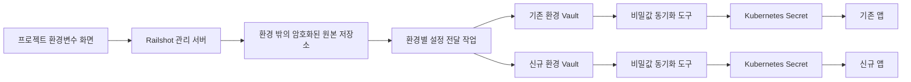

# 프로젝트 환경변수·환경별 Vault·배포환경 이전 구현계획

2026-10-04 · 구현 완료 및 로컬 검증 · Ubuntu 단일 VM 실기 부분 검증입니다.

초기 검토 기준은 별도 워크트리의 `abd968b`, 브랜치는 `design/k8s-secrets-injection`입니다. 이 문서 뒤쪽의 구현·검증 기록은 해당 기준에서 이어진 현재 워크트리 결과입니다. Vault 전체와 Provider별 운영 준비 완료를 뜻하지 않습니다.

중앙 Transit Vault·custody 운영 구성은 [공유 Vault 제어면](shared-vault-control-plane.md)에서 별도로 관리합니다. 환경별 앱 Vault를 대체하지 않으며, 실제 중앙 서버의 TLS·unseal·off-host backup·복원 훈련은 아직 별도 운영 승인과 실증이 필요합니다.

## 1. 권장 구조와 요구사항

각 배포환경에는 Vault와 External Secrets Operator(외부 비밀값을 Kubernetes Secret으로 동기화하는 도구)를 설치합니다. 사용자 입력값의 원본은 배포환경 밖의 Railshot 관리 영역에 암호화해 보관합니다. 환경을 바꾸면 고정된 프로젝트 식별자를 기준으로 같은 설정 버전을 새 환경에 배포합니다.

| 요구사항 | 구현 방향 | 완료 판단 |
|---|---|---|
| Ansible의 Kubernetes 설치 직후 Vault 구성 | 공통 환경 생성 흐름에 `secrets` 단계 추가 | 영구 저장·잠금 해제·인증·시험용 값 동기화까지 확인해야 준비 완료입니다. |
| 프로젝트별 환경변수 관리 페이지 | 프로젝트 상세의 환경변수 탭, 버전별 저장·적용 상태 | 값 등록·수정·삭제와 미적용 변경 안내가 가능해야 합니다. |
| 배포환경 변경 시 기존 값 이동 | 원본 설정 버전 → 새 Vault → 새 앱 주입 | 기존 환경에 접속할 수 없어도 사용자 입력값을 재주입할 수 있어야 합니다. |

이 구조는 Vault 제품의 클러스터 간 복제 기능에 의존하지 않습니다. Railshot이 프로젝트의 필요한 값만 대상 환경으로 전달하는 구조입니다. 환경별 Vault는 실행환경의 비밀값 공급을 담당하고, 중앙 저장소는 환경 소실 이후에도 사용자 설정을 보존합니다. 중앙 원본 저장소까지 잃은 경우 복구를 보장하려면 해당 저장소와 암호화 키의 별도 백업이 필요합니다.

## 2. 현재 코드에서 확인한 연결 지점

| 위치 | 현재 상태 | 필요한 변경 |
|---|---|---|
| `apps/api/src/environments.js` | Provider 자원 생성 → guest 검사 → `runtime.install` → 선택적 데이터베이스 → 등록 순서입니다. | runtime 성공 직후 secrets 구성·검증 단계를 추가합니다. |
| `infrastructure/ansible/run.py`, `inputs.py`, `runtime.yml` | 등록된 대상과 접속 수단을 검사하고 runtime 설치를 호출합니다. | 비밀정보 기반 구성·검증 내부 작업과 입력 계약을 추가합니다. |
| `deployment/bootstrap/install-k3s.sh` | 단일 서버 구성이고 기본 로컬 저장소를 비활성화합니다. | Vault용 영구 저장소를 명시하고 Secret 저장 암호화의 신규·기존 환경 적용 경로를 구분합니다. |
| `apps/api/src/applications.js` | 앱 식별자가 환경 식별자·tenant·앱 이름으로 결정됩니다. | 기존 앱 식별자를 유지하면서 환경에 독립적인 `project_id`를 추가합니다. |
| `apps/api/src/dashboard-schema.sql`, `product-store.js` | 세션·앱·작업 기록을 저장합니다. | 프로젝트·설정 버전·환경 연결·전달 작업 기록을 추가합니다. |
| `gitops/handoff.py` | 일반 env는 전달하지만 임의 비밀값은 차단하고 승인된 DATABASE_URL만 허용합니다. | 승인된 프로젝트 설정 참조와 버전을 허용합니다. |
| `ci/scripts/contract/catalog.yaml`와 게시 입력 검사 | 일반 env와 비밀변수 이름의 입력 규격이 있습니다. | 필요한 변수 이름만 게시 규격에 전달하고 실제 값은 빌드·게시 산출물에서 제외합니다. |
| `gitops/argo.py` | 허용 자원과 배포 선언을 엄격하게 비교합니다. | 새 설정 참조를 검증하고 필요한 허용 자원만 확장합니다. |
| `apps/dashboard/app.js`, `index.html`, `styles.css` | 앱 상세·업데이트·환경 선택 화면이 있습니다. | 환경변수 탭과 환경 이전 계획·진행 화면을 추가합니다. |

현재 관리 화면은 계정 로그인 없이 익명 세션으로 소유권을 분리합니다. 이번 기능도 기존 소유권 검사와 작업 실행 제한을 유지합니다. 만료되거나 잃어버린 세션의 프로젝트를 다른 세션에 자동 연결하지 않습니다. 계정 기반 복구·팀 공유는 별도 범위입니다.

## 3. 환경 생성 직후 Vault 구성

제품의 공통 실행 순서는 다음과 같습니다.

`resources → guest → runtime → secrets → database(선택) → binding/registration → ready`

`runtime_ready=true`는 Kubernetes 준비만 의미합니다. 비밀정보 기능을 요구하는 새 환경은 `secrets_ready=true`까지 확인해야 앱 배포를 허용합니다. 이전 환경은 `unsupported` 또는 `unconfigured`로 표시하고, 명시적인 추가 구성 작업으로 전환합니다.

공통 구현은 기존 `deployment/`와 `infrastructure/ansible/` 영역 아래에 둡니다. 제안 파일은 `deployment/scripts/secrets_runtime.py`, `infrastructure/ansible/secrets.yml`입니다. 내부 작업명은 `secrets.configure`, `secrets.verify`로 제안하며 공개 요청에는 임의 Vault 주소·명령·설정 파일 경로를 받지 않습니다.

설치 절차는 다음과 같습니다.

1. 운영자가 등록한 환경 설정에서 Vault·설치 패키지 버전, 저장소, 인증서, 잠금 해제 방식, 통신 경로를 검증합니다.
2. 전용 Kubernetes namespace(자원 격리 공간), 영구 저장 볼륨, Vault 서버를 구성합니다. 시험용 dev 모드는 사용하지 않습니다.
3. 최초 초기화와 잠금 해제를 수행합니다. 초기 관리자 토큰과 복구 자료는 환경 밖의 승인된 키 보관 수단으로 전달하고, 초기 관리자 토큰은 설정 완료 후 폐기합니다.
4. KV v2(버전별 값을 보관하는 Vault 기능), 감사 기록, 인증 방식과 최소 접근 정책을 구성합니다.
5. 비밀값 동기화 도구를 설치하고 Kubernetes 작업 계정 기반 인증을 설정합니다. 앱·환경별 정책은 다른 프로젝트 경로를 읽지 못하게 제한합니다.
6. 실제 비밀값이 아닌 임시 시험값으로 Vault 쓰기 → Secret 동기화 → 키 존재 확인을 검증하고 시험 자원을 제거합니다.
7. Vault 재기동 후 저장값 유지·잠금 해제·재동기화를 확인합니다. 이 검사를 통과한 뒤 준비 완료로 기록합니다.

재시도 시 이미 초기화된 Vault를 다시 초기화하거나 볼륨을 지우지 않습니다. 설치 소유권과 기존 상태를 조회하고 미완료 단계부터 이어갑니다. 초기화 직후 복구 자료 저장 실패처럼 결과가 불명확하면 `unknown`으로 남기고 추가 초기화를 중단합니다. 초기화 응답을 잃는 경우까지 포함한 복구 자료 인계 절차는 첫 기반 작업의 필수 검증 항목입니다.

### Provider별 차이

| Provider | 영구 저장소 | 자동 잠금 해제의 권장 연결 | 공통 처리와의 경계 |
|---|---|---|---|
| AWS | 등록된 EBS 볼륨과 검증된 연결 방식 | AWS KMS와 해당 서버의 제한된 역할 | K3s이므로 EKS 전용 인증·저장 기능이 있다고 가정하지 않습니다. |
| GCP | 등록된 Persistent Disk와 검증된 연결 방식 | Cloud KMS와 해당 서버의 제한된 서비스 계정 | GKE 자동 구성을 전제로 하지 않습니다. |
| 온프레미스 | 고객이 제공한 영구 볼륨 또는 보존되는 전용 디스크 | 외부 Vault Transit 또는 접근 가능한 키 관리 서비스 | 외부 키 관리 수단이 없으면 수동 잠금 해제 상태를 명확히 표시합니다. |

KMS는 암호화 키 관리 서비스입니다. Transit은 외부 Vault가 암호화·복호화를 제공하는 기능입니다. 대상 Vault가 자기 잠금 해제 키를 자기 안에만 보관하는 순환 의존성은 허용하지 않습니다. 완전 자동 준비에는 환경 밖의 키 관리 수단과 인증 수단이 선행되어야 합니다.

스토리지 드라이버를 사용할지 사전 연결한 전용 볼륨을 사용할지는 Provider 프로필에 명시합니다. 파일시스템 권한, 볼륨 재연결, 서버 삭제 시 보존, 스냅샷 복원까지 시험합니다. 단순히 기본 저장소를 켜는 것으로 데이터 내구성을 충족했다고 판단하지 않습니다.

Vault 통신은 TLS(통신 암호화와 서버 인증)를 사용합니다. 관리 서버에서 대상 Vault까지의 검증된 사설 접속 경로, 동기화 도구에서 Vault·Kubernetes 관리 서버로의 통신을 준비합니다. root 토큰을 상시 사용하지 않고 전달 작업은 대상 프로젝트 경로에만 쓰는 단기 자격을 사용합니다. Kubernetes 인증의 토큰 audience(토큰을 사용할 대상)와 역할 조건도 설치 버전에 맞춰 고정합니다.

초기 지원은 현재 runtime과 같은 단일 서버 구성입니다. 서버 장애 중 가용성을 보장하는 다중 노드 구성은 별도 단계입니다. Vault 버전·라이선스·설치 패키지·동기화 도구·K3s 호환성은 구현 시작 시 확정하고 고정합니다.

## 4. 프로젝트 및 설정 데이터 모델

환경 이전을 위해 기존 `application_id`를 직접 바꾸지 않습니다. 환경에 독립적인 프로젝트와 기존 앱의 관계를 추가합니다.

| 자원 | 주요 필드 | 역할 |
|---|---|---|
| project | `id`, `session_id`, `name`, `active_binding_id` | 환경을 바꿔도 유지되는 프로젝트입니다. |
| project binding | `id`, `project_id`, `environment_id`, `application_id`, `status` | 프로젝트가 특정 환경의 앱에 배포된 연결입니다. |
| configuration revision | `id`, `project_id`, `parent_revision_id`, `created_at`, `schema_version` | 변경 불가능한 사용자 설정 버전입니다. |
| variable | `revision_id`, `name`, `kind`, `scope`, `required`, `origin`, `ciphertext_ref` | 변수의 종류·범위·원본 출처와 암호화된 값의 참조입니다. |
| configuration delivery | `id`, `binding_id`, `revision_id`, `status`, `observed_revision_id` | 저장 버전과 실제 반영 버전을 구분합니다. |
| transfer | `id`, `project_id`, `source_binding_id`, `destination_binding_id`, `revision_id`, `stage`, `status` | 환경 이전과 재시작 복구를 기록합니다. |

사용자 입력값은 관리 영역에서 검증된 암호화 라이브러리와 외부 키 관리 서비스를 사용해 암호화합니다. 데이터 암호화 키도 외부 키로 감싸 보관하며, 복호화에 프로젝트·버전·변수 식별자를 결합해 다른 기록과 바꿔치기되지 않게 합니다. 일반 작업 기록에는 값이나 값의 평문 해시를 넣지 않습니다. 별도 값 저장 영역과 메타데이터 저장 간 부분 실패는 `pending/committed` 상태로 복구하며 원본 저장이 확정되기 전에는 전달 작업을 시작하지 않습니다.

설정 원본과 키는 배포환경의 삭제 수명과 분리합니다. 프로젝트 삭제는 별도의 명시적 요청으로 처리하고 보존기간·백업 삭제 정책을 안내합니다. 익명 세션 만료가 즉시 비밀값이나 운영 앱 삭제를 유발하지 않도록 하되, 세션 분실 후 접근 복구를 보장하지 않습니다.

초기 데이터 이관은 기존 앱마다 프로젝트 하나를 만들고 기존 연결을 붙입니다. 이름이 같다는 이유로 서로 다른 앱을 한 프로젝트로 합치지 않습니다. 기존 식별자·배포 이력·외부 참조를 보존하고 데이터 이관은 반복 실행 가능하게 만듭니다.

### 변수의 구분과 우선순위

| 분류 | 예시 | 새 환경 처리 |
|---|---|---|
| 사용자가 등록한 공통값 | 외부 서비스 인증키, 공통 로그 수준 | 같은 설정 버전에서 복사합니다. |
| 특정 환경에서만 유효한 값 | 내부 서비스 주소, 환경 전용 인증키 | 자동 복사하지 않고 이전 계획에서 유지·변경 여부를 확인합니다. |
| 플랫폼 생성값 | DATABASE_URL, MIGRATION_DATABASE_URL, PORT | 신규 환경의 연결에서 재생성합니다. 사용자 수정은 차단합니다. |

프로젝트 공통값 위에 대상 환경 전용 설정을 적용하고, 플랫폼 예약 변수와 충돌하면 요청을 거부합니다. 서로 다른 배포 대상뿐 아니라 개발·운영 같은 논리적 설정 묶음도 구분합니다. 운영에서 개발로 바꾸면서 운영용 인증키를 조용히 복사하지 않습니다.

일반값은 ConfigMap, 비밀값은 Vault를 거쳐 Secret으로 전달합니다. 초기 범위는 앱 실행 시점의 환경변수입니다. 빌드 시점 비밀값, 인증서 파일, 자동 데이터베이스 계정 발급은 별도 기능으로 둡니다. 브라우저용 번들에 포함되는 값은 비밀값으로 취급할 수 없음을 화면에서 구분합니다.

## 5. 관리 페이지와 요청 계약

프로젝트 상세에 `환경변수` 탭을 추가합니다. 변수 이름, 일반/비밀 구분, 공통/환경 전용 범위, 필수 여부, 등록 여부, 변경 시각, 저장 버전·적용 버전을 표시합니다.

최초 배포 전에도 프로젝트를 생성하고 값을 저장할 수 있게 합니다. 기존 앱은 프로젝트 연결을 이관하며, 새 배포 화면은 선택한 프로젝트와 설정 버전을 요청에 명시합니다. 같은 앱 이름으로 새로 배포했다고 기존 프로젝트의 값을 자동 연결하지 않습니다.

- 일반값은 조회·수정할 수 있고 비밀값은 등록 여부와 교체 입력만 제공합니다. 비밀값 재조회·일괄 내보내기는 초기 범위에 넣지 않습니다.
- 추가·수정·삭제를 저장하면 새 설정 버전이 생깁니다. `저장됨 · 미적용`과 `배포에 적용됨`을 구분합니다.
- `적용`을 누르면 대상 환경, 변경 변수 이름, 앱 재시작 여부를 확인한 뒤 설정 전달·앱 교체 작업을 접수합니다.
- 필수값 누락, 예약 변수 충돌, 동기화 실패, 다른 화면에서 먼저 수정된 경우를 구체적으로 안내합니다.
- `.env` 붙여넣기를 제공한다면 셸 명령이나 변수 치환을 실행하지 않습니다. 중복 키, 줄바꿈, 따옴표 처리 규칙을 정하고 검토 목록을 보여줍니다. 초기 버전에는 키·값 편집을 우선 구현합니다.
- 비밀값을 브라우저 저장소, 주소, 오류 응답, 원격 측정 기록, 일반 작업 로그에 남기지 않습니다. 요청 본문 로깅을 제외하고 제출 후 입력 상태를 비웁니다.

다음은 제안하는 HTTP API(화면과 서버 사이의 요청 규약)이며 아직 구현되지 않았습니다. 기존 `/api/v1` 명명·세션 소유권·오류 형식을 따릅니다.

| 요청 | 의미 |
|---|---|
| `POST /api/v1/projects`, `GET /api/v1/projects` | 최초 배포 전 프로젝트를 만들고 해당 세션의 프로젝트를 조회합니다. |
| `GET /api/v1/projects/{id}/variables` | 일반값과 비밀값 메타데이터를 조회합니다. |
| `POST /api/v1/projects/{id}/revisions` | `base_revision_id`와 변수별 설정·삭제 연산을 받아 새 버전을 저장합니다. |
| `POST /api/v1/projects/{id}/deliveries` | `binding_id`, `revision_id`를 지정해 적용 작업을 접수합니다. |
| `GET /api/v1/projects/{id}/deliveries/{delivery_id}` | 적용 작업의 저장 버전·관측 버전·진행 상태를 조회합니다. |
| `POST /api/v1/projects/{id}/transfers` | 대상 환경과 설정 버전을 고정한 이전 계획을 생성합니다. |
| `GET /api/v1/projects/{id}/transfers/{transfer_id}` | 이전 계획·진행 상태를 조회합니다. |
| `POST /api/v1/projects/{id}/transfers/{transfer_id}/actions` | `action=execute`와 검토한 계획 해시로 실행합니다. |

비밀값을 변경하지 않을 때는 값을 재전송하지 않고 기존 항목을 유지합니다. 삭제는 명시적 삭제 연산으로 표현하며 빈 문자열과 구분합니다. 모든 쓰기에는 버전 충돌 검사와 중복 요청 키를 적용합니다. 공개 계획 해시에는 값이나 평문 값 해시 대신 불투명한 설정 버전 식별자를 포함합니다.

비동기 실행은 `202 + Location`으로 접수하고 이후 상태 조회로 결과를 확인합니다. 계획 생성은 `201`을 사용합니다. 다른 세션의 프로젝트·환경·설정 버전 참조는 거부하며, 임의 namespace·Vault 경로를 사용자 입력으로 받아 접근 권한을 확장하지 않습니다.

## 6. 배포에 실제 값을 반영하는 방식

1. 관리 서버가 확정된 설정 버전을 읽고 대상 프로젝트·환경 연결의 소유권을 검사합니다.
2. 일반값은 대상 ConfigMap으로, 비밀값은 `railshot/projects/{project_id}/revisions/{revision_id}` 같은 버전별 Vault 경로로 전달합니다. 실제 경로는 서버가 결정합니다.
3. 환경에 제한된 실행기가 앱 namespace의 SecretStore·ExternalSecret을 생성합니다. 이 두 자원은 Vault 접속과 동기화 대상을 정의합니다. 일반 앱의 Argo 권한은 Vault 설치·인증 정책 변경 권한을 갖지 않습니다.
4. 해당 버전의 동기화 완료와 필요한 키 존재를 확인합니다. 같은 이름의 과거 Secret이 있다는 이유만으로 새 버전이 준비됐다고 판단하지 않습니다.
5. `gitops/handoff.py`는 버전별 ConfigMap·Secret 이름을 명시적으로 참조합니다. 필수 Secret 키에는 `optional`을 허용하지 않습니다. Git에는 비밀값이 아닌 참조·변수 이름·설정 버전만 기록합니다.
6. 새 Pod(앱 컨테이너 실행 단위)의 준비·실제 서비스 응답·적용 설정 버전을 확인한 후 전달 성공으로 기록합니다.

버전별 경로와 자원은 확정 후 수정하지 않는 규칙으로 운영합니다. 변경은 항상 새 버전으로 생성하고, 배포 선언의 참조가 바뀌면서 앱이 순차 교체되도록 합니다. 동기화 도구가 값을 갱신했다는 사실만으로 앱까지 반영됐다고 표시하지 않습니다. 이전 정상 버전 참조는 복구 기간 동안 유지합니다.

Vault 중단 시 기존 앱은 이미 주입된 값을 사용할 수 있으나, 외부에서 취소된 인증키의 유효성까지 보장하지는 않습니다. 새 버전 전달이 준비되지 않으면 새 배포를 차단하고 기존 준비 앱을 유지합니다. 시간 초과 후에는 버전과 자원을 조회해 결과를 확인하며 미확인 작업을 중복 실행하지 않습니다.

현재 데이터베이스용 Secret을 생성하는 기존 실행기와 새 동기화 도구가 같은 Secret에 동시에 쓰지 않게 합니다. 첫 단계에서는 사용자 입력값만 새 경로로 처리하고, 데이터베이스 생성값은 기존 소유자가 유지합니다. 이를 Vault로 통합하는 작업은 별도 전환 계획이 필요합니다.

## 7. 배포환경 변경 절차

환경 변경은 한 번의 삭제·복사가 아니라 계획 → 새 환경 준비 → 검증 → 활성 연결 변경으로 구현합니다.

`planned → preparing → delivering → deploying → verifying → switching → succeeded`

1. 사용자가 대상 환경을 선택하면 같은 프로젝트의 사용자 입력값, 환경 전용으로 다시 지정할 값, 플랫폼이 재생성할 값을 보여줍니다. 새 공개 주소나 외부 서비스 허용 목록 변경 필요성도 표시합니다.
2. 계획에 프로젝트, 출발·도착 연결, 설정 버전, 앱 소스/이미지 식별자, 만료 시각을 고정합니다. 계획 이후 설정이 바뀌면 다시 검토하도록 합니다.
3. 대상 환경에 Vault가 없으면 환경 구성 절차를 수행합니다. 환경·프로젝트 접근 권한과 저장소·키 관리 준비가 없으면 이 단계에서 중단합니다.
4. 관리 영역의 원본에서 새 Vault로 설정을 전달합니다. 출발 환경이 살아 있다는 조건에 의존하지 않습니다. 기존 환경에만 수동으로 넣은 값은 자동 복구할 수 없으므로 이전 전에 원본 등록이 필요합니다.
5. 대상 환경에 새 앱 연결을 생성하고 새 설정 버전으로 배포합니다. 기존 게시 결과는 대상 식별자와 결합되어 있으므로 단순히 target 값을 바꾸지 않습니다. 대상용 게시·이미지 접근 검증을 다시 수행하며, 이미지 재사용을 허용하려면 별도로 검증된 재연결 계약이 필요합니다.
6. 필수값·Secret 동기화·앱 준비·서비스 응답을 확인합니다. 플랫폼 예약값은 대상 환경에서 생성한 연결을 사용합니다.
7. 성공하면 관리 기록의 활성 연결을 조건부로 변경합니다. 공개 트래픽 전환은 등록된 경로가 지원하는 경우 별도 단계를 통해 확인합니다. 화면의 활성 대상 변경만으로 트래픽 이전을 완료했다고 표시하지 않습니다.
8. 기존 앱·Vault·Secret은 자동 삭제하지 않습니다. 운영자가 정한 복구 기간과 명시적 정리 요청 이후, 다른 프로젝트가 공유하지 않는 자원만 정리합니다.

이전 도중 사용자 설정 적용·앱 삭제·다른 이전 요청이 겹치지 않게 합니다. 초기 구현은 기존 workspace 전체의 변경 작업 실행 제한을 유지합니다. 이전 완료 시에도 최초 설정 버전과 활성 연결을 다시 비교해 다른 변경을 덮어쓰지 않습니다.

실패 시 새 환경의 준비 자원과 비용 발생 여부를 기록하고 기존 연결을 유지합니다. 관리 서버가 재시작되면 저장된 단계와 실제 대상 상태를 비교해 이어갑니다. 트래픽 전환 결과가 불명확하면 `unknown` 상태에서 관측·운영자 확인을 요구합니다. 이미 이전 환경이 소실된 경우 기존 앱으로의 복귀를 보장하지 않습니다.

**환경변수 이전은 데이터베이스 데이터 이전과 별개입니다.** 새 데이터베이스를 만들었다면 새로운 DATABASE_URL을 주입할 수는 있지만 기존 데이터가 자동으로 옮겨지지는 않습니다. 기존 데이터베이스를 계속 사용할 때도 네트워크와 인증서·접근 정책을 검증해야 합니다. 데이터 이전·동일 주소 유지·무중단 전환은 별도 범위로 명시합니다.

## 8. 구현 순서와 공수

숙련 개발자 1명, 기존 기반 재사용, 실행 시점 환경변수, Provider별 시험환경 확보를 전제로 한 초기 추정입니다. 인일은 한 사람이 하루 작업하는 분량입니다. 외부 자원 승인·학습·새로운 다중 노드 운영 구성은 포함하지 않습니다.

| 작업 묶음 | 변경·산출물 | 예상 |
|---|---|---:|
| 1. 식별자·소유권·계약 | 프로젝트/앱 연결, 설정 규격, 기존 데이터 이관, 요청 규약 | 2~3인일 |
| 2. Vault 공통 설치와 Provider 연결 | 저장·키 관리·인증·설치·재기동·준비 상태 | 4~6인일 |
| 3. 중앙 원본 저장과 전달 | 암호화, 설정 버전, 전달 작업, 실패 복구 | 3~4인일 |
| 4. 프로젝트 환경변수 화면 | 편집·저장·적용·오류·세션 경계 | 3~4인일 |
| 5. 배포 선언과 검증 | 일반값/비밀값 참조, 사전 검사, 적용 버전·복구 | 3~4인일 |
| 6. 환경 변경 | 이전 계획, 대상 앱 연결, 상태 복구, 검토 화면 | 4~6인일 |
| 7. 실제 Provider 검증과 운영 문서 | 장애·복원·다른 프로젝트 격리·기존 기능 회귀 검사 | 3~5인일 |
| 합계 | 요구한 세 기능의 초기 제공 범위 | **22~32인일, 약 5~7주** |

첫 수직 검증은 1번의 최소 계약 → 한 Provider의 2번 → 3·5번 → 시험용 앱 순서로 진행합니다. 그다음 화면을 연결하고 두 번째 환경으로 이전한 뒤 Provider 지원을 넓힙니다. 이는 모든 Provider에 설치 코드만 추가한 뒤 마지막에 통합하는 위험을 줄입니다.

전체 범위의 코드 변경은 위 작업 묶음별 검토 단위로 나눕니다. 각 단위는 이전 계약과 하위 호환을 유지하며 비밀값·자격을 저장소에 넣지 않습니다. 다중 노드 가용성, 별도 복구 환경, 폐쇄망 설치 묶음, 계정·팀 권한, 데이터 이전까지 요구하면 별도 산정이 필요합니다.

## 9. 필수 인수 시나리오

| 시나리오 | 통과 기준 |
|---|---|
| AWS·GCP·온프레미스 신규 환경 | runtime 다음 secrets 단계가 실행되고 재기동 후 값·인증이 유지됩니다. 시험하지 않은 Provider는 미검증으로 표시합니다. |
| 저장·키 관리 수단 미준비 | 배포 전 정확한 사유로 차단하며 환경을 준비 완료로 표시하지 않습니다. |
| 같은 설치 재시도 | Vault 초기화·관리 키 생성·볼륨 생성이 중복되지 않습니다. |
| 변수 누락·예약 변수 충돌 | 앱 교체 전에 차단하고 변수 이름만 안내합니다. |
| 저장과 적용 구분 | 화면의 저장 버전과 실행 중 버전이 실제와 일치합니다. |
| 세션·프로젝트 경계 | 다른 세션의 조회·변경·이전이 거절되고 다른 프로젝트 비밀값을 읽지 못합니다. |
| 새 환경으로 이전 | 공통 입력값은 유지되고 환경 전용값은 검토되며 플랫폼 값은 재생성됩니다. |
| 기존 환경 장애·삭제 | 중앙 원본과 키가 있으면 사용자 입력값을 새 환경에 전달할 수 있습니다. |
| Vault 장애·설정 전달 실패 | 새 배포를 차단하고 기존 정상 앱·활성 연결을 유지합니다. |
| 이전 중 설정 수정·중복 요청 | 충돌을 감지하며 다른 버전 혼합이나 중복 이전이 발생하지 않습니다. |
| 작업 중 관리 서버 재시작 | 저장 단계와 실제 상태를 조회해 복구하고 결과 불명은 성공으로 표시하지 않습니다. |
| 비밀값 노출 검사 | 응답·로그·Git·게시 산출물·브라우저 저장소에 비밀값이 없습니다. |
| 정리·복원 | 다른 앱·공유 Vault를 보존하고 백업으로 실제 복원할 수 있습니다. |

## 10. 운영 적용 전에 확정할 입력과 범위

코드 구현 완료는 운영 설정 변경이나 외부 자원 생성을 승인한 것으로 해석하지 않습니다. 운영 적용 전에 다음 입력을 구체화해야 합니다.

- 관리 영역의 암호화 원본 저장소와 외부 키 관리 수단을 정합니다. 두 가지 모두 배포환경 수명과 분리하는 것을 기본으로 합니다.
- 각 Provider의 영구 저장·잠금 해제·사설 접속 프로필을 정합니다. 지원하지 않는 프로필은 자동 준비를 약속하지 않고 차단합니다.
- 단일 서버 초기 제공을 기본으로 하고 다중 노드 가용성은 별도 범위로 둡니다.
- 환경 이전은 사용자 입력값 복사와 새 앱 연결까지 포함합니다. 데이터베이스 데이터 이전과 기존 자원의 삭제는 별도 요청으로 처리합니다.
- 익명 세션 기반 권한을 유지합니다. 장기 소유권 복구나 팀별 공유를 요구하면 별도 계정 설계가 필요합니다.

## 근거

- [현행 환경 생성 코드](../../apps/api/src/environments.js), [앱 연결 코드](../../apps/api/src/applications.js), [배포 선언 생성 코드](../../gitops/handoff.py)
- [기존 요청 규약](../api/conventions.md), [앱 관리 구조와 실행 제한](application-management.md)
- [External Secrets의 Vault 연결](https://external-secrets.io/latest/provider/hashicorp-vault/): KV 저장소 연결과 Kubernetes 인증의 공식 근거입니다.
- [Vault KV v2](https://developer.hashicorp.com/vault/docs/secrets/kv/kv-v2): 버전별 값 저장 기능의 근거입니다.
- [Vault 잠금 해제 설정](https://developer.hashicorp.com/vault/docs/configuration/seal): 외부 키 관리·Transit 등 구성의 근거입니다.
- [Vault Kubernetes 인증](https://developer.hashicorp.com/vault/docs/auth/kubernetes): 작업 계정 인증과 역할 제한의 근거입니다.
- [Kubernetes Secret 환경변수](https://kubernetes.io/docs/tasks/inject-data-application/distribute-credentials-secure/): 실행 중 환경변수에 변경값을 반영하려면 컨테이너 재시작이 필요합니다.
- [K3s 저장 암호화](https://docs.k3s.io/security/secrets-encryption): Secret 저장 암호화와 기존 서버 적용 시 재시작의 근거입니다.

공수·데이터 모델·단계 구성은 이 저장소를 바탕으로 한 계획이며 공식 도구가 자동으로 제공하는 기능으로 해석하지 않습니다. 완료된 검증과 남은 범위는 아래 구현 기록과 [Ubuntu 실기 검증 보고서](../poc/vault-runtime-live-20261004.md)에 구분해 기록합니다.

## 2026-10-04 코드 구현 현황 (운영 검증과 구분)

이 절은 위 설계 이후의 코드 구현 기록입니다. 구현 단계에서는 실제 Provider 자원 생성, 운영 키 사용, Vault 초기화, 배포를 실행하지 않았습니다. 이후 별도 승인된 단일 시험 VM의 부분 검증은 아래 문단과 실기 보고서에 따로 기록합니다.

- **관리 API 구현:** 기존 앱 식별자를 유지하는 프로젝트·환경 연결, 익명 세션 소유권, AES-256-GCM 봉투 암호화, 외부 관리 키링, 불변 버전, 예약 변수·동시 변경 검사, 일반값 조회·비밀값 메타데이터 조회, 중복 요청 처리와 SQLite 원자 저장을 추가했습니다.
- **실제 실행 연결 코드:** 전달은 검증된 소스 재게시 → Vault/Secret 준비 → 버전 참조를 고정한 GitOps 배포 → 앱·서비스·설정 버전 확인 순서입니다. 직접 Deployment만 수정하여 선언과 실행이 어긋나는 경로를 제품 API에서 사용하지 않습니다. 이전은 대상 환경에 별도 앱 연결을 만들고 같은 원본 버전을 전달하며, 성공한 경우에만 활성 연결을 조건부로 바꿉니다. 공개 트래픽 전환과 기존 앱 삭제는 수행하지 않습니다.
- **신규 환경 자동 연결 코드:** runtime 이후 `secrets.configure`를 추가했습니다. 환경 계획의 신뢰된 `secrets_config_file`을 실제 파생 환경 ID에 결합하고, `secrets_delivery_file` 템플릿을 관리 영역에 저장합니다. 준비·등록 성공 기록과 파일 해시로 `secrets-registration.json`을 남깁니다. 프로젝트 배포는 전용 환경의 기존 CD 등록을 재사용하는 환경 연결을 자동 생성합니다. 새 ID를 정적 환경 목록에 수동 추가하는 방식에 의존하지 않습니다.
- **복구:** 재시작 때 진행 중 작업은 unknown으로 복구하여 변경 작업을 재전송하지 않습니다. 전달·이전 `actions`의 `action=observe`는 저장된 게시·배포·설정 참조와 읽기 전용 실행기 관측으로 결과를 확인합니다. 증거가 부족하면 unknown·전역 실행 제한을 유지하고 운영자 확인을 요구합니다.
- **운영자 준비 필요:** 외부 마운트 키링, 보존 저장소, 외부 자동 잠금 해제·복구자료 보관 도구, 고정된 설치 산출물, 관리 사설 접속, 전달 자격이 필요합니다. 설정이 없으면 준비됨을 가장하지 않고 차단합니다. 클라우드 KMS 직접 암호화 API, 계정 복구, 데이터베이스 데이터 이전, 공개 주소의 무중단 전환, 자동 과거 자원 삭제는 구현 범위에 포함하지 않았습니다.

로컬 검증은 임시 디렉터리·가짜 키·모의 실행기로 수행한 API 단위/HTTP 통합·암호화 경계·재시작·전달·이전 검사입니다. 별도 승인된 Ubuntu 단일 VM에서는 guest 계약, K3s API 기동, 실제 Secret의 API readback과 SQLite AES-CBC 암호문 저장, secrets 프로필 누락 차단을 확인했습니다. 높은 I/O 대기와 이미지 pull 지연으로 Cilium 준비 제한을 넘겨 `runtime_ready=false`로 종료됐습니다. 자세한 자원·명령·증거와 제한은 [2026-10-04 Ubuntu 실기 검증](../poc/vault-runtime-live-20261004.md)에 기록합니다.

### 2026-10-04 최종 로컬 검사 기록

운영 kubeconfig·Vault·DB·key service·클라우드 자격은 사용하지 않았습니다. 다음 결과는 임시 파일, 가짜 키, 모의 실행기와 localhost 시험 서버의 증거입니다.

- secrets delivery/runtime 14개와 escrow client 2개: 16/16 통과. `/tmp/railshot-infra-venv/bin/python -m unittest discover -s deployment/scripts/tests -p 'test_secrets*.py' -v` 및 `/tmp/railshot-infra-venv/bin/python -m unittest deployment/scripts/tests/test_recovery_escrow.py -v` (`/tmp/railshot-infra-secrets-tests.log`).
- 실제 publication→Python bridge→GitOps 설정 참조: application release 11/11, GitOps 전체 101/101 통과. `PYTHONPATH=deployment/scripts:deployment/scripts/tests:gitops /tmp/railshot-infra-venv/bin/python -m unittest deployment.scripts.tests.test_application_release -v`, `/tmp/railshot-infra-venv/bin/python -m unittest discover -s gitops -p 'test_*.py' -v` (`/tmp/railshot-infra-release-tests.log`, `/tmp/railshot-infra-gitops-tests.log`).
- 신규 환경 Node adapter→digest-bound ledger→Python `select_target`: 21/21 통과. `node --test apps/api/test/environments.test.js` (`/tmp/railshot-infra-node-cross-tests.log`).
- Ansible 전체 77개 실행에서 72개 통과, 4개 native 도구 전용 검사 skip, localhost API 시작 race 1개 실패가 있었습니다. 실패한 `test_sigterm_drains_bounded_worker_and_persists_unknown_before_exit`은 단독 재실행 1/1 통과했습니다 (`/tmp/railshot-infra-ansible-tests.log`, `/tmp/railshot-infra-ansible-flake-rerun.log`). skip은 native TLS/Vault 도구, native Ansible mount guard, CI native playbook, 실제 Vault CLI 검사용입니다.
- `ANSIBLE_CONFIG=infrastructure/ansible/ansible.cfg ANSIBLE_LOCAL_TEMP=/tmp/railshot-ansible-local /tmp/railshot-infra-venv/bin/ansible-playbook -i 'localhost,' infrastructure/ansible/secrets.yml --syntax-check`, Python compile, JSON/YAML parse, `git diff --check`를 통과했습니다 (`/tmp/railshot-infra-ansible-syntax.log`).
- 상위 통합 검수 보고 기준 API 252/252, dashboard 21/21 및 build, 별도 secrets 14/14가 통과했습니다.

실제 Provider PV bind, KMS/Transit auto-unseal, mTLS escrow 서버의 내구 저장, Vault Pod 재기동, External Secrets의 실제 admission webhook·동기화, Cilium/Node 최종 준비, 재부팅 복구와 앱 HTTP readback은 수행하거나 통과하지 못했습니다. 이는 운영 입력과 적절한 시험 인프라를 준비한 뒤 별도로 확인해야 합니다.
