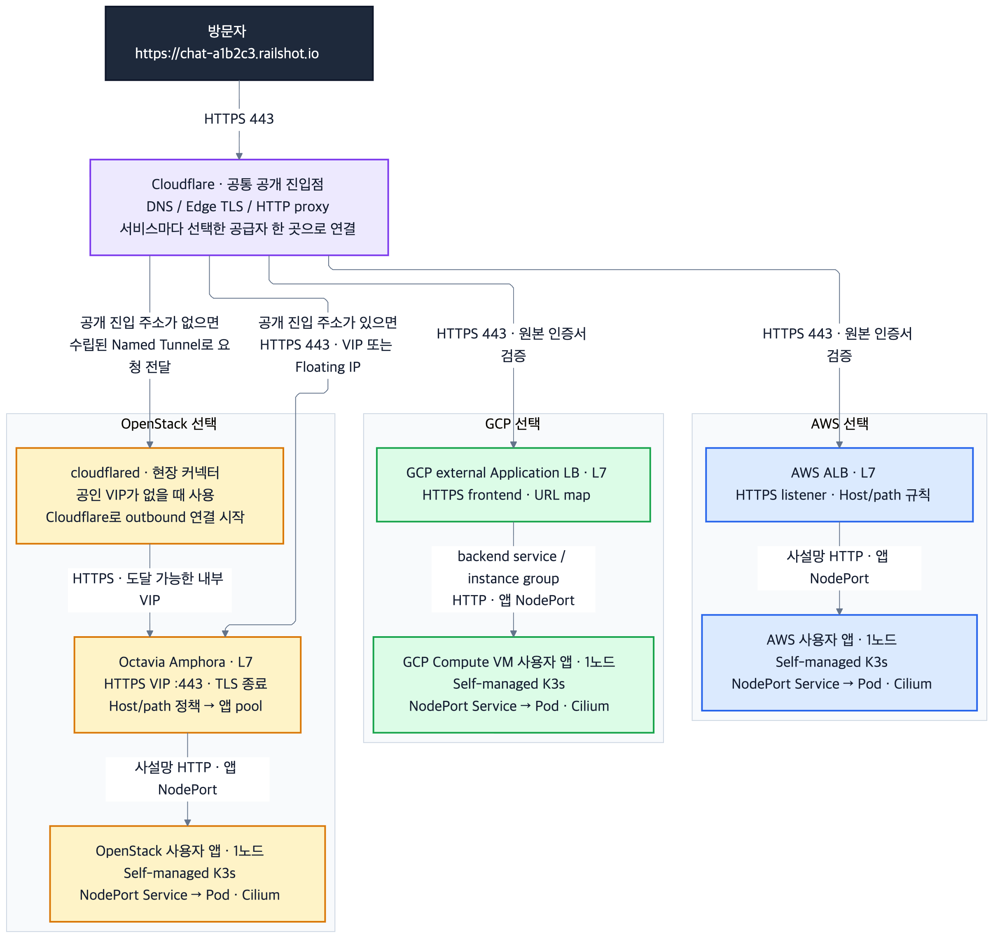
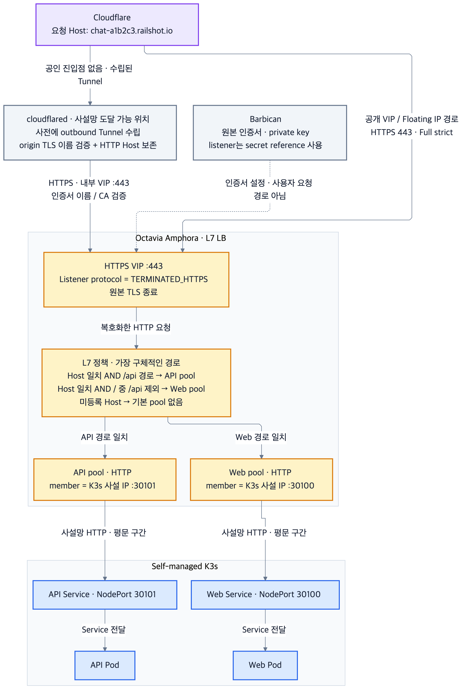

# Self-managed K3s의 공급자별 공개 경로

2026-10-02 사용자 결정. 모든 앱 클러스터는 **VM에 직접 설치한 단일 노드 K3s + Cilium**이다. AWS EKS, GCP GKE, OpenStack Magnum을 전제로 하지 않는다. CI/CD·Ansible·Argo가 동작하는 AWS 운영 클러스터와 사용자 앱 클러스터는 분리한다.

완료 범위는 선택한 공급자의 자원 준비 → K3s 설치 → 앱 적용 → 해당 공급자 공개 경로의 HTTPS 응답 확인이다. 공급자 사이의 앱 통신·DB 복제·장애 전환은 필수 조건이 아니다. 운영 서버의 SSH/Kubernetes API 관리 접근은 별도로 확보한다.

## HTTP ingress와 L4/L7의 의미

여기서 Octavia의 HTTP ingress는 Kubernetes `Ingress` 객체의 이름이 아니라 **HTTP 요청이 들어오는 LB 진입점**이다. 선택한 Amphora provider에서는 LB용 VM의 HAProxy가 요청을 처리한다. Octavia는 이를 listener, pool/member, health monitor, L7 policy/rule로 관리한다.

공식 Kubernetes 연동 구성요소 **`octavia-ingress-controller`**도 별도로 존재한다. 이 controller는 Kubernetes `Ingress` 선언을 감시해 Octavia 자원을 만들고 NodePort Service에 연결한다. controller Pod가 HTTP 트래픽을 직접 중계하는 것은 아니다. 이번 구현은 기존 Terraform 실행 구조를 재사용해 LB를 관리하며 이 controller를 설치하지 않는다. 추후 Ingress 선언 기반 관리로 전환할 때는 같은 LB를 Terraform과 controller가 동시에 수정하지 않도록 소유권을 이관해야 한다. Self-managed K3s라고 해서 이 controller나 OpenStack 연동이 자동 설치되는 것은 아니다.

| 구분 | TCP LB (L4) | HTTP/HTTPS LB (L7) |
| --- | --- | --- |
| 전달 기준 | TCP 연결의 주소·포트, 연결 단위 분산 | HTTP Host·path 등 요청 내용 |
| HTTPS 처리 | 암호화된 바이트를 backend까지 전달할 수 있음 | HTTP 라우팅을 위해 원본 TLS를 LB에서 종료 |
| `/api`와 `/` 분리 | HTTP 경로를 읽지 않아 이 방식으로 분리 불가 | 경로별 pool 선택 가능 |
| 이번 OpenStack 선택 | 기존 OVN 실험 경로 | Amphora `TERMINATED_HTTPS` listener |

Octavia라는 이름 자체가 L4 또는 L7 중 하나를 뜻하지는 않는다. provider와 listener protocol에 따라 지원 범위가 달라진다. **OVN은 L7 policy를 지원하지 않으므로 기존 OVN LB를 L7으로 전환했다고 간주하지 않는다.** 기존 LB를 자동 변경하거나 인수하지 않고 별도 Amphora LB를 만든다.

## 공급자별 목표

[Mermaid 원본](diagrams/self-managed-native-l7.mmd). 그림의 화살표는 목표 요청 흐름이며 현재 실배포 증거가 아니다.

| 공급자 | 공개 진입점 | K3s 연결 | 이 변경의 구현 범위 |
| --- | --- | --- | --- |
| AWS | Cloudflare → ALB | 사설 IP:NodePort | 기존 ALB 모듈 유지. Cloudflare DNS 연결·기존 Route53 이전은 별도 |
| GCP | Cloudflare → external Application LB | instance group/named port → VM NodePort | 목표 설계. GKE Ingress controller나 자동 NEG를 가정하지 않음 |
| OpenStack | Cloudflare → Octavia Amphora | pool member → VM 사설 IP:NodePort | [openstack-edge](../../infrastructure/terraform/openstack-edge/README.md)의 native Terraform 실행 경로 |

서비스 하나는 선택한 공급자 한 곳으로 연결한다. Cloudflare가 여러 공급자 사이의 자동 장애 전환을 수행한다는 뜻은 아니다. `{service-name}-{stable-hash}.railshot.io` 이름은 기존 [서비스 이름 함수](../../gitops/service_name.py)의 입력·충돌 정책을 재사용한다.

## OpenStack의 요청 경로

[Mermaid 원본](diagrams/octavia-amphora-l7.mmd). IP·포트·서비스명은 예시다.

1. listener `TERMINATED_HTTPS:443`가 TLS를 종료한다. Barbican에 미리 준비한 인증서 secret reference를 사용한다. 인증서·개인키 본문을 모듈 변수나 Git에 넣지 않는다.
2. L7 policy에서 Host와 path 조건을 AND로 검사한다. `/api`는 `/api` 및 `/api/...`에만 매칭하고 `/apix`로 확장하지 않는다. 같은 Host의 더 구체적인 경로는 부모 정책의 inverted PATH rule로 제외한다. 따라서 `/` fallback은 `/api`를 받지 않으며, Octavia가 생성 순서에 따라 position을 다시 매겨도 가장 구체적인 경로의 pool만 선택된다.
3. `REDIRECT_TO_POOL`은 선택한 pool로 내부 전달한다. 브라우저 3xx redirect나 path 제거는 하지 않는다.
4. pool member의 노드 사설 IP:NodePort로 HTTP를 보내고 Service가 Pod로 전달한다. 현재 K3s/Cilium 설치와 kube-proxy를 재사용하며 별도 Ingress controller를 설치하지 않는다.
5. listener에 default pool을 두지 않는다. 등록되지 않은 Host는 앱으로 전달되지 않으며 매칭 정책이 없으면 Octavia가 503을 반환한다.

**Amphora → NodePort는 평문 HTTP**다. 내부 TLS가 필요한 환경은 backend 재암호화와 인증서 검증을 별도로 설계한다. NodePort의 보안 그룹·host firewall은 실제 Amphora backend/health monitor source로 제한한다. Pod에서 관찰되는 source는 NodePort 주소 변환에 따라 달라질 수 있으므로 `CF-Connecting-IP` HTTP 헤더를 NetworkPolicy의 source IP로 취급하지 않는다.

## 공개 진입 주소가 없는 현장

`Cloudflare → Named Tunnel → cloudflared → https://내부-VIP:443 → Amphora`로 연결한다. cloudflared는 내부 VIP에 도달할 수 있는 위치에서 Cloudflare로 outbound 연결을 시작한다. 공인 inbound 포트가 없어도 요청을 받을 수 있지만 내부 VIP의 라우팅·방화벽은 여전히 필요하다.

원본 서비스는 `https://...`를 사용한다. `tcp://...` 게시 경로는 일반 브라우저 HTTP 게시와 같은 방식이 아니다. `originServerName`은 인증서의 hostname을 검증하는 값이고, HTTP Host는 서비스 라우팅을 위해 보존한다. 사설 CA라면 CA bundle을 제공하고 `noTLSVerify=false`를 유지한다. 모든 서비스의 Host를 하나로 덮어쓰지 않는다.

이 변경은 Tunnel 생성, 토큰 배포, 커넥터 설치, Cloudflare DNS 변경을 실행하지 않는다. [cloudflared 위치](../../deployment/cloudflared/README.md)는 아직 자동 설치 구현이 없다.

## 실행 경계와 인수

먼저 현장에 Amphora provider·image/flavor·compute·management network·worker/health manager 연결과 Barbican이 준비돼야 한다. **앱 K3s 한 노드 외에 Amphora LB VM 자원이 필요하다.** HA topology를 선택해도 앱 노드 하나의 장애까지 제거되지는 않는다.

이번 모듈은 operator native Terraform 진입점이다. 기존 [제품 환경 생성](../../apps/api/src/environments.js)은 AWS/GCP를 지원하고, [공개 경로 실행기](../../gitops/edge.py)는 AWS ELB/Route53 조회에 묶여 있다. 이 PR만으로 제품 API의 OpenStack 선택→전체 자동 배포가 연결됐다고 표시하지 않는다. 이후에는 해당 호출부에 소유 자원 참조와 provider별 조회를 연결한다.

실제 적용·인수·삭제 명령과 입력은 [모듈 README](../../infrastructure/terraform/openstack-edge/README.md)를 따른다. 다음 증거를 각각 남긴다.

- **로컬/PR 검사:** 입력 거부 조건, provider schema, Terraform validate. 클라우드 생성 증거가 아님.
- **현장 LB 인수:** Amphora·listener·pool·member 상태, HTTP health monitor, Host/path별 응답과 미등록 Host 차단.
- **공개 인수:** 실제 서비스 hostname으로 TLS 검증을 통과한 응답과 기대 앱 revision. Tunnel 경로라면 원본 인증서 검증과 커넥터 재연결도 확인.
- **삭제 인수:** 해당 state가 소유한 LB·listener·policy/rule·pool/member/monitor 삭제 확인. 기존 VM·DB·인증서·DNS·도메인은 이 state의 삭제 대상이 아님.

## 공식 근거

- [Octavia provider 기능표](https://docs.openstack.org/octavia/latest/user/feature-classification/index.html)
- [Octavia L7 정책과 default pool](https://docs.openstack.org/octavia/latest/user/guides/l7.html)
- [Octavia TLS 종료·Barbican·backend TLS](https://docs.openstack.org/octavia/latest/user/guides/basic-cookbook.html)
- [Kubernetes NodePort](https://kubernetes.io/docs/concepts/services-networking/service/#type-nodeport)
- [공식 Octavia Ingress Controller](https://github.com/kubernetes/cloud-provider-openstack/blob/master/docs/octavia-ingress-controller/using-octavia-ingress-controller.md)
- [Cloudflare 원본 연결 설정](https://developers.cloudflare.com/cloudflare-one/networks/connectors/cloudflare-tunnel/configure-tunnels/origin-parameters/)
