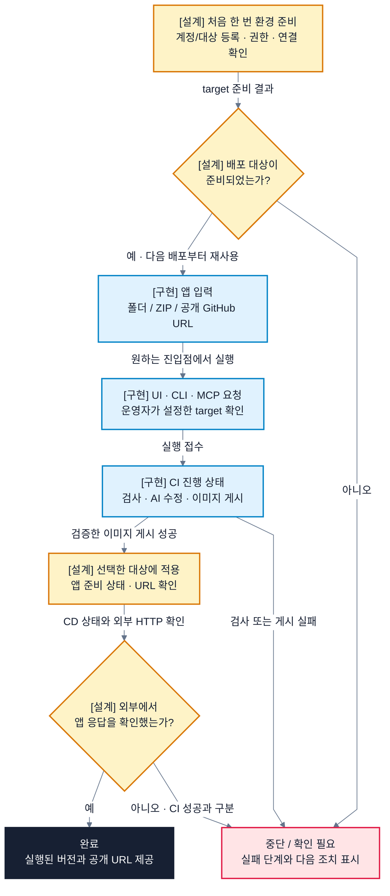

# RAILSHOT 개발 기획서

**One Action, Infinite Clouds. | 로컬 웹앱에서 검증 가능한 배포까지**

RAILSHOT은 로컬에서 만든 웹앱을 AI의 도움으로 배포 가능한 형태로 준비하고, 선택한 클라우드 또는 온프레미스에 배포하는 시스템입니다. 웹 UI·CLI·MCP에서 같은 요청과 검사 결과를 사용하도록 설계합니다. 이 문서는 개발 범위, 사용자 시나리오, 팀 간 연결 순서와 완료 기준을 설명합니다.

**현재 상태 · 2026-10-02:** 담당자 소스 조립과 로컬 연결 검증을 완료했습니다. 실제 AWS/OpenStack 배포와 외부 URL 접속은 아직 인수 전입니다. 검사 결과와 미연결 항목은 [검증 보고](integration/validation.md)에서 관리합니다.

## 1. 사용자와 해결할 문제

첫 사용자는 로컬에서 실행되는 웹앱을 가진 개발자입니다. 앱을 다른 환경으로 옮길 때는 빌드 명령, 실행 포트, 이미지와 네트워크를 다시 맞춰야 합니다. 빌드가 성공해도 외부에서 접속하지 못할 수 있으며, 실패한 단계를 찾는 일도 개발자에게 남습니다.

RAILSHOT은 앱의 준비·검사를 공통으로 처리하고, VM 준비와 공개 접속은 환경별 담당 구현으로 연결합니다. 사용자는 앱 소스와 배포 대상을 확인한 뒤 실행을 요청하고, 어느 단계까지 끝났는지 확인합니다. 완료 결과에는 대상, 실행 버전과 검증된 URL을 제공합니다.

최초 계정 연결과 실행 환경 준비는 별도 작업입니다. **“One Action”은 준비된 환경에서 반복 배포를 단순하게 한다는 뜻입니다.** 초기 AWS 시연은 팀 계정, 온프레미스 시연은 기존 OpenStack 환경을 사용합니다. 고객 AWS 계정 연결과 모든 프레임워크의 무설정 배포는 현재 범위에 포함하지 않습니다.

## 2. 개발 범위와 요구사항

아래는 첫 통합 배포에서 확인할 기능입니다. 실제 완료 여부는 같은 앱 소스와 대상에 연결된 실행 결과로 판단합니다.

| 기능 | 제공할 동작 | 완료 확인 |
|---|---|---|
| 앱 제출 | 폴더·ZIP·공개 GitHub URL을 받고 UI·CLI·MCP를 같은 API에 연결합니다. | 소스 버전·대상·실행 ID가 연결되고, 잘못된 입력은 실행 전에 거부됩니다. |
| AI 보조 검사 | 기본 검사에 실패하면 허용된 범위에서 수정하고 같은 검사를 다시 실행합니다. | 수정 내용과 재검사 결과를 확인할 수 있으며, 실패한 이미지는 게시하지 않습니다. |
| 검증 이미지 전달 | 통과한 이미지를 다시 빌드하지 않고 게시합니다. | 게시한 digest와 대상에서 실행하는 이미지가 일치합니다. |
| 대상 적용 | 준비된 AWS 또는 OpenStack의 독립된 K3s에 앱을 적용합니다. | 대상별 적용 버전, 앱 준비 상태와 외부의 기대 응답을 확인합니다. |
| 진행·실패 표시 | 요청 접수, 검사, 게시, 적용과 공개 접속을 구분합니다. | 중단 단계와 확인할 근거를 표시하고, 게시만 된 실행을 배포 완료로 표시하지 않습니다. |

현재 CD 인계 구현은 **linux/amd64의 단일 stateless 서비스**를 대상으로 배포 선언의 로컬 검토본을 생성합니다. DB·secret 주입·외부 egress가 필요한 앱은 지원하지 않습니다. Git 반영, Argo 동기화와 적용 결과 수집은 남은 연결 작업입니다. 첫 통합 확인에는 이 범위에 맞는 샘플을 사용합니다.

앱 DB의 별도 VM 배치와 Patroni 구현은 화균 담당의 팀 과제로 유지합니다. DB 배치·접속·복구 계약은 별도로 인수합니다. 자동 DB 이관, 다중 노드 HA와 무중단 복구는 검증 후 지원 범위를 정합니다.

공통 품질 기준은 실행 추적, 자격 분리와 실패 판정입니다. 고객 소스와 AI 작업 공간에 플랫폼 관리 자격을 전달하지 않으며, 원격 운영에는 사용자 인증과 대상별 권한 검사가 필요합니다. 소요 시간은 환경 준비·CI·적용·외부 접속으로 나누어 측정합니다. 시간 절감률이나 성공률 목표를 뒷받침할 측정값은 아직 없습니다.

## 3. 사용자 시나리오

개발자는 준비된 대상을 확인하고 앱을 제출합니다. 첫 배포 전에는 대상 등록·권한·연결을 준비하며, 다음 배포부터 이 환경을 재사용합니다. 현재 API의 대상은 운영자 설정으로 고정되어 있습니다. 사용자별 대상 선택과 원격 인증은 후속 연결 범위입니다.

그림은 목표 사용자 흐름입니다. **구현**은 코드가 있는 단계, **설계**는 연결하거나 실환경에서 인수할 단계를 뜻합니다. 요청 접수와 이미지 게시 뒤에도 대상 적용과 외부 접속 확인이 남습니다. 실패하면 해당 단계에서 중단하고 확인할 근거를 제공합니다. 재시도 전에는 이미 생성되거나 적용된 자원의 상태를 확인합니다.

## 4. 동작 방식과 설계도

### AI 수정과 검사

CI는 먼저 기본 검사를 실행합니다. 수정 가능한 실패가 나오면 AI에 진단과 허용된 작업 범위를 전달합니다. 기본 범위는 패키징이며, 소스 수정은 별도 설정으로 구분합니다. 수정 뒤에는 같은 검사를 다시 실행합니다. AI의 설명이 아니라 검사 결과로 다음 단계의 진행 여부를 정합니다.

통과한 이미지는 다시 빌드하지 않고 registry에 게시합니다. 배포 선언에는 이미지의 내용 기반 식별값인 digest를 넣습니다. 이 방식으로 검사 대상과 실제 실행 대상을 비교할 수 있습니다. MCP는 AI 클라이언트가 같은 요청·상태 조회 기능을 사용하는 진입점이며, 현재 구현은 로컬 stdio입니다.

### 공통 구성과 환경별 연결

플랫폼 운영 API, 고객 소스의 CI 실행 환경, 고객 앱의 실행 클러스터를 분리합니다. AWS와 OpenStack도 각각 독립된 K3s 클러스터를 사용합니다. Cilium VXLAN은 각 클러스터 내부 통신을 담당합니다.

환경 준비는 CSP Terraform 또는 OpenStack Provider가 VM을 준비하고, Ansible이 guest 검사 후 공통 K3s/Cilium 설치기를 한 번 호출하는 구조입니다. 앱 배포는 이 환경을 재사용합니다. CD는 회의 합의에 따라 Argo CD로 우선 진행하며 정빈의 대안 조사를 병행합니다. 앱 공개는 AWS ALB·GCP native L7·OpenStack Octavia로 나누고, 사설 Octavia는 Cloudflare Named Tunnel로 연결하는 목표입니다. WireGuard는 지원 경로에서 제거하며 SSH·Kubernetes API 관리 접근은 별도로 확보합니다.

구현 연결에는 [Ansible 명세](api/ansible.md)와 [CI 게시 명세](api/ci-publication.md)를 사용합니다. 다음 그림은 [공통 아키텍처](architecture/README.md)에서 확인할 수 있습니다. 사용자 흐름은 이 기획서의 3절에도 직접 표시합니다.

| 확인할 질문 | 사용할 그림 |
|---|---|
| 운영 API, CI와 고객 실행 환경은 어떻게 연결됩니까? | 전체 시스템 구조도 |
| 어떤 구성 요소가 어느 클러스터와 권한 영역에 속합니까? | 클러스터 구조도 |
| 앱의 공개 요청과 인프라 관리 트래픽은 어디로 이동합니까? | 네트워크 토폴로지 |
| 소스·검사 결과·이미지·배포 선언은 무엇으로 추적합니까? | 데이터 흐름도 |
| 사용자는 언제 실행을 시작하고 완료 또는 실패를 확인합니까? | 사용자 흐름도 |
| API·CI·registry·Argo·K3s는 어떤 순서로 요청합니까? | 배포 시퀀스 다이어그램 |

디렉터리와 파일 책임, 인증 계약과 그림별 코드 근거는 공통 아키텍처에 둡니다. 기획서에는 사용자가 받는 결과와 개발 우선순위를 유지합니다.

## 5. 연결 순서와 인수 기준

[회의 결정·R&R](meetings/2026-10-01.md)의 담당을 기준으로 아래 순서로 연결할 것을 제안합니다. 새 역할 배정이나 확정 일정을 뜻하지 않습니다. **실행 환경 준비와 CI 운영 준비를 병행한 뒤, 두 결과를 CD와 공개 접속에 연결합니다.**

| 작업·선행 조건 | 협업 담당 | 인수할 결과 |
|---|---|---|
| 실행 환경 준비: 대상·자격·관리 경로를 먼저 확정합니다. | 화균·정빈·승민·지환 | VM 정보가 Ansible 입력으로 연결되고, 실제 노드의 guest·runtime 준비와 재실행 결과가 확인됩니다. |
| CI 운영 준비: 신뢰한 workflow·runner·게시 자격이 필요합니다. | 진기·지환 | 고정 소스의 검사·게시 기록과 digest를 같은 실행으로 조회합니다. AI를 사용했다면 수정·재검사 기록도 확인합니다. |
| CD·공개 접속: 준비된 runtime과 검증 이미지가 필요합니다. | 정빈·승민·지환, 온프레 연결은 화균 협업 | Git 선언과 Argo 적용 상태, 실행 이미지, 대상별 DNS·TLS·기대 앱 응답을 연결합니다. |
| 사용자 상태·리허설: 적용·접속 결과를 수집할 수 있어야 합니다. | 진기 및 각 단계 담당 | 성공·실패가 실제 단계와 일치하고, AWS/OpenStack 각각에서 배포와 외부 접속을 재현합니다. |

기능별 연결 전에 OpenStack 인증 방식, 온프레미스 공개 입구, 운영 API의 인증·대상 권한을 결정합니다. DB 배치·복구 계약은 별도 DB 인수 전에 확정합니다. 특히 회의의 unscoped token 제안과 현재 password/application credential 구현은 다릅니다. 선택 이유와 바뀐 계약은 회의·설계 문서에 기록합니다.

첫 통합 완료는 **같은 실행의 소스 버전 → 검사·게시 digest → 대상 적용 버전 → 외부의 기대 앱 응답**이 확인된 상태입니다. 검사 실패, 게시 결과 누락, 적용·접속 실패도 성공으로 표시하지 않아야 합니다. 이전 버전 복구는 대상과 이미지 보존 조건을 정한 뒤 별도 실행으로 확인합니다.

## 6. 시연과 제출 자료

시연에서는 간단한 웹앱의 입력, AI·검사 기록, 게시 이미지, 대상 적용과 공개 URL을 보여줍니다. AWS와 OpenStack에서 같은 CPU·실행 조건을 사용할 때 같은 digest를 재사용합니다. 조건이 다르면 대상별 이미지를 명시합니다. 최초 환경 준비와 현장 실행을 구분하고, 실제 소요 시간에 맞춰 [발표 원고](presentation-script.md)를 확정합니다.

평가에는 두 환경의 실제 동작, 환경별 차이를 처리한 설계, AI 수정과 재검사 기록, 담당자 간 인수 결과를 제시합니다. 이는 공식 안내의 클라우드 활용과 설계·구축·시험·운용, 협업 설명 역량에 대응합니다. 평가 배점·제출 시각·제출 링크·미확인 조건은 [제출 요건](submission-requirements.md)에서 관리합니다.

설계의 근거는 [팀 Notion 회의록](https://app.notion.com/p/3c18bee9ada482b8b38801af258d4c09)과 [Slack 허들 원문 색인](meetings/README.md)입니다. 코드 출처는 [소스 원장](integration/source-map.json), 실행 결과는 [검증 보고](integration/validation.md)를 따릅니다. 자료 작성과 외부 제출 여부는 구분합니다.
