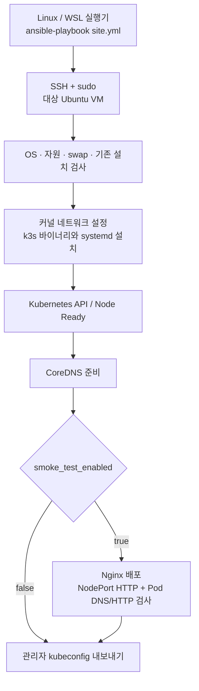

# 통합 Ansible 진입점

통합 호출 계약은 [Ansible 실행 인터페이스](../../docs/api/ansible.md)를 기준으로 합니다. `api.py`가 승인된 AWS/GCP/OpenStack 자원을 작업별 입력과 결합하고, `run.py`가 JB guest 검사 후 승민 K3s/Cilium runtime을 실행합니다. 아래 원본 standalone `site.yml`의 Flannel 설치를 함께 실행하지 않습니다. DB는 K3s 밖의 별도 VM을 기본으로 하며, 현재 HTTP는 배치 검증만 지원하고 담당 플레이북이 없어 설치를 차단합니다.

```bash
python3 run.py --request ../../examples/ansible/runtime-single-node.json --validate-only
python3 -m unittest discover -s . -p 'test_*.py' -v
```

아래는 조립한 JB 원본 starter의 사용·검증 기록이다. 통합 경로의 현재 설치 결과나 기본 실행 지시로 읽지 않는다.

---

# Minimal k3s Ansible starter

해커톤용 단일 노드 Kubernetes 설치 구성입니다. 새 Ubuntu 서버 1대에 k3s를 설치하고,
선택적으로 샘플 웹앱의 NodePort HTTP 응답과 클러스터 내부 DNS 통신을 검사합니다.
챗봇 구현, Terraform, Argo CD, GPU/LLM 서빙은 포함하지 않습니다.

## 구성과 실행 흐름



| 파일 | 역할 |
| --- | --- |
| `site.yml` | 사전 검사, 설치, 상태 확인, kubeconfig 내보내기 |
| `group_vars/all.yml` | 버전, 네트워크 대역, 샘플 앱 옵션 |
| `inventory/hosts.example.yml` | 실제 서버 설정을 작성하기 위한 예제 |
| `templates/` | k3s 설정, systemd unit, 샘플 앱과 검사 Pod |
| `tasks/smoke.yml` | 앱 배포와 DNS·HTTP 검증 |
| `tests/render.yml` | 서버 없이 실행하는 템플릿 테스트 |

## 범위와 전제

- 대상: 새 Ubuntu 22.04/24.04 Linux VM, systemd, amd64 또는 arm64.
- 최소 2 vCPU, RAM 2 GB, 여유 디스크 10 GB. 챗봇 앱에는 4 GB 이상 권장.
- SSH 접속, Python 3, sudo 권한, swap 비활성화 필요.
- 실행기: Linux 또는 WSL의 Ansible Core 2.15 이상. Windows 네이티브 실행은 미지원.
- k3s 버전은 `group_vars/all.yml`에 고정. 버전 변경을 자동 업그레이드로 처리하지 않습니다.
- Flannel, CoreDNS, SQLite, local-path storage 사용. Traefik, ServiceLB, metrics-server 제외.
- Cilium, HA, HTTPS, 외부 DNS, 클라우드 LB/CSI, 자동 방화벽 수정은 미포함.
- local-path PVC는 해당 노드 디스크에 종속됩니다. 노드 삭제 시 데이터 보존/HA를 보장하지 않습니다.

## 실행

WSL/Linux에서 이 디렉터리로 이동합니다. WSL의 `/mnt/c`는 Ansible 설정 파일 자동 로드를
거부하거나 파일 권한을 제대로 적용하지 못할 수 있으므로 `ANSIBLE_CONFIG`를 명시하고,
인증정보는 Linux 홈 디렉터리에 둡니다. 설치 대상은 WSL 자체가 아니라 별도 Linux VM입니다.

```bash
python3 -m venv ~/.venvs/k3s-ansible
source ~/.venvs/k3s-ansible/bin/activate
python -m pip install 'ansible-core>=2.15,<2.20'
export ANSIBLE_CONFIG="$PWD/ansible.cfg"
cp inventory/hosts.example.yml inventory/hosts.yml
```

`inventory/hosts.yml`의 주소, SSH 사용자, 개인키 경로를 실제 값으로 수정합니다.
`k3s_api_host`는 실행기에서 도달 가능한 노드 IP/DNS입니다. NAT 환경에서는 SSH 주소와
API 주소가 다를 수 있습니다. 예제 `192.0.2.10`은 실제 접속용 주소가 아닙니다.
서버 호스트키 지문을 신뢰할 수 있는 경로로 확인한 뒤 SSH known_hosts에 등록합니다.

```bash
ansible k3s_server -m ping
ansible-playbook site.yml --syntax-check
ansible-playbook site.yml -K -e "k3s_artifacts_dir=$HOME/.kube/hackathon-k3s"
```

`-K`는 sudo 비밀번호 입력입니다. passwordless sudo인 자동 실행기는 생략합니다.
기존 `~/.kube/config`는 변경하지 않습니다. 생성된 kubeconfig는 클러스터 관리자 인증정보이므로
Git에 올리거나 대시보드 로그에 출력하지 마세요. 장기 운영 시 배포용 최소 권한 계정을 별도로 만드세요.

```bash
export KUBECONFIG="$HOME/.kube/hackathon-k3s/kubeconfig.yaml"
kubectl get nodes
kubectl get pods -A
curl http://YOUR_NODE_IP:30080/
```

`kubectl`은 실행기에 별도로 필요합니다. 설치와 원격 검증에는 노드의 `k3s kubectl`을 사용합니다.
외부 공개 없이 로컬에서 확인하려면 API 접근이 가능한 실행기에서 다음을 사용합니다.

```bash
kubectl -n k3s-smoke port-forward service/web 8080:80
```

브라우저에서 `http://127.0.0.1:8080`을 엽니다. 이 주소는 다른 사람에게 공개되지 않습니다.

## 네트워크와 성공 판정

| 항목 | 필요한 조건 |
| --- | --- |
| SSH TCP 22 | 실행기에서 노드로 접근. 설정한 SSH 포트를 쓰면 해당 포트 |
| Kubernetes TCP 6443 | kubectl/배포 실행기의 IP 또는 VPN 대역에만 허용 |
| 데모 TCP 30080 | 접근시킬 사용자 대역에서 노드로 허용. 공개 서비스는 TLS/Ingress 별도 |
| 아웃바운드 | OS 패키지 저장소, GitHub 릴리스, 컨테이너 레지스트리, DNS 접근 |
| CIDR | Pod `10.42.0.0/16`, Service `10.43.0.0/16`이 LAN/VPC/VPN과 겹치지 않아야 함 |

UFW/보안그룹/NAT는 자동 변경하지 않습니다. 호스트 방화벽은 Pod/Service 트래픽도 허용해야 합니다.
6443이나 Flannel 포트를 인터넷 전체에 노출하지 마세요. 이 구성은 단일 노드이므로
다중 노드용 VXLAN 포트 개방은 필요 없습니다. NAT 뒤 서버의 DNS 레코드만 등록해도 공개되는 것은 아닙니다.

기본 검증은 Node Ready, CoreDNS rollout, 샘플 앱 rollout, **노드 내부에서 NodePort HTTP 확인**,
**임시 Pod에서 서비스 DNS 이름으로 HTTP 확인**입니다. 인터넷에서 접속 가능한지는 별도입니다.
실행기에서도 접근 가능하면 `-e smoke_test_from_controller=true`로 HTTP 검증을 추가하세요.

## 재실행과 실패 대응

- 설정이 같으면 서비스는 불필요하게 재시작하지 않습니다. DNS 검사 Pod만 매번 다시 만듭니다.
- `ansible-starter.json` 소유권 표시가 없는 기존 k3s는 덮어쓰지 않습니다.
- 버전, 노드 이름, Pod/Service CIDR 변경은 거부합니다. 해당 변경은 새 VM 또는 별도 이전 절차로 처리하세요.
- TLS SAN 변경은 재시작을 유발합니다. 이때 단일 노드 서비스 중단이 발생할 수 있습니다.
- 실패 시 자동 삭제/롤백하지 않습니다. 네트워크/이미지 다운로드 등 원인 수정 후 재실행하세요.
- `--check`는 지원하지 않습니다. `--syntax-check`와 아래 오프라인 테스트를 사용하세요.
- 공식 설치 스크립트 대신 체크섬을 검증한 바이너리와 명시적 systemd unit을 설치합니다.
  따라서 `k3s-uninstall.sh`는 생성하지 않습니다. 일회용 데모 환경 정리는 VM 삭제를 권장합니다.

노드에서 확인할 명령:

```bash
sudo journalctl -u k3s -n 100 --no-pager
sudo k3s kubectl get pods -A -o wide
sudo k3s kubectl get events -A --sort-by=.lastTimestamp
```

샘플 앱 제거는 `kubectl delete namespace k3s-smoke`입니다. 재생성을 막으려면 이후 실행에
`-e smoke_test_enabled=false`를 사용합니다. 이 변수만 바꿔서는 기존 앱을 삭제하지 않습니다.
챗봇을 올릴 때는 별도 Namespace/Deployment/Service로 추가하세요. GPU 모델 서버는 이 최소 구성의 범위 밖입니다.

## 파이프라인 연결

Terraform/API의 서버 주소를 inventory에 넣고, GoCD 또는 다른 Linux 실행기에서 `site.yml`을 호출합니다.
종료 코드 0을 성공으로 취급하고 로그를 수집하되, SSH 키와 kubeconfig는 비밀정보로 취급합니다.
같은 클러스터를 동시에 변경하지 않도록 파이프라인에서 잠금을 걸어야 합니다.
환경 생성 작업과 앱 배포 작업은 분리하세요. Cilium을 채택하면 새 클러스터에서 Flannel을 끄고
Cilium 설치 단계를 별도 설계해야 하며, 실행 중인 이 클러스터에 단순 추가 설치하면 안 됩니다.

## 검증

```bash
ansible-playbook -i inventory/hosts.example.yml site.yml --syntax-check
ansible-playbook -i localhost, tests/render.yml
```

2026-10-01 검증 결과:

| 검증 | 결과 |
| --- | --- |
| WSL / Ansible Core 2.15.13 구문·inventory 검사 | 통과 |
| 템플릿·포트 변경·kubeconfig 인증정보 보존 | 통과 |
| EC2 t3.medium / Ubuntu 24.04 / gp3 20 GiB 첫 설치 | 통과, Ansible failed=0 |
| Node Ready, CoreDNS, 샘플 앱 rollout | 통과 |
| 노드 NodePort HTTP, Pod 내부 서비스 DNS/HTTP | 통과 |
| WSL 및 Windows 실행기의 HTTP 요청 | HTTP 200과 Nginx 응답 확인 |
| 두 번째 실행의 멱등성, 재부팅 복구 | 미검증 |
| Ubuntu 22.04, arm64, 온프렘 | 지원 대상으로 정의했으나 실제 설치 미검증 |

검증 당시 외부 접근은 실행기 공인 IP 하나로 제한했습니다. HTTP 성공은 모든 인터넷 사용자의
접근 가능성을 의미하지 않습니다. 팀 환경에서 재실행·재부팅 검증을 추가한 뒤 데모에 사용하세요.

참고: [k3s 설정](https://docs.k3s.io/installation/configuration),
[k3s 요구사항](https://docs.k3s.io/installation/requirements).
